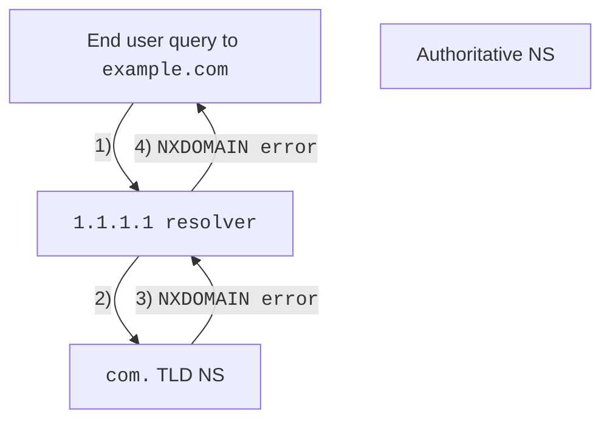
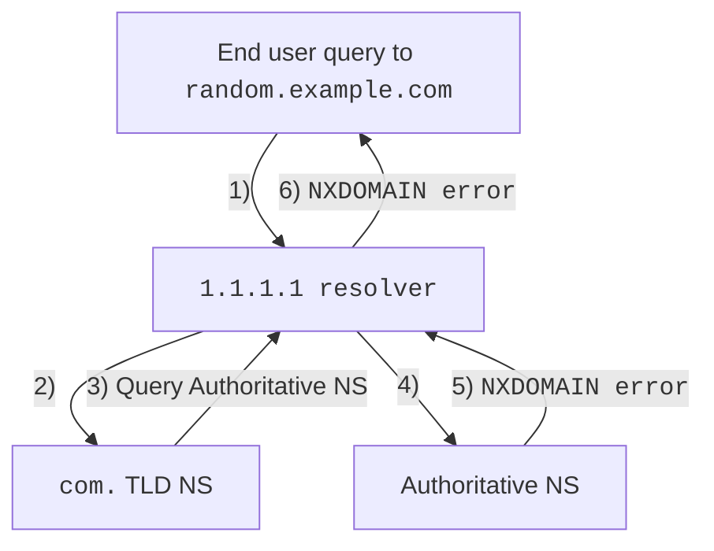

import { Render } from "~/components";

<Render file="random-prefix-attack-definition" product="dns" />  

## 공격 특성

### 존재하지 않는 도메인에 대한 쿼리

요청이 존재하지 않는 도메인만 포함한다면 `NXDOMAIN` 오류는 `com.`의 top-level domain(TLD) nameserver에서만 제공됩니다. 즉, 쿼리가 authoritative nameserver까지 도달하지 않습니다.

 

### 존재하지 않는 서브도메인에 대한 쿼리

이 공격이 성공하는 이유는 기존 도메인의 authoritative nameserver가 응답해야 하는 서브도메인을 겨냥하기 때문입니다.

 

기존 도메인의 서브도메인을 겨냥한 공격에서는, 이러한 무작위 서브도메인이 resolver나 다른 프록시에 캐시되어 있을 가능성이 낮기 때문에 resolver가 authoritative nameserver를 상대로 전체 해석을 수행할 수밖에 없습니다. 공격자가 이런 쿼리를 충분히 많이 보내고 authoritative nameserver가 그 부하를 감당하지 못하면, nameserver가 응답하지 않거나 심지어 다운되어 공격 대상 zone뿐 아니라 그 서버가 호스팅하는 모든 zone이 함께 영향을 받을 수 있습니다.

이 공격은 몇 가지 이유로 완화가 어렵습니다. authoritative nameserver의 관점에서 공격자는 Cloudflare(`1.1.1.1`)로 보이기 때문에, Cloudflare를 차단하는 것은 정상 트래픽까지 차단하게 되므로 선택지가 아닙니다.

## 해결 방법

[랜덤 프리픽스 공격 완화](/dns/dns-firewall/random-prefix-attacks/setup/)를 활성화하면 Cloudflare가 들어오는 쿼리를 모니터링해 잠재적인 랜덤 프리픽스 공격을 탐지합니다.

공격이 탐지되면, Cloudflare는 서브도메인, 하위 서브도메인 등에 대해 사용자의 업스트림 nameserver로 쿼리하는 작업을 일시적으로 중단합니다. 이후 Cloudflare는 캐시된 응답(TTL이 아직 만료되지 않은 경우)을 반환합니다.
