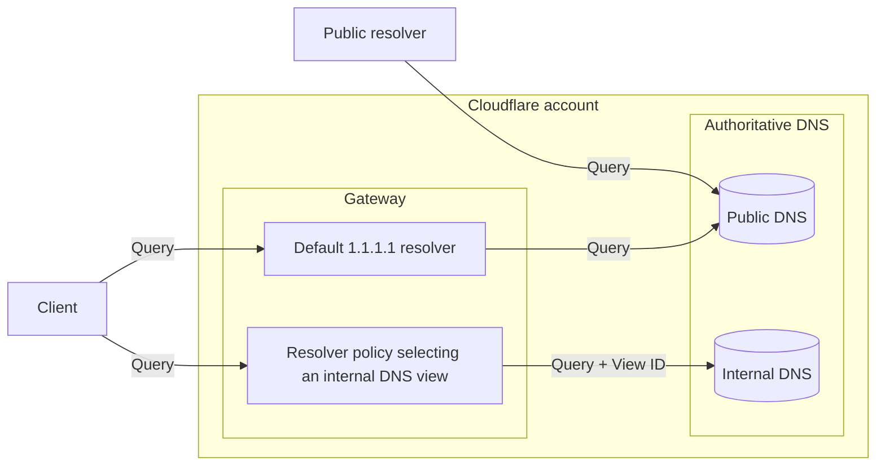
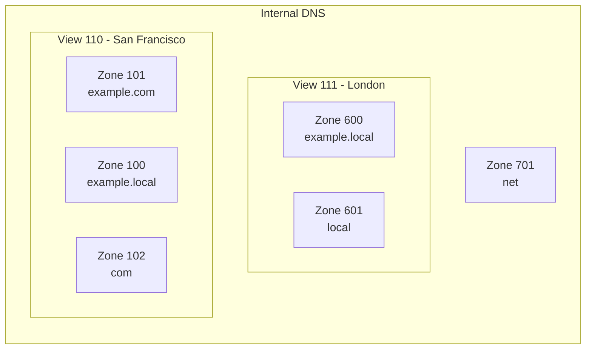
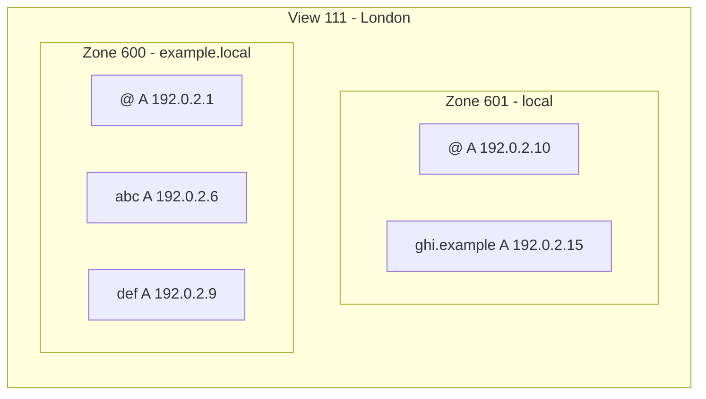

import {
	Render,
	Description,
	Plan,
	RelatedProduct,
	DirectoryListing,
	GlossaryTooltip,
	Example,
} from "~/components";

<Description>
	내부 리소스를 위한 Cloudflare DNS로 사설 네트워크 관리를 단순화하세요.
</Description>

<Plan type="enterprise" />

사설 네트워크 내부에서만 접근 가능해야 하는 DNS 레코드를 관리하세요. Internal DNS [zones](/dns/internal-dns/internal-zones/)와 [views](/dns/internal-dns/dns-views/)는 [Gateway resolver policies](/cloudflare-one/traffic-policies/resolver-policies/)와 함께 동작하여, 쿼리 소스 IP 같은 쿼리 컨텍스트에 따라 DNS 쿼리에 어떻게 응답할지 제어할 수 있게 해 줍니다.

<Render file="internal-dns-beta-note" product="dns" />

## 아키텍처 개요

트래픽을 Cloudflare로 온보딩하기 위해 여러 [연결 옵션](/dns/internal-dns/connectivity/)을 사용할 수 있습니다. 그런 다음 Cloudflare Gateway resolver가 DNS 클라이언트와 내부 DNS 영역 사이의 인터페이스 역할을 합니다.

Internal DNS 영역에는 Cloudflare 네임서버가 할당되지 않으며, Cloudflare Gateway resolver를 통해서만 질의할 수 있습니다.

Internal DNS 영역은 DNS 뷰로 그룹화되며, 사용자가 정의한 resolver policy가 이 뷰를 선택합니다. 뷰는 일반적으로 서로 다른 지리적 위치처럼 조직과 관련된 논리적 그룹입니다.

Internal DNS 영역에는 내부 DNS 쿼리를 해석하는 데 사용해야 하는 <GlossaryTooltip term="DNS record" link="/dns/internal-dns/internal-zones/internal-dns-records/">DNS 레코드</GlossaryTooltip>가 포함됩니다. 또한 일치하는 내부 영역 안에서 내부 레코드를 찾지 못하면, Cloudflare는 해당 내부 영역이 [다른 내부 영역을 참조](/dns/internal-dns/internal-zones/reference-zones/)하고 있는지 확인합니다.

<Example>

이 예시에서 view ID 111로 라우팅된 `ghi.example.local`에 대한 쿼리는 가장 긴 일치 영역 이름(`example.local`)을 가진 zone 600으로 이동합니다. zone 600에는 `ghi`에 대한 레코드가 없지만, zone 601을 참조하고 있다면 Cloudflare는 참조 영역 안에서 요청된 레코드를 계속 조회합니다.

</Example>

## 리소스

<DirectoryListing />

## 관련 제품

<RelatedProduct
	header="Cloudflare Gateway"
	href="/cloudflare-one/traffic-policies/"
	product="privacy-gateway"
>
	DNS, Network, HTTP, Egress 트래픽을 검사하는 정책을 설정합니다.
</RelatedProduct>

<RelatedProduct
	header="Cloudflare WAN"
	href="/cloudflare-wan/"
	product="cloudflare-wan"
>
	기업 전체 네트워킹의 보안과 성능을 개선하고 비용과 운영 복잡성을 줄입니다.
</RelatedProduct>
