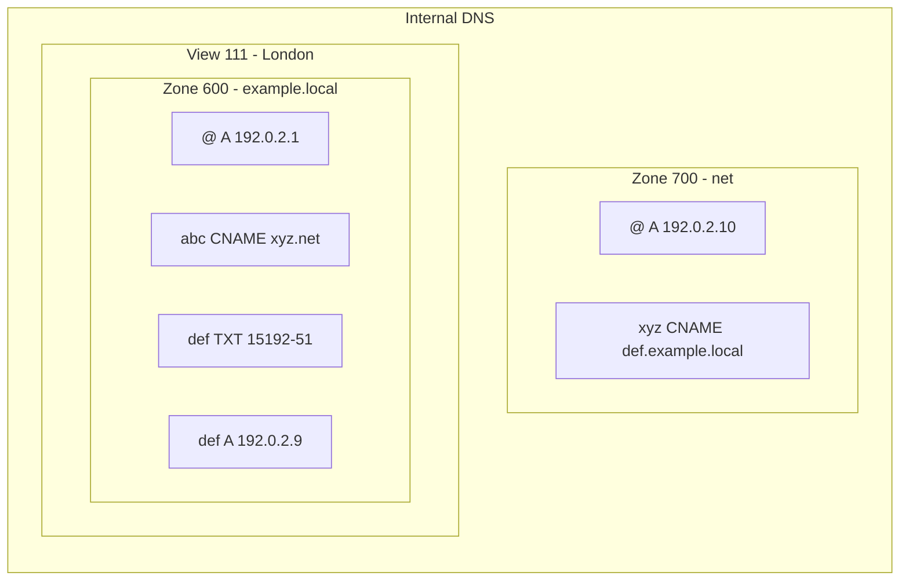

import { Details, Example } from "~/components";

Internal zones에는 Cloudflare가 public zones에 대해 지원하는 것과 동일한 [DNS record types](/dns/manage-dns-records/reference/dns-record-types/)를 포함할 수 있습니다.

internal DNS records는 public DNS records를 관리하는 것과 같은 방식으로 관리할 수 있지만, [proxy status](/dns/proxy-status/)는 internal DNS records에는 적용되지 않는다는 차이가 있습니다.

자세한 안내는 [DNS 레코드 관리](/dns/manage-dns-records/how-to/create-dns-records/) 또는 [API documentation](/api/resources/dns/subresources/records/)를 참고하세요.

## Internal DNS에서의 CNAME flattening

[CNAME flattening](/dns/cname-flattening/)을 사용하면 Cloudflare는 CNAME이 가리키는 최종 대상 콘텐츠를 찾아 CNAME 레코드 대신 해당 콘텐츠를 반환합니다. Internal DNS에서는 CNAME flattening이 기본적으로 적용되며 비활성화할 수 없습니다.

Cloudflare는 지정된 [DNS view](/dns/internal-dns/dns-views/)와 기존 [reference zones](/dns/internal-dns/internal-zones/reference-zones/)를 모두 고려하여 CNAME 레코드를 flatten하려고 시도합니다. 참조 영역에 또 다른 CNAME이 있으면, 해당 레코드는 다시 원래 view의 관점에서 처리됩니다.

- view ID 111로 `abc.example.local`의 `A` 레코드를 질의합니다.
- zone 600이 어떤 view에도 연결되지 않은 zone 700을 참조합니다.

`xyz.net`을 가리키는 CNAME 레코드를 찾은 후 Cloudflare는 zone 600 안에서는 이를 해석할 수 없습니다. 그러나 이 영역이 zone 700을 참조하고 있으므로, 해당 참조가 해석 과정에 반영됩니다.

zone 700의 레코드는 `def.example.local`을 가리키며, Cloudflare는 이를 원래 view에서 다시 해석합니다. `def.example.local`에 대한 `A` 레코드를 찾을 수 있으므로, Cloudflare는 해당 IP 주소를 반환합니다. 이 예시에서는 `192.0.2.9`입니다.

CNAME 레코드를 flatten할 수 없는 경우 다음이 발생합니다.

1. CNAME 레코드가 [Gateway resolver](/dns/internal-dns/#architecture-overview)에 있는 그대로 반환됩니다.
2. Gateway resolver는 **Fallback through public DNS** 구성에 따라 반환된 레코드를 처리합니다.
    - On: Gateway가 Cloudflare의 public DNS resolver([1.1.1.1](/1.1.1.1/))로 쿼리를 보내 public DNS를 통해 해석을 시도합니다.
    - Off: Gateway가 응답을 그대로 클라이언트에 반환합니다.
