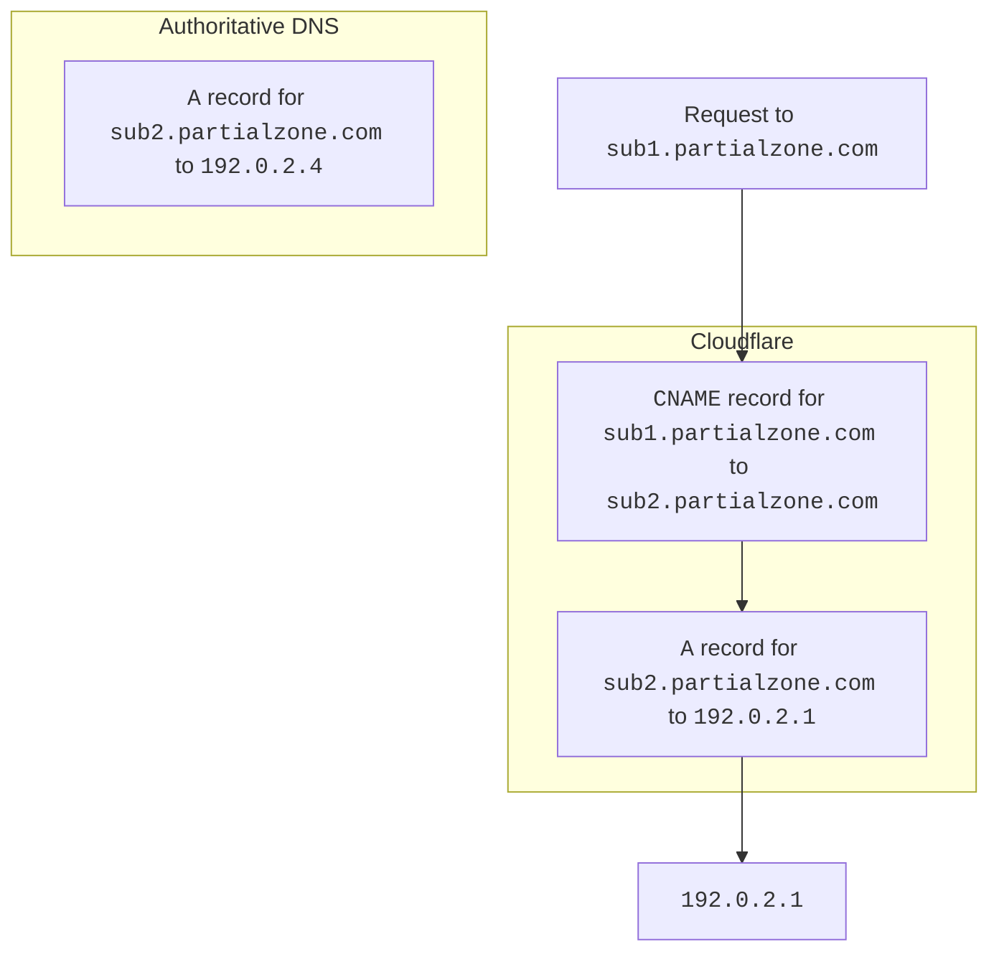
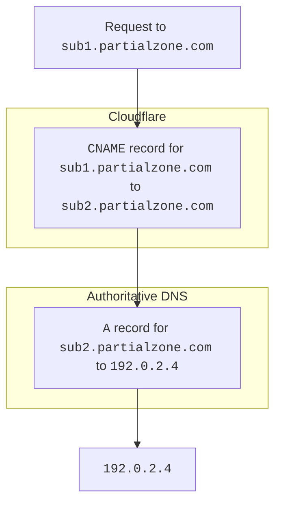
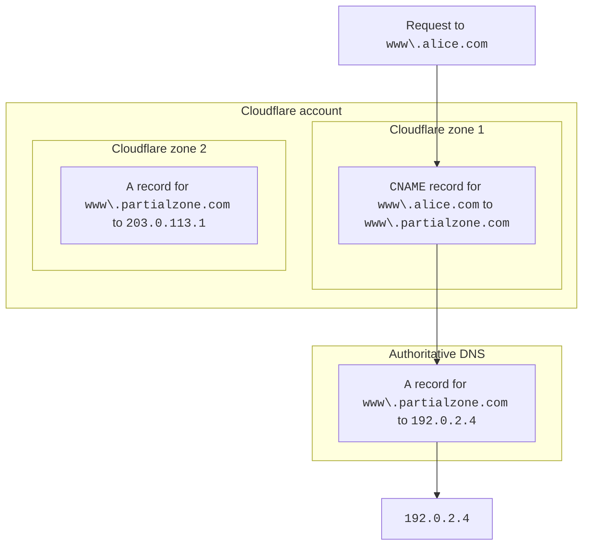
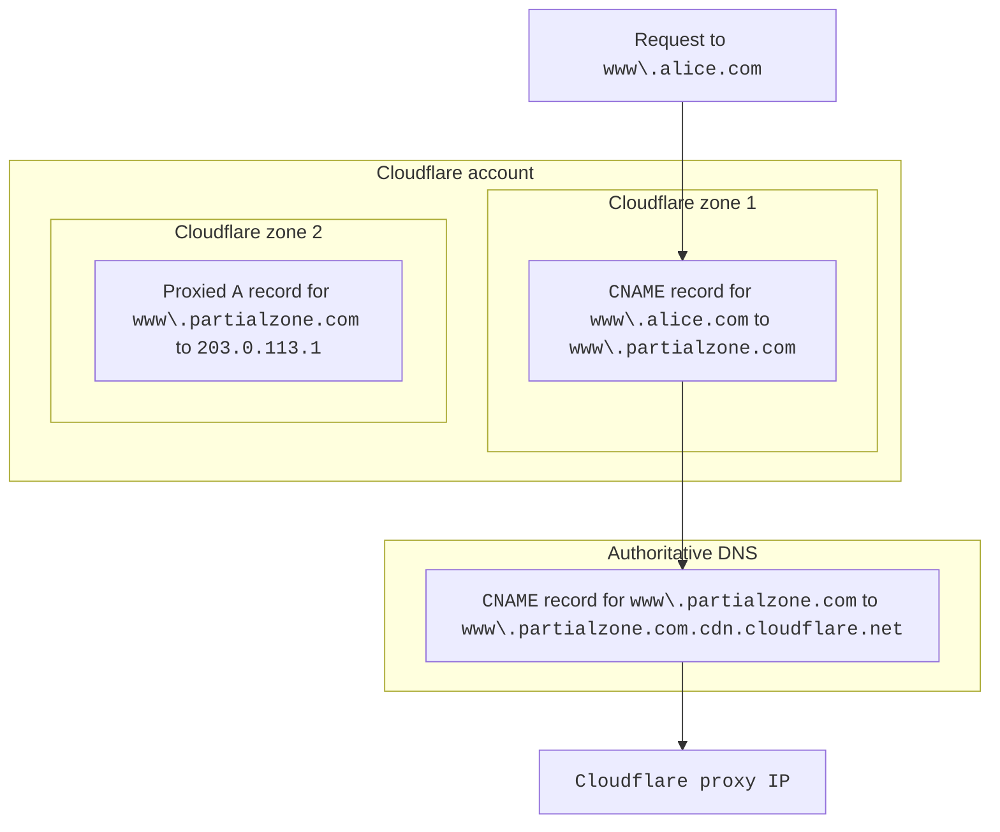

import { GlossaryTooltip } from "~/components"

부분 영역(<GlossaryTooltip term="CNAME setup" link="/dns/zone-setups/partial-setup/">CNAME 설정</GlossaryTooltip>)에서는 Cloudflare가 프록시된 HTTP 요청을 어느 오리진 서버로 보낼지 내부적으로 해석하기 위해, 기본 영역(전체 설정)과는 조금 다른 방식으로 DNS 레코드를 처리합니다.

## 동일한 영역 안의 레코드

부분 영역에서 [새 DNS 레코드](/dns/manage-dns-records/how-to/create-dns-records/#create-dns-records)를 만들면 Cloudflare는 CNAME 레코드 중 같은 영역 안의 기존 A, AAAA, CNAME 레코드를 가리키는 것이 있는지 자동으로 확인합니다.

예를 들어 부분 영역에 다음과 같은 레코드가 있다면 Cloudflare는 경고를 표시합니다.

```txt
sub1.partialzone.com   CNAME   sub2.partialzone.com
sub2.partialzone.com   A       192.0.2.1
```

Cloudflare가 CNAME 레코드와 그 대상 레코드를 모두 보유하고 있기 때문에, 들어오는 `sub1.partialzone.com` HTTP 요청은 오리진 `192.0.2.1`로 전송됩니다.

이 상황은 authoritative DNS 공급자에도 `sub2.partialzone.com`용 DNS 레코드가 있을 경우 문제가 될 수 있습니다. 그 레코드는 `192.0.2.4`, 다른 IP 주소 또는 다른 도메인을 가리킬 수 있지만, Cloudflare가 처음 레코드와 그 대상을 모두 알고 있기 때문에 authoritative DNS 공급자에게 `sub2.partialzone.com` 레코드를 질의하지 않기 때문입니다.



<br />

이 상황을 피하면, 즉 부분 영역 안에 CNAME 레코드의 **대상**이 존재하지 않게 하면 DNS 해석은 다르게 동작합니다.



***

## 동일한 계정의 부분 영역을 가리키는 레코드

또한 계정 내의 다른 부분 영역에 있는 레코드를 가리키는 [CNAME 레코드](/dns/manage-dns-records/how-to/create-dns-records/#create-dns-records)를 한 영역(부분 또는 전체)에 생성할 수도 있습니다.

이 경우 Cloudflare는 항상 CNAME 대상 영역의 authoritative DNS 공급자에 있는 값을 기준으로 CNAME 대상을 해석합니다.



### Auth DNS가 `cdn.cloudflare.net`을 가리키는 경우

다음 상황을 가정해 보겠습니다.

- 대상 영역(이 예시의 Cloudflare zone 2)이 부분 영역이고, 그 부분 영역의 DNS 레코드는 프록시되어 있습니다.
- authoritative DNS 서버의 DNS 레코드가 `cdn.cloudflare.net`을 가리킵니다.

이와 같은 구성이 되어 있으면, 서브도메인(이 예시의 `www.partialzone.com`)은 Cloudflare 프록시 IP로 해석되고 결국 오류가 발생합니다. 대신 [custom hostnames](/cloudflare-for-platforms/cloudflare-for-saas/domain-support/)와 [Orange-to-Orange](/cloudflare-for-platforms/cloudflare-for-saas/saas-customers/how-it-works/) 구성을 고려하세요.


