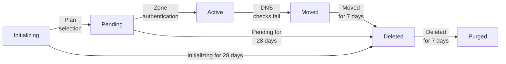

[웹사이트 또는 애플리케이션을 Cloudflare에 추가](/fundamentals/manage-domains/add-site/)한 뒤 [영역](/dns/concepts/#zone)이 가질 수 있는 여러 상태에 대한 정보를 확인하세요.

영역 상태는 도메인 상태라고도 합니다. [애플리케이션 서비스 구성](/fundamentals/manage-domains/add-site/)이 적용되려면 도메인 상태가 **active**여야 합니다. 자세한 내용은 [Cloudflare의 동작 방식](/fundamentals/concepts/how-cloudflare-works/)을 참고하세요.

영역 상태가 바뀌면 계정에 연결된 이메일 주소로 알림이 전송됩니다.

아래 다이어그램은 적용 가능한 여러 상태와 영역이 한 상태에서 다른 상태로 전환되는 방식을 개괄적으로 보여 줍니다. 활성 유료 구독이 있는 영역의 경우, 자동 삭제 또는 purge까지의 시간은 이 다이어그램과 다를 수 있습니다. 자세한 내용은 아래 섹션을 참고하세요.

:::note

API를 사용해 웹사이트나 애플리케이션을 Cloudflare에 추가하면 영역은 바로 **Pending** 상태로 생성됩니다. **Initializing**은 대시보드를 통해 추가된 도메인에만 적용됩니다.
:::

## Initializing (Setup)

대시보드에서 설정을 시작했지만 영역 요금제를 선택하지 않은 상태입니다. Cloudflare 대시보드에서는 이 상태가 **Setup**으로 표시됩니다.

이 상태에서는 Cloudflare가 도메인에 대한 DNS 쿼리에 응답하지 않습니다.

영역이 **Setup** 상태로 28일 이상 유지되면 자동으로 [삭제](#deleted)됩니다.

## Pending

Cloudflare 대시보드에서는 영역 상태가 **Pending Nameserver Update**로 표시됩니다.

:::note
실수로 계정에 영역을 추가한 경우 pending 상태로 표시됩니다. 이 경우 안전하게 [제거](/fundamentals/manage-domains/remove-domain/)할 수 있습니다.
:::

Cloudflare는 pending 영역에 대해 할당된 Cloudflare 네임서버 IP에서 DNS 쿼리에 응답하지만, 영역은 아직 활성 상태가 아니며 [Cloudflare로 트래픽을 프록시](/dns/proxy-status/limitations/#pending-domains)하는 데 사용할 수 없습니다.

### 원인

* [기본 설정(전체)](/dns/zone-setups/full-setup/): authoritative 네임서버를 아직 [변경](/dns/nameservers/update-nameservers/)하지 않았거나, 변경 사항이 아직 Cloudflare에서 인증되지 않았습니다.
* [CNAME 설정(부분)](/dns/zone-setups/partial-setup/): authoritative DNS 공급자에 확인용 TXT 레코드를 아직 추가하지 않았거나, 해당 레코드가 아직 Cloudflare에서 인증되지 않았습니다.

도메인을 추가한 뒤 Cloudflare는 일정 주기로 검사를 수행해 네임서버가 업데이트되었는지 확인합니다. 첫 검사는 60초 후에 이뤄지고, 그 이후 시도는 점차 간격이 늘어납니다. [API](/api/resources/zones/subresources/activation_check/methods/trigger/) 또는 해당 도메인의 [Overview 페이지](https://dash.cloudflare.com/?to=/:account/:zone/)에서 대시보드를 통해 검사를 다시 트리거할 수 있습니다.

### 요금제별 예상 동작

도메인이 Free 요금제에 있으면 28일 안에 활성화되지 않을 경우 자동 삭제됩니다.

유료 요금제(Pro, Business, Enterprise)의 pending 영역은 요금제가 제거되거나, 도메인이 활성화되거나, [Cloudflare에서 제거](/fundamentals/manage-domains/remove-domain/)될 때까지 pending 상태를 유지합니다.

:::caution[운영 환경에서는 pending 영역을 사용하지 마세요]
운영 트래픽에 pending 영역을 사용하지 않도록 주의하세요. Cloudflare는 pending 영역에 대해 할당된 Cloudflare 네임서버 IP에서 DNS 쿼리에 응답하지만, 특히 [zone hold](/fundamentals/account/account-security/zone-holds/)를 사용하지 않는 경우 관련 위험이 있습니다.
:::

Enterprise 영역의 경우, 영역 활성화 전에 설정을 조정하려고 한다면 [DNS 로그](/logs/logpush/logpush-job/datasets/zone/dns_logs/)용 Logpush와 [DNS Zone Transfer](/dns/zone-setups/zone-transfers/) 구성은 pending 상태에서도 예상대로 동작합니다.

## Active

Cloudflare가 [네임서버 변경](/dns/nameservers/update-nameservers/) 또는 [확인용 TXT 레코드](/dns/zone-setups/partial-setup/setup/#2-도메인-소유권-확인)를 인증했으며, 이제 도메인 트래픽을 Cloudflare로 프록시할 수 있습니다. 자세한 내용은 [Cloudflare의 동작 방식](/fundamentals/concepts/how-cloudflare-works/)과 [도메인 구성](/fundamentals/manage-domains/add-site/)을 참고하세요.

## Moved

도메인이 여러 차례 DNS 검사에 실패했습니다. 이는 Cloudflare 네임서버가 더 이상 도메인의 `NS` 레코드에 존재하지 않거나([기본 설정(전체)](/dns/zone-setups/full-setup/)), 영역에 대해 `SOA` 레코드가 반환되지 않는([CNAME 설정(부분)](/dns/zone-setups/partial-setup/)) 경우입니다.

### 요금제별 예상 동작

도메인이 Free 요금제에 있으면 moved 상태에 들어간 지 7일 후 자동 삭제됩니다.

유료 요금제(Pro, Business, Enterprise)의 moved 영역은 다음 중 하나가 관찰되면 7일 후 삭제됩니다.

- 유료 요금제가 제거됨
- 다른 Cloudflare 계정에서 도메인이 활성화됨

[수동으로 도메인을 제거](/fundamentals/manage-domains/remove-domain/)할 수도 있습니다.

## Deleted

영역이 보관된 상태입니다. Cloudflare는 삭제된 영역에 대해서도(삭제되지 않은 DNS 레코드에 한해) 할당된 Cloudflare 네임서버 IP에서 DNS 쿼리에 응답하며, [일반적인 온보딩 절차](/fundamentals/manage-domains/add-site/)를 따라 도메인을 Cloudflare에 다시 추가할 수 있습니다.

삭제된 상태로 7일이 지나면 영역은 자동으로 [purged](#purged)됩니다.

## Purged

영역이 삭제된 지 7일이 지나면 purge됩니다. Cloudflare는 purged 영역에 대해 DNS 쿼리에 응답하지 않으며, [deleted 영역](#deleted)과 달리 이 상태는 되돌릴 수 없습니다. 이 경우 같은 Cloudflare 계정에 도메인을 다시 추가하더라도 기존 영역 설정이 복구되지 않을 수 있습니다.
