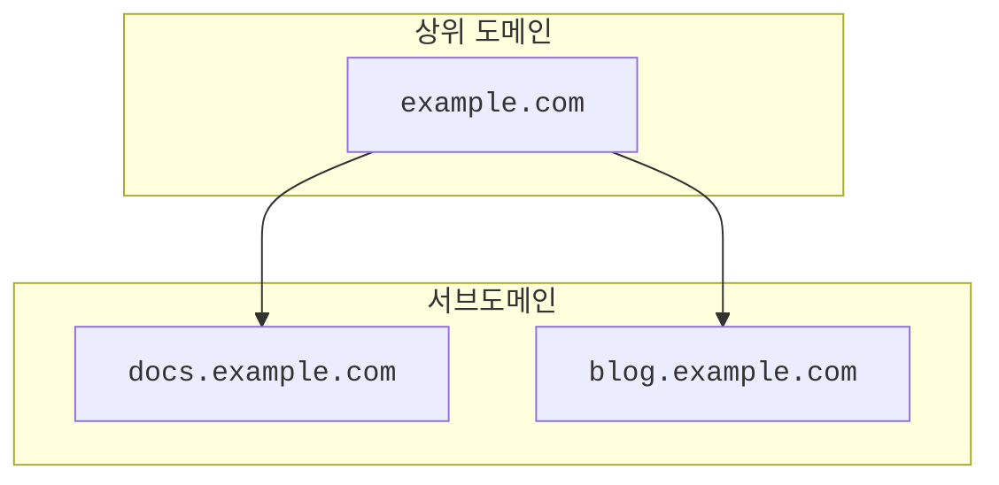

import { DirectoryListing, GlossaryTooltip, Render } from "~/components";

:::caution

서브도메인 설정은 Enterprise 계정에서만 사용할 수 있습니다. Cloudflare에서 사이트용 서브도메인만 만들고 싶다면 [서브도메인 레코드 만들기](/dns/manage-dns-records/how-to/create-subdomain/)를 참고하세요.
:::

[서브도메인 설정](/dns/zone-setups/subdomain-setup/)은 위임(delegation)이라고 알려진 절차에 의존합니다. `example.com`과 같은 상위 도메인에서 `blog.example.com`이라는 서브도메인에 대해 [NS 레코드](https://www.cloudflare.com/learning/dns/dns-records/dns-ns-record/)를 생성하면, 해당 서브도메인의 DNS 관리는 별도의 <GlossaryTooltip term="DNS zone" link="/dns/concepts/#zone">DNS zone</GlossaryTooltip>에서 독립적으로 수행될 수 있음을 의미합니다.

---

## 사용 가능한 설정

<Render file="subdomain-setup-matrix" product="dns" />

:::caution[partial setup의 서브도메인 zone은 위임되지 않습니다]

CNAME setup(partial)을 사용하는 서브도메인은 이 문맥에서 위임이 적용되지 않는 예외입니다. 전용 [CNAME setup (Partial) 섹션](/dns/zone-setups/partial-setup/)에서 설명하듯, 이 설정은 개별 서브도메인만 Cloudflare를 통해 프록시하기 위한 목적입니다. 다만 완전성을 위해 이 표에도 옵션으로 표시되어 있으며, [사용 방법 가이드](/dns/zone-setups/subdomain-setup/setup/parent-on-partial/)에는 CNAME setup(partial)을 사용하는 서브도메인 zone을 구성하는 방법이 자세히 설명되어 있습니다.
:::

이 표는 zone이 [활성 상태](/dns/zone-setups/reference/domain-status/)에 있다고 가정합니다. 예를 들어 자식 zone이 이미 CNAME setup(partial)으로 존재하는 상태에서 부모 zone을 Cloudflare에 추가해야 하는 경우, 부모 zone이 아직 pending 상태일 때 [CNAME setup (partial)으로 부모 zone을 전환](/dns/zone-setups/partial-setup/setup/#1-convert-your-zone-and-review-dns-records)할 수 있습니다.

---

## 방법

부모 zone에 사용 중인 설정에 따라 서브도메인 설정을 구성하는 방법은 아래 가이드를 참고하세요.

<DirectoryListing />

이 문서의 how-to 가이드는 부모 도메인과 서브도메인이 모두 Cloudflare에 존재하는 상황을 중심으로 설명하지만, 부모 도메인이 다른 DNS 제공자에 존재하는 상태에서도 Cloudflare에서 서브도메인 설정을 구성할 수 있습니다.

---

## SSL/TLS 인증서

서브도메인 설정을 사용할 때는 부모 zone과 자식 zone 구성 간의 상호작용이 [SSL/TLS 인증서](/ssl/) 발급에 영향을 줄 수 있다는 점을 고려해야 합니다.

특정 호스트명(`subdomain.example.com`)에 대해 자식 zone에 이미 활성 인증서가 있다면, 부모 zone(`example.com`)에서 정확히 그 호스트명을 포함하는 모든 인증서 팩은 검증에 실패합니다.

## Access 애플리케이션

<Render file="subdomain-setup-access-apps" product="dns" />
