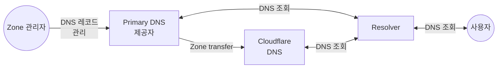

들어오는 zone transfer를 사용하면 기존 primary DNS 제공자는 유지하면서 Cloudflare를 secondary DNS 제공자로 사용할 수 있습니다.

primary DNS 제공자에서 레코드를 수정하면 해당 DNS 레코드는 [AXFR](https://datatracker.ietf.org/doc/html/rfc5936) 또는 [IXFR](https://datatracker.ietf.org/doc/html/rfc1995)를 사용하는 zone transfer를 통해 primary DNS 제공자에서 Cloudflare로 전송됩니다.

## 방법

* [들어오는 zone transfer 설정](/dns/zone-setups/zone-transfers/cloudflare-as-secondary/setup/)
* [Secondary DNS Override](/dns/zone-setups/zone-transfers/cloudflare-as-secondary/proxy-traffic/)를 사용해 Cloudflare를 통해 트래픽 프록시

## 제공 여부

Secondary DNS는 Enterprise 고객만 사용할 수 있습니다. 활성화와 가격에 대한 자세한 내용은 계정 팀에 문의하세요.
