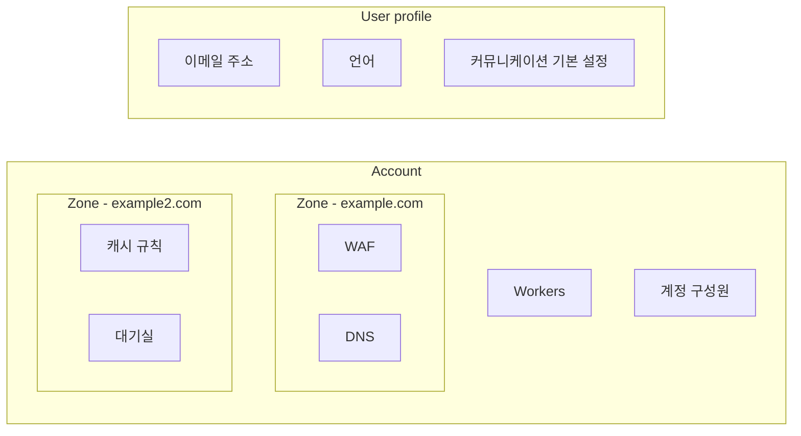

import { Render } from "~/components";

Cloudflare 생태계에는 특정 설정이 어디에 속하는지를 결정하는 세 가지 구성 개념이 있습니다. 사용자 프로필, 계정, 영역입니다.

---

## 사용자 프로필

<Render file="user-profiles" product="fundamentals" />

## 계정

계정은 하나 이상의 사용자와 영역을 포함하는 조직 계정을 의미합니다. 사용자는 여러 계정에 속할 수 있으며, 각 계정은 [청구 프로필](/billing/create-billing-profile/), [계정 구성원](/fundamentals/manage-members/), [목록](/waf/tools/lists/) 및 기타 구성을 포함한 자체 설정을 유지합니다.

[Workers](/workers/), [Pages](/pages/), [Security Center](/security-center/), [Bulk redirects](/rules/url-forwarding/bulk-redirects/)와 같은 일부 계정 수준 제품은 해당 계정 안의 일부 또는 모든 영역에 영향을 줄 수 있습니다.

계정 선택 후 영역을 선택하기 전에는 사이드바에 계정 수준 제품이 표시됩니다.

[Cloudflare 대시보드](https://dash.cloudflare.com)에 로그인하면 사용자가 구성원으로 속한 모든 계정에 접근할 수 있습니다. 영역 내부에서 계정 설정과 계정 수준 제품에 접근하려면 탐색 사이드바의 **Accounts** 옵션을 사용하세요.

## 영역

Cloudflare에 추가된 도메인(또는 [하위 도메인](/dns/zone-setups/subdomain-setup/))은 영역(zone)[^1]이 되며, 이는 웹사이트, 애플리케이션 또는 API의 보안과 성능에 직접적인 영향을 줍니다. 영역을 사용해 보안과 성능을 모니터링하고, 구성을 업데이트하며, 영역 수준 제품 및 서비스를 적용할 수 있습니다.

[Load Balancers](/load-balancing/), [Cache rules](/cache/how-to/cache-rules/)와 같은 영역 수준 서비스는 같은 계정 안에 있더라도 다른 영역이 아니라 해당 영역의 웹사이트, 애플리케이션 또는 API에만 영향을 줍니다.

[Cloudflare 대시보드](https://dash.cloudflare.com)에 로그인하고 계정을 선택하면 해당 계정 안의 모든 영역 목록을 볼 수 있습니다.

영역 내부에 들어가면 사이드바 항목은 영역 관련 제품으로 표시됩니다. 다른 영역으로 전환해야 한다면 영역 이름 옆의 앞으로 화살표를 사용하거나 계정 홈으로 돌아가세요.

[^1]: [DNS 영역](https://www.cloudflare.com/learning/dns/glossary/dns-zone/)과 유사하지만 추가 기능이 있습니다.
