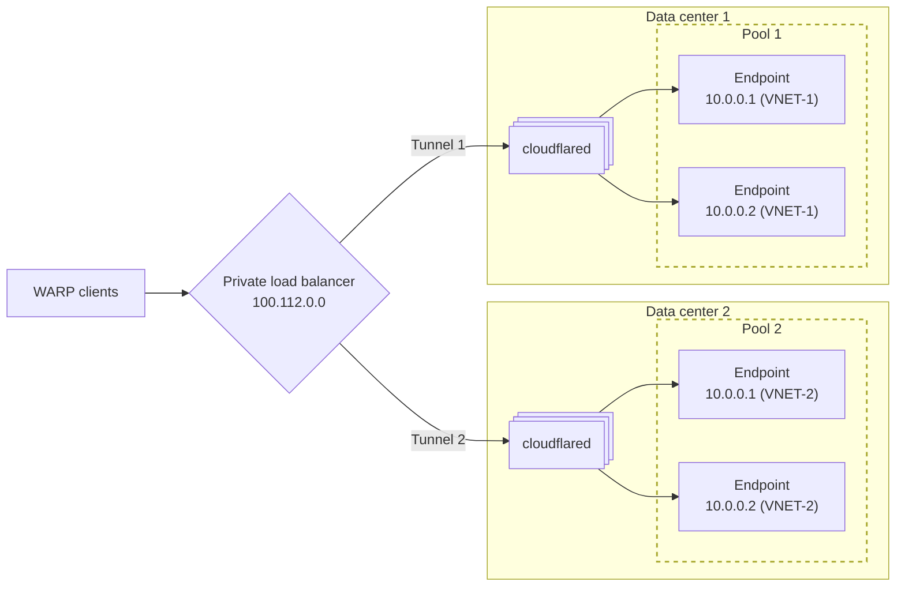

import {
	DashButton,
	Render,
	Tabs,
	TabItem,
	APIRequest,
	GlossaryTooltip,
} from "~/components";

WARP 클라이언트 트래픽을 [Cloudflare Tunnel](/cloudflare-one/networks/connectors/cloudflare-tunnel/)을 통해 연결된 프라이빗 호스트명과 IP로 분산하기 위해 Private Network Load Balancing을 사용할 수 있습니다.

예를 들어 두 개의 데이터 센터에서 내부 애플리케이션을 실행하고 있고, WARP 사용자가 지리적으로 가장 가까운 데이터 센터를 통해 애플리케이션에 접근하게 하려는 상황을 가정해 보겠습니다. 일반적인 로드 밸런싱 구성은 다음 다이어그램과 같습니다.

다이어그램의 구성 요소는 다음과 같습니다.

- **cloudflared**: 각 데이터 센터는 자체 Cloudflare Tunnel을 통해 Cloudflare에 연결됩니다. `cloudflared`는 네트워크 내 하나 이상의 호스트 머신에 설치됩니다. 자세한 내용은 [여기](/cloudflare-one/networks/connectors/cloudflare-tunnel/configure-tunnels/tunnel-availability/#cloudflared-replicas)를 참고하세요.
- **Private load balancer IP**: 최종 사용자는 로드 밸런서의 IP 주소를 사용해 애플리케이션에 연결합니다. 이 주소는 `100.112.0.0/16` 범위의 Cloudflare 할당 IP일 수도 있고, [RFC 1918 range](https://datatracker.ietf.org/doc/html/rfc1918)의 사용자 지정 `/32` IP일 수도 있습니다.
- **Load balancer pool**: 로드 밸런서는 터널마다 하나의 [pool](/load-balancing/understand-basics/load-balancing-components/#pools)로 구성됩니다.
- **Load balancer endpoint**: 하나의 풀에는 하나 이상의 엔드포인트가 포함되며, 각 엔드포인트는 애플리케이션을 실행하는 `cloudflared` 뒤쪽의 서버입니다. 서버 IP가 서로 겹친다면, Load Balancer가 요청을 올바른 엔드포인트로 결정적으로 라우팅할 수 있도록 터널마다 서로 다른 [virtual network (VNET)](/cloudflare-one/networks/connectors/cloudflare-tunnel/private-net/cloudflared/tunnel-virtual-networks/)를 할당할 수 있습니다.

:::note
Load Balancing은 현재 [private hostname routing](/cloudflare-one/networks/connectors/cloudflare-tunnel/private-net/cloudflared/connect-private-hostname/)을 지원하지 않습니다. 로드 밸런싱 엔드포인트는 IP 주소와 virtual network를 사용해 정의해야 합니다(예: `10.0.0.1 (VNET-1)`).
:::

## 전제 조건

- 엔드포인트 IP 주소가 Cloudflare Tunnel을 통해 라우팅되어야 합니다. 프라이빗 네트워크 연결 방법은 [Connect an IP/CIDR](/cloudflare-one/networks/connectors/cloudflare-tunnel/private-net/cloudflared/connect-cidr/)를 참고하세요.

## 1. 로드 밸런서 풀 생성

로드 밸런서 풀은 엔드포인트의 논리적 그룹으로, 일반적으로 물리적 데이터센터나 지리적 리전 기준으로 구성됩니다. 풀 안의 엔드포인트는 트래픽이 최종적으로 라우팅되는 대상입니다.

풀은 Cloudflare 대시보드 또는 API를 통해 생성할 수 있습니다.

<Tabs syncKey="dashPlusAPI">

<TabItem label="대시보드">

대시보드를 사용해 풀을 생성하려면 [Create a pool](/load-balancing/pools/create-pool/#create-a-pool) 문서를 참고하세요.

:::note[엔드포인트 IP 주소 제한]

- 프라이빗 IP를 가진 모든 엔드포인트에는 [virtual network (VNET)](/cloudflare-one/networks/connectors/cloudflare-tunnel/private-net/cloudflared/tunnel-virtual-networks/)를 지정해야 합니다. Cloudflare Tunnel route를 추가할 때 VNET을 선택하지 않았다면 엔드포인트는 `default` VNET에 할당됩니다.
- 같은 IP 주소를 가진 여러 엔드포인트를 하나의 풀에 둘 수는 없으며, 서로 다른 virtual network를 사용하는 경우에도 마찬가지입니다. 하지만 [예시 다이어그램](#_top)처럼 IP가 겹치는 엔드포인트를 서로 다른 풀에 할당하는 것은 가능합니다.
  :::

</TabItem>

<TabItem label="API">

현재 virtual network 목록을 가져오려면 [List virtual networks](/api/resources/zero_trust/subresources/networks/subresources/virtual_networks/methods/list/) API 작업을 사용하세요.

API 요청의 `origins`에 `virtual_network_id` 필드를 추가해 virtual/private IP 지원을 활성화하세요. API로 풀을 생성하는 방법에 대한 자세한 내용은 [Cloudflare Load Balancer API documentation](/api/resources/load_balancers/subresources/pools/methods/create/)를 참고하세요.

다음 예시는 기존 Load Balancer 풀에 Cloudflare Tunnel 엔드포인트를 추가합니다.

<APIRequest
	path="/accounts/{account_id}/load_balancers/pools/{pool_id}"
	method="PATCH"
	json={{
		origins: [
			{
				name: "server-1",
				address: "10.0.0.1",
				enabled: true,
				weight: 1,
				virtual_network_id: "a5624d4e-044a-4ff0-b3e1-e2465353d4b4",
			},
		],
	}}
/>

</TabItem>
</Tabs>

## 2. Private Load Balancer 생성

1. Cloudflare 대시보드에서 **Load Balancing** 페이지로 이동합니다.

   <DashButton url="/?to=/:account/load-balancing" />

2. **Create a Load Balancer**를 선택합니다.
3. **Private Load Balancer**를 선택합니다.
4. 다음 단계에서 이 로드 밸런서를 다음 둘 중 하나와 연결할 수 있습니다.
   - `100.112.0.0/16` 범위의 Cloudflare 할당 IP
   - [RFC 1918 range](https://datatracker.ietf.org/doc/html/rfc1918)의 사용자 지정 `/32` IP
5. 로드 밸런서를 식별할 수 있는 설명적인 이름을 추가합니다.
6. 설정을 계속 진행합니다.

설정을 완료하면 Load Balancing 대시보드로 리디렉션됩니다. 검색창을 사용하거나 **Private** 로드 밸런서로 필터링해 해당 로드 밸런서를 찾을 수 있습니다. 이후 단계에서 필요하므로 로드 밸런서 IP를 반드시 기록해 두세요.

## 3. WARP를 통해 로드 밸런서 IP 라우팅

WARP 클라이언트가 로드 밸런서에 연결하려면, 로드 밸런서의 IP 주소가 [Split Tunnel settings](/cloudflare-one/team-and-resources/devices/warp/configure-warp/route-traffic/split-tunnels/)에서 WARP 터널을 통해 라우팅되도록 설정되어 있어야 합니다.

1. [Cloudflare One](https://one.dash.cloudflare.com)에서 **Team & Resources** > **Device profiles**로 이동합니다.
2. 수정할 [device profile](/cloudflare-one/team-and-resources/devices/warp/configure-warp/device-profiles/)을 찾아 **Edit**를 선택합니다.
3. **Split Tunnels** 아래에서 [Split Tunnels mode](/cloudflare-one/team-and-resources/devices/warp/configure-warp/route-traffic/split-tunnels/#change-split-tunnels-mode)가 **Exclude**인지 **Include**인지 확인합니다.
4. **Manage**를 선택합니다. 모드에 따라 다음을 수행합니다.
   - **Exclude mode**: 로드 밸런서 IP를 포함하는 IP 범위를 삭제합니다. 예를 들어 로드 밸런서가 Cloudflare 할당 CGNAT IP를 사용하는 경우 `100.64.0.0/10`을 삭제합니다. 로드 밸런서에서 사용하지 않는 IP는 [다시 추가](/cloudflare-one/networks/connectors/cloudflare-tunnel/private-net/cloudflared/connect-cidr/#3-route-private-network-ips-through-warp)하는 것을 권장합니다.
     :::note
     `100.64.0.0/10` 범위의 일부 IP는 Gateway <GlossaryTooltip term = "initial resolved IP">initial resolved IP</GlossaryTooltip> 또는 <GlossaryTooltip term = "WARP CGNAT IP">WARP CGNAT IP</GlossaryTooltip>와 같은 다른 Zero Trust 서비스용으로 예약되어 있을 수 있습니다. 이런 IP는 Exclude 목록에서 계속 제거된 상태로 두어야 합니다.
     :::
   - **Include mode**: 로드 밸런서 IP를 추가합니다.

이제 WARP 트래픽이 프라이빗 로드 밸런서에 도달할 수 있습니다. 예를 들어 로드 밸런서가 웹 애플리케이션을 가리키는 경우, WARP 디바이스에서 `curl <load-balancer-IP>`를 실행해 테스트할 수 있습니다. 이 트래픽은 구성한 steering method에 따라 Cloudflare Tunnel을 통해 프라이빗 엔드포인트들로 분산됩니다.

## 4. (선택 사항) 로드 밸런서에 호스트명 할당

로드 밸런서와 그 엔드포인트를 호스트명을 통해 사용자에게 투명하게 제공하고 싶다면, 호스트명을 로드 밸런서 IP 주소에 매핑하는 Gateway DNS [Override policy](/cloudflare-one/traffic-policies/dns-policies/#override)를 만들 수 있습니다. 이렇게 하면 해당 호스트명으로 향하는 트래픽이 올바른 IP로 해석됩니다.

1. [Cloudflare One](https://one.dash.cloudflare.com)에서 **Traffic policies** > **Firewall policies**> **DNS**로 이동합니다.
2. **Add a policy**를 선택합니다.
3. **Traffic**에서 **Selector**가 `Host`, **Operator**가 `is`, **Value**가 로드 밸런서에 연결하려는 호스트명이 되도록 표현식을 만듭니다. 예를 들면 다음과 같습니다.

   | Selector | Operator | Value |
   | -------- | -------- | -------------------- |
   | Host     | is       | `app.internal.local` |

4. **Action**을 _Override_로 설정합니다.
5. **Override Hostname**에 프라이빗 로드 밸런서 IP(예: `100.112.0.0`)를 입력합니다.

이제 해당 호스트명에 대한 요청은 프라이빗 로드 밸런서로 해석됩니다.
