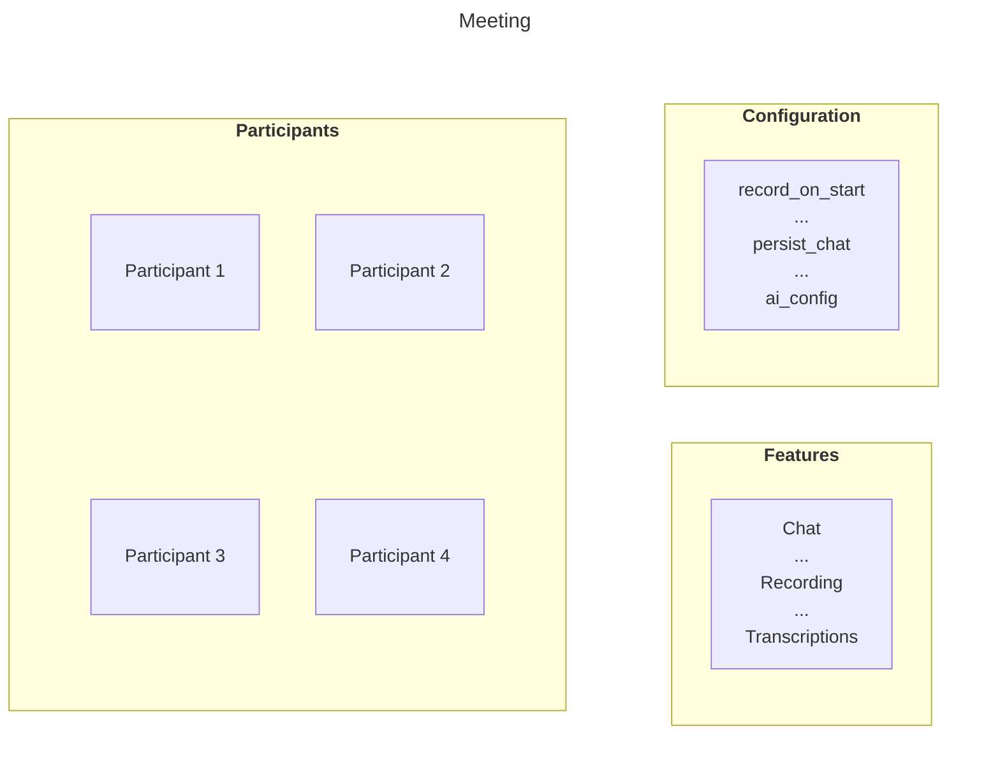

import { Details } from "~/components";

회의는**재사용 가능한 가상 룸**가입하고 상호 작용할 수 있습니다.

제목과 기능 구성을 지정할 수 있으며, 참여자에게 권한이 부여된 참가자를 추가할 수 있습니다. 회의 자체는 "시작"또는 "끝"이 아닙니다. 그것은 단지 존재합니다.

회의는 특정 날짜 또는 시간을 가지고 있지 않기 때문에, 당신은 그(것)들을 미리 창조할 수 있습니다 또는 사용자가 가입할 필요가 있을 때 그(것)들을 다만 시간 창조하.

다음 다이어그램은 회의의 청사진을 보여줍니다.



### 회사연혁

·**회사연혁**회의의 라이브 인스턴스입니다. 첫 번째 참가자가 회의에 참여하고 마지막 참가자 잎 후 곧 종료 될 때 자동으로 시작됩니다.
세션은 부모 회의에서 모든 설정을 상속합니다.

회의가 지속되기 때문에 여러 세션이 있습니다.

예제 -**주간 대기 행사로 회의를 생각하십시오.**

회의는 시스템에 존재하는 영구적 인 "standup event"입니다.

매주 참가자가 이번 주에 참가할 때**새로운 세션**이 세션은 이번 주에 실제 생방송을 나타냅니다.

> **이름 \***: 이 구분은 청구에 중요합니다. 활동 세션 기간 동안 단 1분 만에 부과됩니다.

세션의 세부 정보를 얻을 수 있습니다.[RealtimeKit 대시보드](https://dash.cloudflare.com/?to=/:account/realtime/kit)또는 사용[세션 API](/api/resources/realtime_kit/subresources/sessions/)끝점.


### 세션 용어

#### 대기실

·**대기실**참가자는 즉시 라이브 세션을 입력하지 않고 회의에 참여합니다. 이것은 호스트 전체 제어를 제공합니다**에 도착**, **그들이 들어가는 때**·**회의 흐름이 관리되는 방법**.

호스트는 사용자가 대기실에서 회의로 이동하는 방법에 대한 특정 행동을 구성 할 수 있습니다.

- **로그인**참가자는 호스트 또는 다른 공인 사용자까지 대기실에 머무를 수 있습니다. 높게 통제되는 개인적인 회의를 위한 이상.

- **권한이 있는 사용자가 참여할 때**참가자는 대기실에서 처음에 남아 있지만 호스트 또는 기타 특권 사용자가 회의를 입력하면 자동으로 인정됩니다. 참석자가 모더레이터가 현재 이후에만 참여해야 할 예정된 행사에 유용합니다.

- **대기실로 사용자를**호스트는 대기 사용자 목록을 볼 수 있으며 개별적으로 또는 대량으로 인정하거나 제거 할 수 있습니다. 이 모드는 최대 가시성 및 제어를 제공합니다.

이 옵션은 액세스가 관리되는 방법을 맞춤화 할 수 있습니다. 엄격한 입학 통제가 필요하거나 호스트가 도착하거나 둘 다의 조합을 한 번 부드럽게 흐릅니다.

#### 기본 정보

회의는 구성될 수 있습니다**가상 스테이지**, 당신은 높은 출석 세션 동안 오디오 및 비디오와 적극적으로 참여하는 데 도움이.

참가자가 될 때**무대에서**, 그들은 그리드에서 볼 수 있으며 그들은 회의에서 모든 사람에게 오디오 및 비디오를 게시 할 수 있습니다. 참가자는**무대에서**미디어를 게시 할 수 없습니다, 하지만 그들은 여전히 완전히 같은 기능을 통해 참여할 수 있습니다**이름 \***, **계정 만들기**, **사이트맵**·**플러그인**- 라이브 비디오 레이아웃을 압도하지 않고 상호 작용하는 경험.

참가자는 또한 할 수 있습니다**단계에 가입**, 그들이 말하는 것 또는 현재 할 때 신호를 허용. 주인은 모든 시간에 가득 차있는 통제를 유지합니다: 그들은 할 수 있습니다**approve 또는 deny 요청**또는 직접**무대에서 참가자를 초대하거나 제거**자주 묻는 질문

이 설정은 웨비나, 도시 홀, AMA 및 기타 구조 이벤트에 이상적입니다. 사용자의 하위 세트 만 관객과의 참여하면서 방송되어야합니다.

#### 연결 회의

Connected Meetings는 연결된 미팅 공간을 만들 수 있도록, 참가자들은 세션 중에 전환할 수 있습니다. 이 워크샵, 교실, 병렬 토론 또는 메인 회의가 함께 돌아 가기 전에 작은 그룹으로 나뉩니다.

참가자가 다음의 권한을 사용하여 연결된 공간 사이에 이동하는 방법을 제어 할 수 있습니다.

- **가득 차있는 접근:**&#xCC38;가자가 생성, 업데이트 및 연결 회의를 삭제할 수 있습니다.
- **스위치 연결 회의:**&#xCC38;여자는 가능한 연결 (아이들) 회의 사이에 자유롭게 이동합니다.
- **부모 회의로 전환:**&#xCC38;가자는 언제든지 메인 (parent) 회의로 돌아갈 수 있습니다.

### 회의 만들기

RealtimeKit 회의를 만들고 관리하며, 일반적으로 백엔드에서[회의 API](/api/resources/realtime_kit/subresources/meetings/). 만들기
회의는, 보냅니다`POST`요청하기[회사연혁](/api/resources/realtime_kit/subresources/meetings/methods/create/)끝점.

<Details header="API 필수">
  이 API 요청에 대한 다음 값이 있는지 확인하십시오.

  - Cloudflare`ACCOUNT_ID`
  - 실시간Kit`APP_ID`
  - 내 계정`CLOUDFLARE_API_TOKEN`(실행 권한)

  아직 없다면, 참조[시작하기](/realtime/realtimekit/quickstart/)관련 기사
</Details>

```bash
curl https://api.cloudflare.com/client/v4/accounts/{ACCOUNT_ID}/realtime/kit/{APP_ID}/meetings \
  --request POST \
  --header "Authorization: Bearer <CLOUDFLARE_API_TOKEN>" \
  --header "Content-Type: application/json" \
  --data '{
    "title": "My First Cloudflare RealtimeKit meeting"
    }'
```

성공적인 응답은 독특한`id`창조적인 회의를 위해. 이 특정 회의에서 모든 미래 작업에 필요한대로이 ID를 저장하십시오.
참가자 추가 또는 비활성화.

모든 사용 가능한 구성 매개 변수의 전체 목록은 참조[미팅 API 만들기](/api/resources/realtime_kit/subresources/meetings/methods/create/).

### 오시는 길

회의 및 세션에 대한 학습 후 다음 단계를 탐험 할 수 있습니다.

- 설정하기[옵션 정보](/realtime/realtimekit/concepts/preset/)앱에 대한 - 기본 권한, 미디어 설정 및 회의에서 생성 된 모든 세션에 대한 행동을 설정합니다.
- 더 보기[회사 소개](/realtime/realtimekit/concepts/participant/)회의에 - 가입 할 수있는 관리, 그들의 역할, 그리고 액세스 제어 그들은 상속.
- 시작하기[RealtimeKit SDK는](/realtime/realtimekit/quickstart/)– RealtimeKit을 웹 또는 모바일 앱으로 통합하여 몇 줄의 코드가 있습니다.
