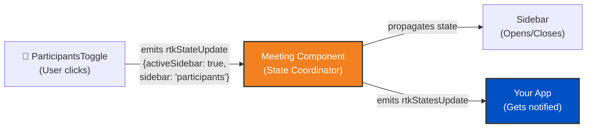

import RTKSDKSelector from "~/components/realtimekit/RTKSDKSelector/RTKSDKSelector.astro";
import RTKCodeSnippet from "~/components/realtimekit/RTKCodeSnippet/RTKCodeSnippet.astro";

## 자주 묻는 질문

이 페이지는[Basic 구현 가이드](/realtime/realtimekit/ui-kit). 먼저 읽을 수 있습니다.

이 페이지의 코드 예제는 이미 필요한 패키지를 수입하고 SDK를 초기화했습니다.

<RTKSDKSelector />

## UI 키트 구성 요소 Communicate

<RTKCodeSnippet id="web-react">
  UI 키트 구성 요소는 각 다른 사람과 동기화 할 수 있기 때문에 그들은 아래에 배열되어 있기 때문에`RtkMeeting`부품. 더 보기`RtkMeeting`구성 요소는 회의 상태, 참가자 업데이트 및 기타 실시간 변경에 관해서 동기화에서 모든 구성 요소를 보장하는 중앙 코디네이터 역할을합니다.
</RTKCodeSnippet>

<RTKCodeSnippet id="web-web-components">
  UI 키트 구성 요소는 각 다른 사람과 동기화 할 수 있기 때문에 그들은 아래에 배열되어 있기 때문에`rtk-meeting`부품. 더 보기`rtk-meeting`구성 요소는 회의 상태, 참가자 업데이트 및 기타 실시간 변경에 관해서 동기화에서 모든 구성 요소를 보장하는 중앙 코디네이터 역할을합니다.
</RTKCodeSnippet>

<RTKCodeSnippet id="web-angular">
  UI 키트 구성 요소는 각 다른 사람과 동기화 할 수 있기 때문에 그들은 아래에 배열되어 있기 때문에`rtk-meeting`부품. 더 보기`rtk-meeting`구성 요소는 회의 상태, 참가자 업데이트 및 기타 실시간 변경에 관해서 동기화에서 모든 구성 요소를 보장하는 중앙 코디네이터 역할을합니다.
</RTKCodeSnippet>

다음은 참가자 사이드바를 열 때 state 동기화 작업의 예입니다.



## 국가 흐름

1. **Child 부품은 상태 업데이트**: UI 컴포넌트가 state를 업데이트해야 할 때 state 업데이트 이벤트를 방출합니다.
2. **회의 구성 요소 듣기 및 좌표**: 회의 구성 요소는 아이들의 모든 상태 업데이트 이벤트를 듣고
3. **국가 전파**: 회의 구성 요소는 동기화 된 모든 다른 어린이 구성 요소에 업데이트 된 상태를 전파
4. **외부 알림**: 회의 구성 요소도 방출`rtkStatesUpdate`응용 프로그램은 사용자 정의 UI를 업데이트하거나 상태 변경에 따라 작업을 수행 할 수 있습니다

## State 업데이트

UXPA(사용자경험전문가협회)는 제품 및 서비스 UX를 리서치, 디자인, 평가하는 인력을 지원한다.`rtkStatesUpdate`회의 구성 요소에 의해 방출 된 이벤트. 이 이벤트는 활성 스피커, 참가자 목록, 기록 상태 등을 포함하여 회의의 현재 상태에 당신을 제공합니다.

:::참조
React와 같은 상태 관리 해결책에 있는 국가를 저장하십시오`useState`또는 일반 JavaScript 객체)는 회의 상태 변경에 따라 UI를 변경합니다.
주요 특징

## 예제 코드

<RTKCodeSnippet id="web-react">
  React를 위해, 당신은 사용할 수 있습니다`onRtkStatesUpdate`광고하기`RtkMeeting`상태 업데이트를 듣는 구성 요소.

  ```jsx
  import {
  	RealtimeKitProvider,
  	useRealtimeKitClient,
  } from "@cloudflare/realtimekit-react";
  import { RtkMeeting } from "@cloudflare/realtimekit-react-ui";
  import { useEffect, useState } from "react";

  function App() {
  	const [meeting, initMeeting] = useRealtimeKitClient();
  	const [authToken, setAuthToken] = useState("<participant_auth_token>");
  	const [states, setStates] = useState({});

  	useEffect(() => {
  		if (authToken) {
  			initMeeting({
  				authToken: authToken,
  			});
  		}
  	}, [authToken]);

  	return (
  		<RealtimeKitProvider value={meeting}>
  			<RtkMeeting
  				showSetupScreen={true}
  				meeting={meeting}
  				onRtkStatesUpdate={(e) => {
  					//rtk-meeting이 state 업데이트를 방출 할 때 업데이트 상태
  					setStates(e.detail);

  					//예제: 다양한 상태 속성 접근
  					console.log("Meeting state:", e.detail.meeting); //'idle', 'setup', 'joined', 'ended', 'waiting'
  					console.log("Is sidebar active:", e.detail.activeSidebar);
  					console.log("Current sidebar section:", e.detail.sidebar);
  					console.log("Is screen sharing:", e.detail.activeScreenShare);
  				}}
  			/>

  			{/*사용자 정의 UI 구축*/}
  			<div className="custom-ui">
  				<p>Meeting State: {states.meeting}</p>
  				<p>Sidebar Open: {states.activeSidebar ? "Yes" : "No"}</p>
  			</div>
  		</RealtimeKitProvider>
  	);
  }
  ```

  ### 대안: Refs 사용 (다중 회의)

  동일한 페이지 또는 뒷면 회의에서 여러 회의와 경험을 구축하면 refs를 사용하여 다른 회의 인스턴스 사이의 국가 충돌을 방지하는 것이 좋습니다.

  ```jsx
  import {
  	RealtimeKitProvider,
  	useRealtimeKitClient,
  } from "@cloudflare/realtimekit-react";
  import { RtkMeeting } from "@cloudflare/realtimekit-react-ui";
  import { useEffect, useState, useRef } from "react";

  function App() {
  	const [meeting, initMeeting] = useRealtimeKitClient();
  	const [authToken, setAuthToken] = useState("<participant_auth_token>");
  	const [states, setStates] = useState({});
  	const meetingRef = useRef(null);

  	useEffect(() => {
  		if (authToken) {
  			initMeeting({
  				authToken: authToken,
  			});
  		}
  	}, [authToken]);

  	useEffect(() => {
  		if (!meetingRef.current) return;

  		const handleStatesUpdate = (e) => {
  			setStates(e.detail);
  			console.log("Meeting state:", e.detail.meeting);
  			console.log("Is sidebar active:", e.detail.activeSidebar);
  		};

  		//ref를 통해 이벤트 청취자 추가
  		meetingRef.current.addEventListener("rtkStatesUpdate", handleStatesUpdate);

  		//구성 요소가없는 경우 Cleanup 청취자 또는 회의 변경
  		return () => {
  			meetingRef.current?.removeEventListener(
  				"rtkStatesUpdate",
  				handleStatesUpdate,
  			);
  		};
  	}, [meetingRef.current]);

  	return (
  		<RealtimeKitProvider value={meeting}>
  			<RtkMeeting ref={meetingRef} showSetupScreen={true} meeting={meeting} />

  			{/*사용자 정의 UI 구축*/}
  			<div className="custom-ui">
  				<p>Meeting State: {states.meeting}</p>
  				<p>Sidebar Open: {states.activeSidebar ? "Yes" : "No"}</p>
  			</div>
  		</RealtimeKitProvider>
  	);
  }
  ```

  :::참조
  event listeners와 ref를 사용하여 여러 가지 처리시 더 나은 제어 및 고립을 제공합니다.`RtkMeeting`예제. 이 접근법은 한 회의의 상태 업데이트가 다시 돌아 가기 회의 또는 멀티 회의 인터페이스에 중요하지 않습니다.
  주요 특징
</RTKCodeSnippet>

<RTKCodeSnippet id="web-web-components">
  웹 구성 요소의 경우, 이벤트 리스너를 추가해야합니다.`rtk-meeting`관련 기사`rtkStatesUpdate`이벤트.

  ```html
  <body>
  	<rtk-meeting id="meeting-component"></rtk-meeting>
  </body>
  <script type="module">
  	import RealtimeKitClient from "https://cdn.jsdelivr.net/npm/@cloudflare/realtimekit@latest/dist/index.es.js";

  	const meeting = await RealtimeKitClient.init({
  		authToken: "<participant_auth_token>",
  	});

  	// Add <rtk-meeting id="meeting-component" /> to your HTML, otherwise you will get error
  	const meetingComponent = document.querySelector("#meeting-component");

  	// Listen for state updates from rtk-meeting
  	meetingComponent.addEventListener("rtkStatesUpdate", (event) => {
  		console.log("RTK states updated:", event.detail);

  		// Store states to update your custom UI
  		const states = event.detail;

  		// Example: Access various state properties
  		console.log("Meeting state:", states.meeting); // 'idle', 'setup', 'joined', 'ended', 'waiting'
  		console.log("Is sidebar active:", states.activeSidebar);
  		console.log("Current sidebar section:", states.sidebar); // 'chat', 'participants', 'polls', etc.
  		console.log("Is screen sharing:", states.activeScreenShare);

  		// Update your custom UI based on states
  		// For example: Show/hide elements based on meeting state
  		if (states.meeting === "joined") {
  			// Show meeting controls
  		}
  	});

  	meetingComponent.showSetupScreen = true;
  	meetingComponent.meeting = meeting;
  </script>
  ```
</RTKCodeSnippet>

<RTKCodeSnippet id="web-angular">
  Angular를 위해, 당신은 이벤트 청취자를 추가해야합니다`rtk-meeting`관련 기사`rtkStatesUpdate`이벤트.

  ```typescript title="meeting.component.ts"
  import {
  	Component,
  	ElementRef,
  	OnInit,
  	OnDestroy,
  	ViewChild,
  } from "@angular/core";

  @Component({
  	selector: "app-meeting",
  	template: `
  		<rtk-meeting #meetingComponent id="meeting-component"></rtk-meeting>

  		<!-- Use states to build custom UI -->
  		<div class="custom-ui" *ngIf="states">
  			<p>Meeting State: {{ states.meeting }}</p>
  			<p>Sidebar Open: {{ states.activeSidebar ? "Yes" : "No" }}</p>
  			<div *ngIf="states.meeting === 'joined'" class="meeting-controls">
  				<!-- Show meeting controls when joined -->
  				<p>Meeting controls would go here</p>
  			</div>
  		</div>
  	`,
  	styleUrls: ["./meeting.component.css"],
  })
  export class MeetingComponent implements OnInit, OnDestroy {
  	@ViewChild("meetingComponent", { static: true }) meetingElement!: ElementRef;

  	meeting: any;
  	states: any = {};
  	private authToken = "<participant_auth_token>";
  	private stateUpdateListener?: (event: any) => void;

  	async ngOnInit() {
  		//RealtimeKit 클라이언트를 동적으로 가져 오기
  		const RealtimeKitClient = await import(
  			"https://cdn.jsdelivr.net/npm/@cloudflare/realtimekit@latest/dist/index.es.js"
  		);

  		//회의를 초기화
  		this.meeting = await RealtimeKitClient.default.init({
  			authToken: this.authToken,
  		});

  		//회의 구성 요소 설정
  		const meetingComponent = this.meetingElement.nativeElement;

  		//이벤트 리스너 만들기
  		this.stateUpdateListener = (event: any) => {
  			console.log("RTK states updated:", event.detail);

  			//사용자 정의 UI 업데이트
  			this.states = event.detail;

  			//예제: 다양한 상태 속성 접근
  			console.log("Meeting state:", this.states.meeting); //'idle', 'setup', 'joined', 'ended', 'waiting'
  			console.log("Is sidebar active:", this.states.activeSidebar);
  			console.log("Current sidebar section:", this.states.sidebar); //'chat', 'participants', 'polls' 등
  			console.log("Is screen sharing:", this.states.activeScreenShare);

  			//상태에 따라 사용자 정의 UI 업데이트
  			//예를 들면: 회의 상태에 근거를 둔 Show/hide 성분
  			if (this.states.meeting === "joined") {
  				//회의 제어 표시
  				console.log("Meeting joined - showing controls");
  			}
  		};

  		//rtk-meeting의 상태 업데이트 듣기
  		meetingComponent.addEventListener(
  			"rtkStatesUpdate",
  			this.stateUpdateListener,
  		);

  		//회의 구성
  		meetingComponent.showSetupScreen = true;
  		meetingComponent.meeting = this.meeting;
  	}

  	ngOnDestroy() {
  		//구성 요소가 파괴 될 때 정리 이벤트 청취
  		if (this.stateUpdateListener && this.meetingElement) {
  			this.meetingElement.nativeElement.removeEventListener(
  				"rtkStatesUpdate",
  				this.stateUpdateListener,
  			);
  		}
  	}
  }
  ```
</RTKCodeSnippet>

## 국가 속성

더 보기`rtkStatesUpdate`이벤트는 UI Kit의 내부 상태에 대한 자세한 정보를 제공합니다. 주요 속성:

- **`meeting`**: 현재 회의 상태 -`'idle'`, `'setup'`, `'joined'`, `'ended'`, 또는`'waiting'`
- **`activeSidebar`**: 사이드바가 현재 열려있을지 여부 (boolean)
- **`sidebar`**: 현재 sidebar 섹션 -`'chat'`, `'participants'`, `'polls'`, `'plugins'`등
- **`activeScreenShare`**: 화면 공유 UI가 활성화되는지 여부 (boolean)
- **`activeMoreMenu`**: 더 많은 메뉴가 열려 있는지 (불린)
- **`activeSettings`**: 설정 패널이 열지 여부 (boolean)
- **`viewType`**: 현재 비디오 그리드보기 유형 (string)
- **`prefs`**: 사용자 preferences 객체 (예 :`mirrorVideo`, `muteNotificationSounds`)
- **`roomLeftState`**: 방을 떠날 때 국가
- **`activeOverlayModal`**: Active overlay modal 구성 객체
- **`activeConfirmationModal`**: Active 확인 modal 구성 객체
- **그리고 더 많은 UI 국가 재산**

:::참조
현재 위치**UI 키트 내부 상태**인터페이스 관리 참가자, 적극적인 스피커 또는 녹음 상태와 같은 미팅 데이터를 위해[Core SDK의 미팅 객체](/realtime/realtimekit/core/meeting-object-explained/)직접.
주요 특징

## 최고의 연습

- **저장 상태 적절하게**: React의 사용`useState`React 앱을 위한 Hook 또는 state 관리 라이브러리(Zustand 또는 Redux와 같은). vanilla JavaScript를 위해, 민감하는 국가 관리 해결책 또는 간단한 목표 저장을 사용하십시오.
- **과도한 재 렌더링을 피하십시오**: 필요한 경우 UI 만 업데이트됩니다. React에서 사용 고려`useMemo`또는`useCallback`성능 최적화.
- **Access Nested 속성은 안전하게**: 해당 속성에 접근하기 전에 항상 체크 (예를 들어,`states.sidebar`, `states.prefs?.mirrorVideo`).
- **상태 렌더링에 대한 사용 상태**: UI 상태를 show/hide UI 엘리먼트로 레버리지하거나 인터페이스 변경(예: 사용자 지정 지표를 표시할 때`states.activeScreenShare`사실).
- **차이를 이해**: `rtkStatesUpdate`제품정보**UI 키트 내부 상태**인터페이스 관리. 회의 데이터(participants, active speaker, recording status)를 위해 Core SDK를 사용합니다.`meeting`객체와 그 이벤트는 직접.
