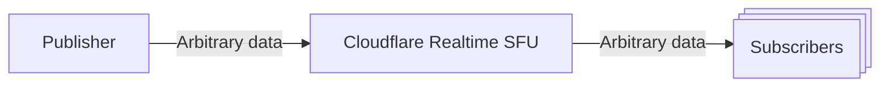

DataChannels는 낮은 대기 시간에서 클라이언트 사이에서 오디오 또는 비디오 데이터를 보낼 수있는 방법입니다. DataChannels는 채팅, 게임 상태, 또는 오디오 또는 비디오로 인코딩 할 필요가없는 다른 데이터와 같은 시나리오에 유용하지만 여전히 실시간 클라이언트 사이에 보내야합니다.

DataChannels를 통해 오디오 및 비디오를 보낼 수 있지만 오디오 및 비디오 전송이 DataChannels가없는 미디어 특정 최적화를 포함하기 때문에 최적입니다. simulcast, forward error Correction, retransmissions에 대한 Cloudflare 네트워크에서 더 나은 캐싱.

Cloudflare에 데이터채널 Realtime은 게시자 당 많은 가입자에게 확장 할 수 있으며 게시자 당 구독자 수에 제한이 없습니다.

### DataChannels를 사용하는 방법

1. 2 Realtime 세션을 생성, 게시자 및 가입자에 대한 하나.
2. DataChannel 을 작성하여 /datachannels/new 를 "local" 로 설정하고 dataChannel DataChannel의 이름으로 설정된 이름.
3. /datachannels/new 를 호출하여 DataChannel 을 작성하여 위치 설정 "remote"및 sessionId 의 sessionId 의 게시자.
4. DataChannel을 사용하여 게시자로부터 구독자에게 데이터를 보낼 수 있습니다.

### Unidirectional 데이터채널

Cloudflare 실시간 SFU DataChannels는 하나의 방법입니다. 이것은 게시자에서 구독자에게만 데이터를 보낼 수 있다는 것을 의미합니다. 구독자는 게시자에게 데이터를 다시 보낼 수 없습니다. 일반 MediaStream WebRTC DataChannels는 양방향이지만, 이것은 CloudflareXQXQ에 대한 문제를 소개합니다 SFU가 데이터 백업을 보낼 세션이 없다는 것을 알고 있기 때문에 Realtime. 이 시나리오에 대한 특히 문제가 있습니다. 여러 가입자와 당신은 멀티 플레이어 게임에서 모든 플레이어에게 게임 점수 업데이트를 배포와 같은 게시자에서 모든 가입자에 데이터를 보내려면.

양방향 방식으로 데이터를 보내려면 두 개의 DataChannels를 사용할 수 있으며, 게시자로부터 구독자에게 데이터를 보내고 반대 방향으로 데이터를 전송할 수 있습니다.

## 이름 \*

작업의 DataChannels의 예는 에서 찾을 수 있습니다[실시간 예제 github repo](https://github.com/cloudflare/calls-examples/tree/main/echo-datachannels).
