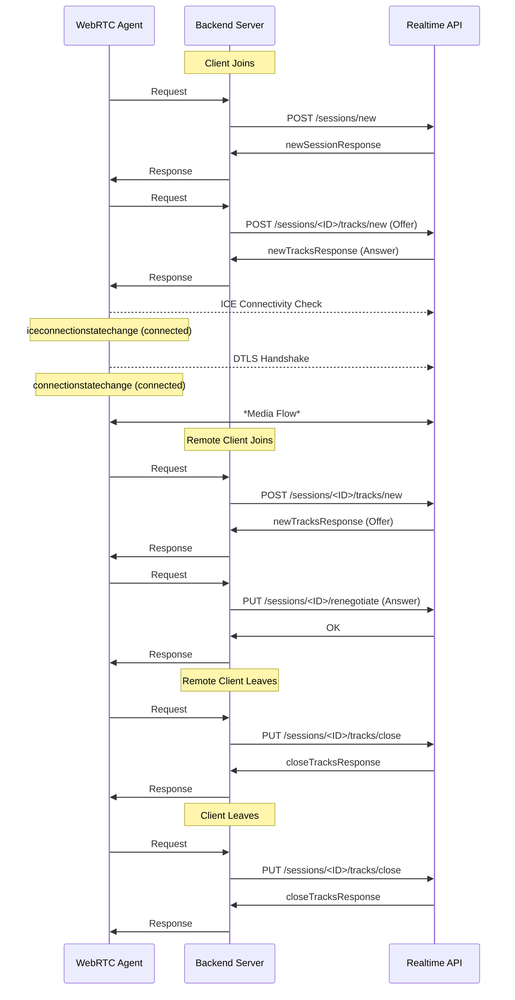

Cloudflare Realtime은 HTTPS API 엔드포인트를 통해 피어 연결 및 미디어 트랙의 관리를 단순화합니다. 이 엔드포인트는 개발자가 세션을 효율적으로 관리하고, 트랙을 추가하거나 제거하고 세션 정보를 수집합니다.

## API 엔드포인트

- **새 세션 만들기**: Cloudflare의 새로운 세션 시작 아래에 다른 endpoints로 변경할 수 있는 Realtime.
  - `POST /apps/{appId}/sessions/new`
- **새로운 트랙 추가**: 기존 세션에 미디어 트랙 (audio 또는 비디오) 추가.
  - `POST /apps/{appId}/sessions/{sessionId}/tracks/new`
- **세션 Renegotiate**: 세션의 협상 상태를 업데이트하여 새로운 트랙을 수용하거나 기존에 변경할 수 있습니다.
  - `PUT /apps/{appId}/sessions/{sessionId}/renegotiate`
- **자주 묻는 질문**: 세션에서 지정된 트랙을 제거한다.
  - `PUT /apps/{appId}/sessions/{sessionId}/tracks/close`
- **검색 세션 정보**: 특정 세션에 대한 자세한 정보
  - `GET /apps/{appId}/sessions/{sessionId}`

[전체 API 및 스키마 보기 (OpenAPI 형식)](/realtime/static/calls-api-2024-05-21.yaml)

## 취급 비밀

App ID 및 비밀을 안전하게 관리하는 것이 중요합니다. 트랙 및 세션 ID가 공개 될 수 있지만, 잘못을 방지하기 위해 보호해야합니다. 공격자는 귀하의 백엔드 서버가 제대로 인증되지 않는 경우 이러한 ID를 방해 할 수 있습니다, 예를 들어, 요청을 전송하여 자신의 세션에 대한 트랙을 닫을 수 있습니다. 귀하의 백엔드 서버에 요청의 보안 및 인증은 애플리케이션의 무결성을 유지하기위한 것이 중요합니다.

## STUN 및 TURN 서버 사용

Cloudflare Realtime은 Cloudflare로 대부분의 시나리오에서 TURN 서버의 필요 없이 효율적으로 작동하도록 설계되었습니다. Realtime의 공공 IP 주소를 노출합니다. 그러나 STUN 서버를 통합하면 피어 발견과 연결성을 촉진 할 수 있습니다.

- **Cloudflare STUN 서버**: `stun.cloudflare.com:3478`

Cloudflare의 STUN 서버가 실시간 애플리케이션에 대한 연결 프로세스를 도울 수 있습니다.

## 간단한 세션의 수명주기

이 섹션은 오디오 전용 응용 분야에 초점을 맞추고 간단한 세션의 전형적인 수명주기의 overview를 제공합니다. 클라이언트가 백엔드 서버에서 새로운 원격 클라이언트가 참여하거나 떠나기로 통보하는 방법을 설명합니다. 비디오 통합은 추가 트랙 및 고려사항을 세션에 소개할 것입니다.

