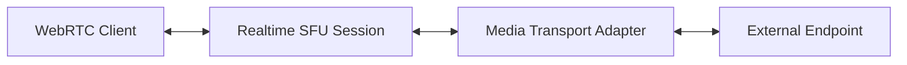

import { Render } from "~/components";

매체 수송 접합기 교량 WebRTC와 다른 수송 의정서. 어댑터 처리 프로토콜 변환, 코덱 트랜스 코딩 및 WebRTC 세션과 외부 엔드포인트 사이의 양방향 미디어 흐름.

## 어떤 어댑터가

어댑터는 WebRTC-to-WebRTC 통신을 넘어 실시간 확장:

- 외부 소스에서 WebRTC 세션으로 오디오/비디오
- WebRTC 미디어를 처리 또는 저장을 위한 외부 시스템에 스트리밍
- transcription, Translation, 또는 세대를위한 AI 서비스 통합
- Bridge WebRTC 애플리케이션과 레거시 통신 시스템

## 유효한 접합기

### WebSocket 어댑터 (베타)

WebRTC 트랙과 WebSocket 엔드포인트 사이 오디오 및 비디오 스트리밍. 비디오는 egress-only이며 JPEG로 변환됩니다. 현재 베타; API 변경할 수 있습니다.

[더 알아보기](/realtime/sfu/media-transport-adapters/websocket-adapter/)

## 회사연혁

매체 수송 접합기는 Cloudflare 사이 중간으로 작동합니다 실시간 SFU 세션 및 외부 엔드포인트:



### 주요 개념

**어댑터 인스턴스**: 각 연결은 고유한 인스턴스를 만듭니다.`adapterId`Lifecycle을 관리합니다.

**위치 유형**:

- `local`(Ingest): 외부 엔드포인트에서 미디어를 수신하여 새로운 WebRTC 트랙을 만들 수 있습니다.
- `remote`(Stream): 기존 WebRTC 트랙에서 외부 엔드포인트로 미디어 전송

**Codec 지원**: 어댑터는 WebRTC와 외부 시스템 포맷으로 변환합니다.

## 일반적인 사용 사례

### AI 처리

- Speech-to-text 구독
- Text-to-speech 생성
- 실시간 번역
- 오디오 향상

### 미디어 녹음

- 클라우드 녹음
- Content Delivery 네트워크
- 미디어 처리 파이프라인

### Legacy 통합

- 전통 telephony
- 방송 인프라
- 사용자 정의 미디어 서버

## API overview

미디어 전송 어댑터는 Realtime SFU API를 통해 관리됩니다.

```
POST /v1/apps/{appId}/adapters/{adapterType}/new
POST /v1/apps/{appId}/adapters/{adapterType}/close
```

각 접합기 유형에는 특정한 윤곽 필요조건 및 기능이 있습니다. 상세한 API 명세를 위한 개별 접합기 문서에 Refer.

## 좋은 관행

- 더 이상 필요로 할 때 닫기 어댑터 인스턴스
- 네트워크 실패에 대한 재연결 논리 구현
- 대역폭 및 품질 요구 사항에 따라 코덱 선택
- 민감한 미디어에 대한 인증 보안 엔드포인트

## 제한 사항

- 각 접합기 유형에는 특정한 코덱 및 체재 지원이 있습니다
- CloudflareXQ 가장자리와 외부 엔드포인트 사이의 네트워크 지연은 실시간 성능에 영향을 미칩니다.
- 최대 메시지 크기 및 스트리밍 모드는 어댑터 유형에 따라 다릅니다.

## 시작하기

[WebSocket 어댑터 (베타)](/realtime/sfu/media-transport-adapters/websocket-adapter/)- WebRTC와 WebSocket endpoints 사이의 오디오 및 비디오 스트리밍 (JPEG로 비디오 egress)
