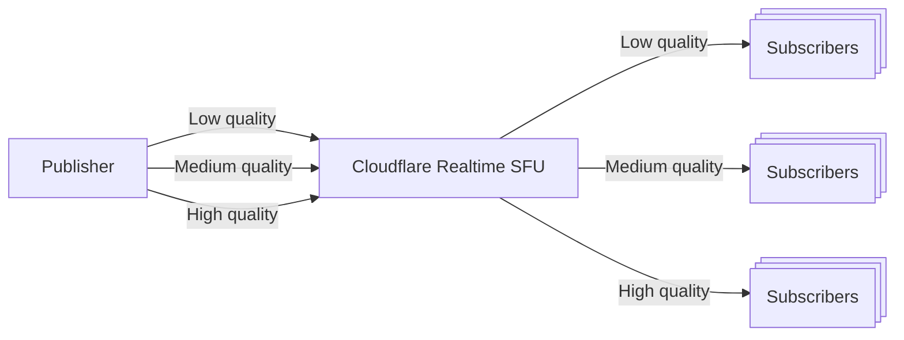

Simulcast는 게시자를 허용하는 WebRTC의 기능으로 다른 품질의 여러 비디오 스트림을 보낼 수 있습니다. 예를 들어, 데스크톱 사용자 및 모바일 사용자의 낮은 품질 스트림을 보낼 수있는 시나리오에 유용합니다.



### 어떻게 작동합니까?

WebRTC의 Simulcast는 카메라 또는 스크린 공유와 같은 단일 비디오 소스를 허용하여 여러 품질 수준에서 인코딩되고 동시에 전송됩니다. 이는 다양한 네트워크 조건 및 장치 기능으로 가입자에게 유리합니다. 비디오 소스는 여러 스트림으로 인코딩되며 RID (RTP Stream Identifiers)가 낮은 중간 및 높은 수준과 같은 다양한 품질 수준으로 식별됩니다. 이 simulcast 스트림은 SDP에 설명되어있어 Cloudflare Realtime SFU로 보내집니다. Cloudflare Realtime SFU의 책임은 해당 네트워크 조건 및 장치 기능에 따라 각 가입자에게 적합한 품질 스트림이 전달되도록 합니다.

Cloudflare Realtime SFU는 자동으로 SDP에 기반한 simulcast 구성을 처리하여 게시자로부터 전송합니다. SFU는 구독자의 네트워크 조건을 기반으로 다른 품질 수준 사이를 자동으로 전환합니다. 또는 품질 수준은 API를 통해 수동으로 제어 할 수 있습니다. 품질 전환 행동을 제어 할 수 있습니다.`simulcast`원격 트랙을 끌어 시작하려면 API 호출을 보낼 때 구성 객체.

### 품질 관리

더 보기`simulcast`원격 트랙을 끌어 시작할 때 API 호출의 구성 객체는 지정할 수 있습니다.

- `preferredRid`: 비디오 스트림의 선호 품질 수준 (RID for the simulcast stream.[RIDs는 발행인에 의해 지정될 수 있습니다.](https://developer.mozilla.org/en-US/docs/Web/API/RTCRtpSender/setParameters#encodings))
- `priorityOrdering`: SFU가 대역폭 제약을 처리하는 방법을 제어합니다.
  - `none`: 선호하는 층을 보내려면, 선호하는 Rid를 통해 설정, 심지어 충분한 대역폭이 없습니다.
  - `asciibetical`: 알파벳순 주문 (a-z)을 사용하여 우선순위를 결정합니다. 'a'는 가장 바람직하고 'z'는 적어도 바람직합니다.
- `ridNotAvailable`: RID가 더 이상 사용할 수 없을 때 어떤 일이 일어나는지 제어합니다. 예를 들어 게시자가 전송을 중지합니다.

  - `none`: 아무것도 없다.
  - `asciibetical`: 'a'가 가장 바람직하고 'z'가 적어도 바람직하다는 것을 우선순위 주문에 따라 다음 사용 가능한 RID로 전환하십시오.

  원하는 메트릭을 기반으로 한 asciibetical RIDs를 주문할 수 있습니다. 가장 낮은 대역폭 또는 가장 낮은 대역폭과 같은 가장 높은 대역폭.

### 미디어 트랙의 대역폭 관리

Cloudflare Realtime은 모든 미디어 트랙을 운송 수준에 동일하게 취급합니다. 예를 들어, 여러 비디오 트랙이있는 경우 (카메라, 스크린 공유 등), 그들은 모두 대역폭 할당에 대한 동등한 우선권을 가지고 있습니다. 이 수단:

1. 각 궤도의 simulcast 윤곽은 자주적으로 취급됩니다
2. SFU는 각 궤도를 위해 자주적으로 네트워크 상태에 근거를 둔 자동적인 대역폭 추정 및 층 엇바꾸기를 실행합니다

### 층 전환 Behavior

레이어 스위치가 요청되면 (업데이트를 통해)`preferredRid`)와`/tracks/update`API:

1. SFU는 전체 Intraframe Request (FIR)를 자동으로 생성합니다.
2. PLI 발생은 과도한 요청을 방지하기 위해 debounced

### 게시자 구성

게시자 (현지 트랙)의 경우 SDP의 simulcast 속성을 포함해야합니다. SFU는 자동으로 SDP를 기반으로 시뮬레이션 구성을 처리합니다. 예를 들어, SDP는 다음과 같은 섹션을 포함해야합니다.

```txt
a=simulcast:send f;h;q
a=rid:f send
a=rid:h send
a=rid:q send
```

게시자 엔드포인트가 브라우저에 있는 경우 지정하여 이를 포함할 수 있습니다.`sendEncodings`이 같은 트랜시버를 만들 때:

```js
const transceiver = peerConnection.addTransceiver(track, {
	direction: "sendonly",
	sendEncodings: [
		{ scaleResolutionDownBy: 1, rid: "f" },
		{ scaleResolutionDownBy: 2, rid: "h" },
		{ scaleResolutionDownBy: 4, rid: "q" },
	],
});
```

## 이름 \*

다음은 Cloudflare Realtime과 simulcast를 사용하는 방법의 예입니다:

1. simulcast 구성으로 새로운 로컬 트랙을 만듭니다. SDP 섹션이 있어야 합니다.`a=simulcast:send`.
2. 사용 방법[Cloudflare 실시간 API](/realtime/sfu/https-api)/tracks/new endpoint를 호출하여이 로컬 트랙을 밀어.
3. 사용 방법[Cloudflare 실시간 API](/realtime/sfu/https-api)/tracks/new endpoint를 호출하여 원격 트랙 (다른 브라우저 또는 장치에서)을 풀기 시작합니다.`simulcast`원격 트랙 ID와 함께 구성 객체 당신은 단계 2에서 얻을.

더 많은 예제를 위해, 체크 아웃[실시간 예제 GitHub 저장소](https://github.com/cloudflare/calls-examples/tree/main/echo-simulcast).
