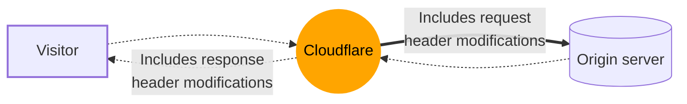

import { Render } from "~/components";

요청 헤더 Transform 규칙을 사용하여 HTTP 요청의 헤더를 원래 서버로 전송합니다.

 

HTTP 헤더를 수정하려면**이름 \***&#xC6F9; 사이트 방문자에게 전송, 참조[응답 헤더 Transform 규칙](/rules/transform/response-header-modification/).

요청 헤더 Transform을 통해 당신이 할 수있는 규칙 :

- HTTP 요청 헤더의 값을 리터 문자열 값으로 설정하거나 이전 값을 초과하거나 요청에 새로운 헤더를 추가합니다.
- 표현에 따라 HTTP 요청 헤더의 값을 설정하고 이전 값을 초과하거나 요청에 새로운 헤더를 추가합니다.
- 요청에서 HTTP 헤더를 제거하십시오.

요청 헤더 변형 규칙을 만들 수 있습니다.[대시보드](/rules/transform/request-header-modification/create-dashboard/), [API를 통해](/rules/transform/request-header-modification/create-api/), 또는[Terraform 사용](/terraform/additional-configurations/transform-rules/#create-a-request-header-transform-rule).

<Render file="snippets-alternative" product="rules" params={{ suffix: "request header modifications" }} />

## 중요한 말

- HTTP 요청 헤더를 수정하거나 제거할 수 없습니다.`x-cf-`또는`cf-`자주 묻는 질문`cf-connecting-ip`HTTP 요청 헤더, 제거 할 수 있습니다.

- 프로토콜 준수 이유로 인해 요청 헤더를 수정하거나 제거[forbidden 헤더 이름](https://developer.mozilla.org/en-US/docs/Glossary/Forbidden_header_name)(예 :`Accept-Encoding`) 일반적으로 Request Header Transform 규칙에 허용되지 않습니다.

- 웹 사이트 방문자의 IP 주소 또는 초기 프로토콜을 식별하는 데 사용되는 모든 헤더의 가치를 수정할 수 없습니다.`x-forwarded-for`, `true-client-ip`, `x-real-ip`, 또는`x-forwarded-proto`.

- 제거 할 수 있지만`x-forwarded-for`헤더는 Cloudflare의 캐시 서비스에 의해 다시 추가됩니다 (다른 값으로), 이 헤더는 원래 서버에 도달합니다. 제거하면`x-forwarded-for`헤더 및 요청은 Cloudflare Workers에 의해 처리됩니다.[캐시 전에 실행](/workers/reference/how-the-cache-works/)- 한국어`x-forwarded-for`요청 헤더는 absent입니다.

- 설정하거나 수정할 수 없습니다.`cookie`HTTP 요청 헤더,하지만 당신은이 헤더를 제거 할 수 있습니다. 제거하는 규칙 구성`cookie`HTTP 요청 헤더는 모두 제거됩니다.`cookie`일치하는 요청에 있는 헤더.

- 기존 HTTP 요청 헤더의 값을 수정하면 빈 문자열로 평가할 수 있습니다 (`""`) 또는 undefined 값, HTTP 요청 헤더는**이름 \***.

- HTTP 요청 헤더 제거 작업은 제공된 이름과 모든 요청 헤더를 제거합니다.

- 현재 수정할 수 없는 HTTP 요청 헤더의 제한 번호가 있습니다. Cloudflare는 유효한 사용 케이스로 선물될 때 이 HTTP 요구 우두머리의 일부를 제한을 제거할지도 모릅니다.[커뮤니티에서 게시물 만들기](https://community.cloudflare.com)견적 요청

- 이용안내[JSON Web Token 내부 청구 (JWT)](/api-shield/security/jwt-validation/transform-rules/), API ShieldXQ에서 토큰 검증 구성을 먼저 설정해야합니다.

- 요청 헤더 변환 규칙은 순서대로 실행되며, 나중에 규칙은 이전 규칙에 따라 변경을 덮을 수 있습니다.

- 요청 및 응답 필드의 값은 각 영역 내에서 immutable 입니다.[단계별](/ruleset-engine/about/phases/), 등`http_request_late_transform`요청 헤더 변형 규칙을 정의하는 단계. 이것은 나중에 요청 헤더 변형 규칙은 이전 요청 헤더 변형 규칙에 의해 수행 된 변경 사항에 따라 일치하지 않습니다. 더 알아보기[규칙 평가 중 필드 값](/ruleset-engine/about/rules/#field-values-during-rule-evaluation)더 많은 정보.

## 실행 순서

<Render file="product-execution-order" product="rules" />

<Render file="troubleshoot-rules-with-trace" product="rules" params={{ rulesFeatureName: "Request Header Transform Rules" }} />
