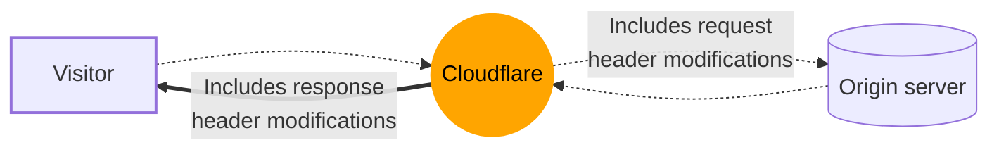

import { Render } from "~/components";

웹 사이트 방문자에게 보낸 HTTP 응답 헤더를 조작하는 응답 헤더 변환 규칙을 사용합니다.

 

HTTP 헤더를 수정하려면**이름 \***&#xB2F9;신의 Origin 서버에 전송, 참조[Header Transform 규칙 요청](/rules/transform/request-header-modification/).

응답 헤더 Transform을 통해 당신이 할 수있는 규칙 :

- HTTP 응답 헤더의 값을 리터 문자열 값으로 설정, 이전 값을 과잉하거나 존재하지 않는 경우 응답에 새로운 헤더를 추가.
- 표현에 따라 HTTP 응답 헤더의 값을 설정, 이전 값을 과잉하거나 존재하지 않는 경우 응답에 새로운 헤더를 추가.
- 기존의 헤더를 제거하지 않고 리터 문자열 값으로 새로운 HTTP 응답 헤더를 추가하십시오.
- 같은 이름으로 기존 헤더를 제거하지 않고 새로운 HTTP 응답 헤더를 추가합니다.
- 응답에서 HTTP 헤더를 제거하십시오.

응답 헤더 변형 규칙을 만들 수 있습니다.[대시보드](/rules/transform/response-header-modification/create-dashboard/), [API를 통해](/rules/transform/response-header-modification/create-api/), 또는[Terraform 사용](/terraform/additional-configurations/transform-rules/#create-a-response-header-transform-rule).

<Render file="snippets-alternative" product="rules" params={{ suffix: "response header modifications" }} />

## 중요한 말

- 응답 헤더 값은 해당 HTTP 요청에서 필드 값으로 계산됩니다. 예를 들어, 값`ip.src.country`웹 사이트 방문자의 국가가 될 것입니다, 응답이 전송 된 기원.

- HTTP 응답 헤더를 추가하거나 수정하거나 제거할 수 없습니다.`cf-`또는`x-cf-`.

- 특정 헤더의 값을 수정할 수 없습니다.`server`, `eh-cache-tag`, 또는`eh-cdn-cache-control`.

- 현재 참고 자료[IP 목록](/waf/tools/lists/custom-lists/#ip-lists)응답 헤더 변형 규칙의 표현.

- HTTP 응답 헤더 제거 작업은 제공된 이름과 모든 응답 헤더를 제거합니다.

- 빈 문자열로 평가하는 표현을 사용하여 기존 HTTP 응답 헤더의 값을 변경하는 경우 (`""`) 또는 undefined 값, HTTP 응답 헤더는**이름 \***.

- 현재 변경할 수 없는 HTTP 응답 헤더의 제한 번호가 있습니다. Cloudflare는 유효한 사용 케이스로 선물될 때 이 HTTP 응답 우두머리의 일부를 제한을 제거할지도 모릅니다.[커뮤니티에서 게시물 만들기](https://community.cloudflare.com)견적 요청

- 응답 헤더 변형 규칙은 기본적으로 Cloudflare 오류 페이지에 적용되며[사용자 정의 오류](/rules/custom-errors/).

- 수정하기`cache-control`, `CDN-Cache-Control`, 또는`Cloudflare-CDN-Cache-Control`헤더는 CloudflareXQ 캐시가 객체를 변경하지 않습니다. 대신, 당신은 만들[캐시 규칙](/cache/how-to/cache-rules/).

- 추가하기`set-cookie`응답에 우두머리, 당신이 1개를 사용하는 것을 확인합니다*static 추가*/*동적 추가*대신 작업*설정 static*/*동적 설정*. 중 하나 사용*설치하기*작업이 제거됩니다`set-cookie`Bot 관리와 같은 다른 Cloudflare 제품에 의해 추가된 사람들을 포함하여 응답에서 머리가 이미.

- 응답 헤더 변형 규칙은 순서대로 실행되며, 나중에 규칙은 이전 규칙에 의해 수행 된 변경을 덮을 수 있습니다.

- 요청 및 응답 필드의 값은 각 영역 내에서 immutable 입니다.[단계별](/ruleset-engine/about/phases/), 등`http_response_headers_transform`응답 헤더 변형 규칙이 정의되는 단계. 이것은 나중에 응답 헤더 변형 규칙이 이전 응답 헤더 변형 규칙에 의해 수행 된 변경 사항에 따라 일치하지 않습니다. 더 알아보기[규칙 평가 중 필드 값](/ruleset-engine/about/rules/#field-values-during-rule-evaluation)더 많은 정보.

<Render file="troubleshoot-rules-with-trace" product="rules" params={{ rulesFeatureName: "Response Header Transform Rules" }} />
