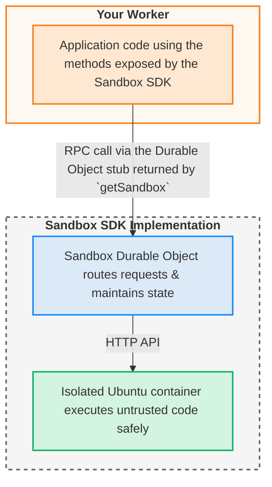

import { WranglerConfig } from "~/components";

Sandbox SDK를 사용하면 Workers에서 안전하게 신뢰할 수 없는 코드를 실행할 수 있습니다. Cloudflare 기술을 결합하여 안전한 상태, 고립된 실행을 제공합니다:

- **Workers**- Sandbox SDK를 호출하는 애플리케이션 논리
- **Durable Objects**- 고유 한 식별이있는 영구 샌드 박스 인스턴스
- **회사 소개**- 코드가 실제로 실행되는 고립 된 Linux 환경

## 건축 overview



### 레이어 1: 클라이언트 SDK

WorkersXQ에서 사용하는 개발자 직면 API:

```typescript
import { getSandbox } from "@cloudflare/sandbox";

const sandbox = getSandbox(env.Sandbox, "my-sandbox");
const result = await sandbox.exec("python script.py");
```

**제품정보**: 모든 샌드박스 작업에 대한 깨끗하고 안전한 TypeScript 인터페이스를 제공합니다.

### 층 2: 튼튼한 목표

샌드박스 수명주기 및 여정 관리:

```typescript
export class Sandbox extends DurableObject<Env> {
	//Cloudflare 확장 고립을 위한 콘테이너
	//클라이언트와 컨테이너 사이의 경로 요청
	//미리보기 URL 및 상태 관리
}
```

**제품정보**: persistent, stateful sandbox 인스턴스를 고유 식별합니다.

**왜 Durable Objects**:

- **Persistent 정체성**- 동일한 샌드박스 ID는 항상 같은 인스턴스로 이동합니다.
- **컨테이너 관리**- 튼튼한 Object는 컨테이너 수명주기를 소유하고 관리합니다.
- **Geographic 배포**- Sandboxes는 사용자에게 가까이 실행
- **자동 스케일링**- Cloudflare는 규정을 관리합니다

### 층 3: 콘테이너 Runtime

완전한 Linux 기능을 가진 고립에 있는 코드 실행.

**제품정보**: 안전하게 위탁된 코드를 실행합니다.

**왜 콘테이너**:

- **VM 기반 고립**- 각 sandbox는 자체 VM에서 실행됩니다.
- **전체 환경**- Python, Node.js, Git 등 우분투 리눅스

## 통신 수송

SDK는 튼튼한 목표와 콘테이너 사이 커뮤니케이션을 위한 2개의 수송 의정서를 지원합니다:

### HTTP 수송 (과태)

각 SDK 방법은 컨테이너 API에 별도의 HTTP 요청을 만듭니다. 간단한, 믿을 수 있고, 대부분의 사용 케이스를 위해 작동합니다.

```typescript
//기본 동작 - HTTP 사용
const sandbox = getSandbox(env.Sandbox, "my-sandbox");
await sandbox.exec("python script.py");
```

### WebSocket 운송

Multiplexes 단일 지속성 WebSocket 연결을 통해 모든 SDK 호출. 안전하다[subrequest 제한](/workers/platform/limits/#subrequests)많은 동시 가동을 만들 때.

WebSocket 수송 가능`SANDBOX_TRANSPORT`작업자의 구성에서 변수:

<WranglerConfig>
  ```jsonc
  {
  	"vars": {
  		"SANDBOX_TRANSPORT": "websocket"
  	},
  }
  ```
</WranglerConfig>

전송 층은 애플리케이션 코드에 투명합니다 - 모든 SDK 방법은 운송에 관계없이 동일하게 작동합니다. 이름 \*[수송 형태](/sandbox/configuration/transport/)각 수송 및 구성 예제를 사용할 때 세부 사항.

## 주문 흐름

명령을 실행할 때:

```typescript
await sandbox.exec("python script.py");
```

**HTTP 수송 교류**:

1. **클라이언트 SDK**매개변수를 검증하고 HTTP 요청을 튼튼한 개체로 보냅니다.
2. **튼튼한 목표**컨테이너에 HTTP 요청을 전달합니다.
3. **컨테이너 Runtime**입력을 검증, 명령을 실행, 출력 캡처
4. **응답은 뒤를 흐릅니다**모든 레이어를 통해 적절한 오류 변환

**WebSocket 운송 흐름**:

1. **클라이언트 SDK**매개변수를 검증하고 persistent WebSocket 연결을 통해 요청을 보냅니다.
2. **튼튼한 목표**WebSocket 연결 유지, 다중화 동시 요청
3. **컨테이너 Runtime**WebSocket 메시지를 HTTP 스타일 요청/response에 적용
4. **응답은 뒤를 흐릅니다**적절한 오류 변환과 같은 WebSocket 연결

WebSocket 연결은 첫 번째 SDK 호출에 설치되며 모든 후속 작업에 재사용되며 고주파 작동을 위해 오버 헤드를 줄입니다.

## 관련 자료

- [Sandbox 수명주기](/sandbox/concepts/sandboxes/)- 모래 상자가 생성되고 관리되는 방법
- [컨테이너 런타임](/sandbox/concepts/containers/)- 실행 환경 내부
- [보안 모델](/sandbox/concepts/security/)- 어떻게 고립과 검증 작업
- [세션 관리](/sandbox/concepts/sessions/)- 고급 상태 관리
