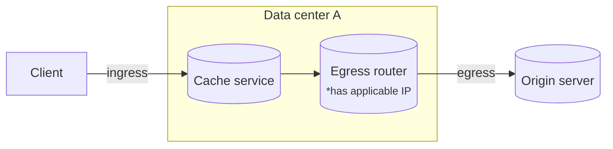
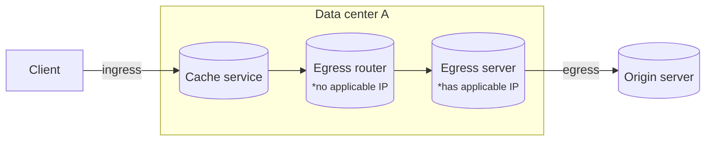
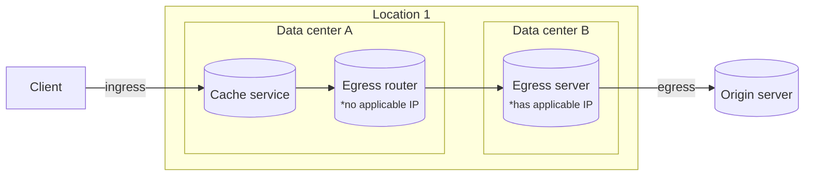
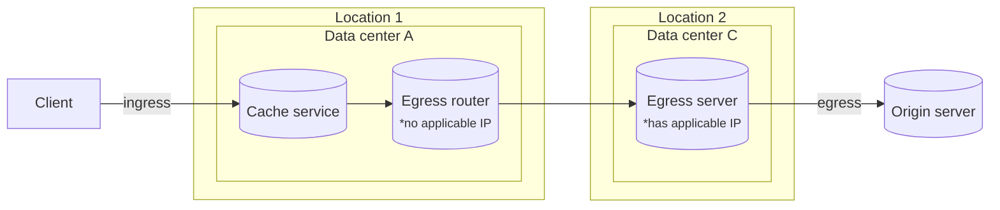

IPv6 주소 범위는 전 세계적으로 배포되므로 전달이 필요하지 않습니다.

IPv4 트래픽의 경우 [IP 할당](/smart-shield/configuration/dedicated-egress-ips/how-it-works/egress-ips/#ips-allocation)에 따라 모든 egress 데이터 센터가 적용 가능한 Dedicated CDN Egress IP에 접근할 수 있는 것은 아닙니다.

Dedicated CDN Egress IP는 트래픽 급증에 대응해 다른 위치로 전달하지 않습니다. 대신 각 IPv4는 최대 네 개 위치로 나뉠 수 있으며, 이들 위치 중 일부에는 여러 데이터 센터가 있을 수 있습니다. 각 데이터 센터의 IP 수용량도 각 위치에 도달하는 트래픽 양에 맞춰 조정될 수 있습니다.

요청이 ingress 데이터 센터에서 Cloudflare에 도달하고, 캐시 서비스가 egress router가 origin에 연결하도록 요청을 보내면 다음과 같은 시나리오가 가능합니다.

### 트래픽이 동일한 서버에서 egress될 수 있는 경우

egress router를 실행하는 서버가 적용 가능한 Dedicated CDN Egress IP에 접근할 수 있다면, 트래픽은 그 서버에서 egress됩니다.

### 연결 전달이 필요한 경우

서버가 적용 가능한 IP에 접근할 수 없으면, 다음 옵션을 순서대로 확인하고 가능한 첫 번째 방식이 적용됩니다.

* 동일한 데이터 센터의 다른 서버가 적용 가능한 IP에 접근할 수 있으며, 연결이 해당 서버로 전달됩니다.

* 동일한 위치에 있는 다른 데이터 센터가 적용 가능한 IP에 접근할 수 있으며, 연결이 해당 데이터 센터로 전달됩니다.

* 다른 위치의 다른 데이터 센터가 적용 가능한 IP에 접근할 수 있습니다. 가장 가까운 위치를 선택하고 해당 위치로 연결을 전달합니다.

