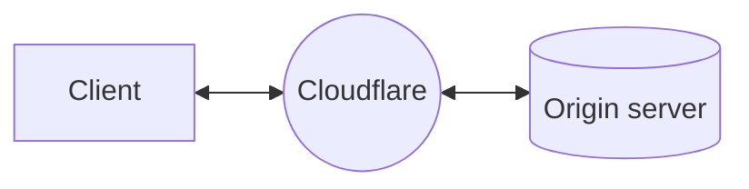
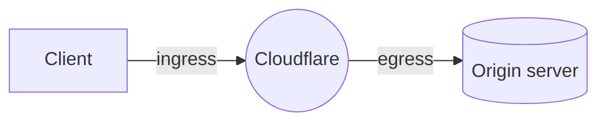

import { Render } from "~/components";

Cloudflare를 [reverse proxy로](/fundamentals/concepts/how-cloudflare-works/#how-cloudflare-works-as-a-reverse-proxy) 사용하면 [Cloudflare의 글로벌 네트워크](https://www.cloudflare.com/network/)가 클라이언트 요청과 origin 서버 사이에 위치합니다.

요청이 Cloudflare를 거쳐 라우팅될 때 일어나는 일을 확대해서 보면, 이 과정을 ingress와 egress 두 부분으로 나눠 생각할 수 있습니다.

ingress는 인터넷 라우팅을 기준으로 클라이언트 요청이 도착하는 데이터 센터를 의미합니다. 그 이후 요청은 Cloudflare 구성에 따라 처리되고, 필요하면 egress 데이터 센터를 통해 origin으로의 연결이 시작됩니다.

전통적으로 Cloudflare는 모든 Cloudflare 고객이 사용하며 [공개적으로 문서화된](https://www.cloudflare.com/ips/) 매우 큰 egress IP 풀을 유지합니다. Dedicated CDN Egress IPs를 사용하면 Cloudflare는 귀하를 위해 예약된 IP를 사용해 origin에 연결합니다.

## BYOIP 또는 Cloudflare 임대 IP

각 Dedicated CDN Egress IP 풀은 [BYOIP prefix](/byoip/)의 IP 또는 Cloudflare가 임대한 IP로만 구성될 수 있습니다. 하나의 Dedicated CDN Egress IP 풀에는 BYOIP와 임대 IP를 동시에 포함할 수 없습니다.

<Render
	file="check-leased-ips"
	product="byoip"
	params={{
		product: "dedicated IPs for CDN egress",
	}}
/>

BYOIP를 사용 중이라면 대신 **BYOIP prefixes**를 참고하세요.

## IP 할당

Dedicated CDN Egress IP는 IPv4와 IPv6 주소를 모두 지원합니다.

IPv6 주소 범위는 전 세계적으로 배포되므로, 전용 IPv6 주소는 모든 Cloudflare 데이터 센터에서 Cloudflare와 origin 서버 사이의 연결에 사용할 수 있습니다.

:::note[China 예외]
Dedicated CDN Egress IP는 현재 [Cloudflare China Network](/china-network/)에서 **사용할 수 없습니다**.
:::

IPv4 주소의 경우 각 IP를 어느 위치에 배치할지 account 팀과 협의해야 합니다. 이상적으로는 전용 IPv4 주소를 origin 서버 근처에 배치하고, 각 리전에 예상되는 트래픽 양에 맞춰 조정해야 합니다.

서로 다른 Cloudflare 데이터 센터에 도달한 요청이 어떻게 처리되는지 이해하려면 [연결 전달](/smart-shield/configuration/dedicated-egress-ips/how-it-works/connection-forwarding/)을 참고하세요.

### origin으로의 연결

<Render file="concurrent-connections-explainer" product="smart-shield" />

Dedicated CDN Egress IP는 [연결 재사용 및 병합](/smart-shield/concepts/connection-reuse/)의 이점도 활용합니다.

GraphQL Analytics API를 사용하면 [IP 활용도](/smart-shield/configuration/dedicated-egress-ips/ips-utilization/)를 확인할 수 있습니다.

### Regional Services

[Regional Services](/data-localization/regional-services/)를 사용 중이라면 전용 IPv4 주소를 할당할 때 이를 고려해야 합니다. 해당 위치에 Dedicated CDN Egress IP가 프로비저닝되어 있다면, 트래픽은 지정된 위치에서 egress됩니다.
