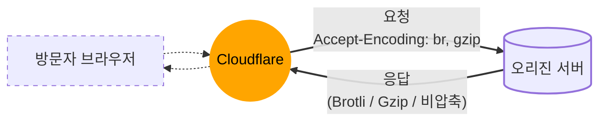

import { Stream, Render } from "~/components";

Cloudflare는 콘텐츠를 두 가지 방식으로 압축합니다. 하나는 Cloudflare와 웹사이트 방문자 사이에서, 다른 하나는 Cloudflare와 오리진 서버 사이에서 수행됩니다.

## Cloudflare와 웹사이트 방문자 사이의 압축

Cloudflare는 [기본 캐싱 동작](/cache/concepts/default-cache-behavior/)에 더해, 웹사이트 방문자에게 콘텐츠를 전달할 때 Gzip, Brotli, Zstandard 압축을 지원합니다.

<Stream
  id="9103750883217fcb9274666fd57ebac1"
  title="콘텐츠 압축"
  thumbnail="https://imagedelivery.net/xDOJvHcv1KwTQn6S-BGFIw/386f9df0-25fc-4d2a-07fa-6dd3497d2e00/public"
/>

:::note
고객은 [Compression Rules](/rules/compression-rules/)를 통해 Zstandard 압축을 활성화할 수 있습니다.
:::

방문자의 웹 브라우저가 지원하는 경우, Cloudflare는 다음 콘텐츠 유형에 대해 Gzip, Brotli 또는 Zstandard로 인코딩된 응답을 반환합니다.

```
text/html
text/richtext
text/plain
text/css
text/x-script
text/x-component
text/x-java-source
text/x-markdown
application/javascript
application/x-javascript
text/javascript
text/js
image/x-icon
image/vnd.microsoft.icon
application/x-perl
application/x-httpd-cgi
text/xml
application/xml
application/rss+xml
application/vnd.api+json
application/x-protobuf
application/json
multipart/bag
multipart/mixed
application/xhtml+xml
font/ttf
font/otf
font/x-woff
image/svg+xml
application/vnd.ms-fontobject
application/ttf
application/x-ttf
application/otf
application/x-otf
application/truetype
application/opentype
application/x-opentype
application/font-woff
application/eot
application/font
application/font-sfnt
application/wasm
application/javascript-binast
application/manifest+json
application/ld+json
application/graphql+json
application/geo+json
```

Cloudflare의 글로벌 네트워크는 다음 조건에 따라 웹사이트 방문자에게 Gzip 압축, Brotli 압축, Zstandard 압축 또는 비압축 콘텐츠를 전달할 수 있습니다.

- 방문자가 `accept-encoding` 요청 헤더에 제공한 값
- 사용 중인 [Cloudflare 플랜](#between-visitors-and-cloudflare)
- 들어오는 요청과 일치하는 구성된 [compression rule](/rules/compression-rules/)

오류 상태 코드 응답의 경우, Cloudflare는 오류 상태 코드가 `403` 또는 `404`일 때만 응답을 압축합니다. 성공 상태 코드 응답의 경우에는 상태 코드가 `200`일 때만 응답을 압축합니다. 그 외 상태 코드를 가진 응답은 압축되지 않습니다.

[Compression Rules](/rules/compression-rules/)를 사용하면 Cloudflare의 기본 압축 동작을 재정의할 수 있습니다.

:::caution[압축을 위한 최소 응답 크기]

Cloudflare는 웹사이트 방문자에게 응답을 보낼 때, 응답 크기가 최소 기준을 충족하는 경우에만 압축을 적용합니다.

- Gzip의 경우 응답 크기가 최소 48바이트여야 합니다.
- Brotli와 Zstandard의 경우 응답 크기가 최소 50바이트여야 합니다.

이보다 작은 응답은 콘텐츠 유형과 관계없이 압축되지 않습니다.

:::

### Content-Length 헤더 처리

Cloudflare가 웹사이트 방문자에게 보내는 응답을 압축할 때, 동적 변환으로 인해 잘못된 길이 정보가 전달되는 것을 방지하기 위해 `Content-Length` HTTP 헤더를 생략할 수 있습니다. 오리진 서버가 설정한 `Content-Length` 헤더를 유지하려면, 오리진 서버 응답에 `cache-control: no-transform`을 추가하세요. 이 지시는 Cloudflare가 응답 압축을 변경하지 못하게 하여 `Content-Length` 헤더가 원래대로 전달되도록 합니다. `cache-control: no-transform` 헤더는 반드시 오리진에서 설정되어야 하며, 클라이언트 요청에 추가할 수는 없습니다.

---

## 오리진 서버에서 Cloudflare 네트워크로 전달되는 콘텐츠 압축

Cloudflare는 오리진 서버에 콘텐츠를 요청할 때 Brotli 압축, Gzip 압축 또는 비압축 응답을 지원합니다.



오리진 서버가 Cloudflare 요청에 Brotli/Gzip 압축을 사용해 응답하는 경우, 다음 조건을 모두 만족하면 Cloudflare는 웹사이트 방문자에게 보내는 응답에서도 동일한 압축을 유지합니다.

- 서버 응답에 사용 중인 압축(`br` 또는 `gzip`)을 나타내는 `content-encoding` 헤더를 포함하는 경우
- 방문자 브라우저(또는 클라이언트)가 해당 압축 알고리즘을 지원하는 경우
- 응답 내용을 변경하는 Cloudflare 기능을 활성화하지 않은 경우([종단 간 압축 관련 참고 사항](#notes-about-end-to-end-compression) 참고)

Cloudflare의 리버스 프록시는 압축 형식과 비압축 형식 사이의 변환도 수행할 수 있습니다. 캐싱 여부와 관계없이, Cloudflare는 오리진 서버로부터 Brotli 또는 Gzip으로 압축된 콘텐츠를 받아 방문자에게 비압축으로 제공하거나 그 반대로 제공할 수 있습니다.

오리진에서 제공한 특정 응답이 웹사이트 방문자에게 전달될 때 Brotli/Gzip으로 인코딩되지 않게 하려면, 오리진 웹 서버의 응답에 `cache-control: no-transform` HTTP 헤더를 포함하세요.

:::caution
Cloudflare는 웹사이트 방문자에게 응답을 보낼 때 방문자 요청의 `accept-encoding` 헤더 값을 고려합니다. 그러나 오리진 서버에 콘텐츠를 요청할 때는 Brotli와 Gzip 압축을 지원하는 별도의 `Accept-Encoding` 헤더를 보냅니다.
:::

---

<Render file="brotli-compression-warning" product="speed" />

## 플랜별 압축 방식

### 방문자와 Cloudflare 사이

기본적으로 Cloudflare는 영역 플랜에 따라 다음과 같은 압축 방식을 사용해 콘텐츠를 전달합니다. 다만 실제 적용되는 압축 방식은 방문자 브라우저가 `accept-encoding` 헤더로 무엇을 요청했는지에 따라서도 달라질 수 있습니다.

- Free 플랜: 콘텐츠는 기본적으로 Zstandard를 사용해 압축됩니다.
- Pro 및 Business 플랜: 콘텐츠는 기본적으로 Brotli를 사용해 압축됩니다.
- Enterprise 플랜: 콘텐츠는 기본적으로 Gzip을 사용해 압축됩니다.

### Cloudflare와 오리진 서버 사이

모든 플랜에서 Cloudflare는 `accept-encoding: br, gzip` 헤더를 사용해 오리진 서버에 콘텐츠를 요청합니다. 이는 Cloudflare가 오리진 서버에 Brotli 또는 Gzip 중 오리진이 지원하는 방식으로 압축된 콘텐츠를 보내 달라고 요청한다는 뜻입니다.
