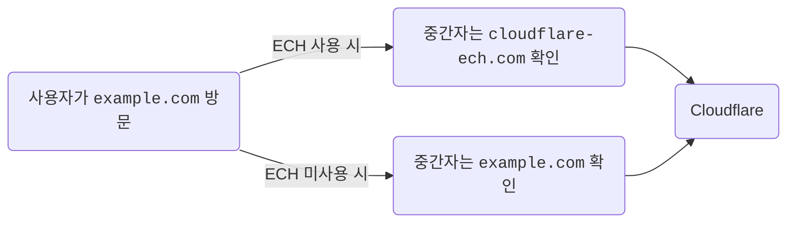

import { DashButton } from "~/components";

ECH는 [Encrypted Client Hello](https://datatracker.ietf.org/doc/draft-ietf-tls-esni/16/)의 약자입니다. 이는 Transport Layer Security(TLS) 맥락의 프로토콜 확장입니다. ECH는 핸드셰이크의 일부를 암호화하고 TLS 세션 협상에 사용되는 Server Name Indication(SNI)을 숨깁니다. 즉, 사용자가 ECH가 활성화된 Cloudflare의 웹사이트를 방문할 때 중간자는 사용자가 Cloudflare의 웹사이트를 방문한다는 사실까지만 볼 수 있고, 어느 웹사이트인지는 알 수 없습니다.

## ECH의 역할

ECH는 특정 사용자가 웹사이트를 방문하고 있다는 정보에 대한 접근을 제한하여, 인터넷 서비스 제공자(ISP) 같은 중간자에게 불필요하게 공유되지 않도록 합니다. ECH를 사용하면 사용자가 웹사이트에 접근할 때 방문과 관련된 구체적 정보가 더 이상 네트워크 중간자에게 노출되지 않습니다.

## ECH 작동 방식

일반적인 [TLS 핸드셰이크](https://www.cloudflare.com/learning/ssl/what-happens-in-a-tls-handshake/)에서 클라이언트는 TLS 세션을 시작하기 위해 서버에 ClientHello 메시지를 보냅니다. 이 메시지에는 지원하는 암호 알고리즘 목록, TLS 버전, 요청된 서버 이름(클라이언트가 연결하려는 웹사이트의 도메인 이름) 등 중요한 정보가 포함됩니다. 서버 이름은 Server Name Indication(SNI)을 통해 전달됩니다.

ECH를 사용하면 ClientHello 메시지 부분이 내부와 외부의 두 개 메시지로 나뉩니다. 외부 부분에는 사용할 암호군과 TLS 버전 같은 민감하지 않은 정보와 "outer ClientHello"가 들어갑니다. 내부 부분은 암호화되며 "inner ClientHello"를 포함합니다.

outer ClientHello에는 사용자가 Cloudflare의 암호화된 웹사이트를 방문하려 한다는 것을 나타내는 공통 이름(SNI)이 포함됩니다. Cloudflare는 모든 웹사이트가 공유할 SNI로 `cloudflare-ech.com`을 선택했습니다. Cloudflare가 이 도메인을 제어하므로 해당 서버 이름에 대한 TLS 핸드셰이크를 협상할 적절한 인증서를 보유하고 있습니다.

inner ClientHello에는 사용자가 실제로 방문하려는 서버 이름이 들어 있습니다. 이 부분은 공개 키로 암호화되며 Cloudflare만 읽을 수 있습니다. 핸드셰이크가 완료되면 웹 페이지는 다른 TLS 기반 웹사이트와 동일하게 정상적으로 로드됩니다.

실제로 이는 트래픽을 관찰하는 어떤 중간자라도 일반 TLS 핸드셰이크만 보게 된다는 뜻입니다. 단, Cloudflare에서 ECH가 활성화된 서버 이름으로 가는 모든 트래픽은 동일하게 보입니다. 모든 TLS 핸드셰이크는 실제 웹사이트가 아니라 `cloudflare-ech.com` 웹사이트를 로드하려는 것처럼 동일하게 보이게 됩니다.

아래 예시에서는 사용자가 `example.com`을 방문하고 있습니다. ECH가 없으면 중간 네트워크는 사용자가 접근하는 웹사이트를 감지할 수 있습니다. ECH가 있으면 보이는 정보는 `cloudflare-ech.com`으로 제한됩니다.

 

 

ECH 프로토콜 기술에 대한 자세한 내용은 [소개 블로그](https://blog.cloudflare.com/encrypted-client-hello/)를 참고하세요.

## ECH 활성화

ECH는 Free 영역에서 기본적으로 활성화됩니다. 다른 플랜은 다음 단계에 따라 켜거나 끌 수 있습니다.

1. Cloudflare 대시보드에서 **Edge Certificates** 페이지로 이동합니다.

   <DashButton url="/?to=/:account/:zone/ssl-tls/edge-certificates" />

2. **Encrypted ClientHello (ECH)**에서 설정을 **Enabled**로 변경합니다.

## 엔터프라이즈 네트워크 적용성

일부 엔터프라이즈 또는 지역 네트워크는 네트워크를 통과하는 트래픽에 대해 감사 또는 필터링 정책을 적용해야 할 수 있습니다. 이러한 정책은 IP 주소가 아니라 도메인 이름 기준으로 표현됩니다. 따라서 개별 도메인 이름에 대한 `A` 및 `AAAA` 질의에 응답하는 로컬 DNS 리졸버에서 적용하는 것이 가장 적절합니다.

그러나 DNS 기반 필터링이 적용되지 않는 환경에서는 기존 필터링 메커니즘이 계속 예상대로 동작하도록 하기 위해 ECH를 비활성화하는 두 가지 방법이 있습니다.

가장 신뢰할 수 있는 방법은 로컬 또는 재귀 DNS 리졸버 자체에서 클라이언트에 반환되는 HTTPS 리소스 레코드에서 ECH 구성을 제거하거나, 가능하면 HTTPS 질의에 대해 “no error no answer” 또는 NXDOMAIN 응답을 반환하는 것입니다. 이렇게 하면 클라이언트가 ECH를 사용하는 데 필요한 정보를 얻지 못하게 됩니다. 단, HTTPS 리소스 레코드를 수정하면 DNSSEC 검증을 수행하는 클라이언트에서 실패가 발생할 수 있으므로 HTTPS 응답을 제거하는 편이 바람직할 수 있습니다. 이렇게 하면 Chrome 같은 브라우저가 ECH를 사용하지 못하게 됩니다.

두 번째 방법은 네트워크 카나리 도메인을 이용하는 것입니다. 구체적으로, 네트워크의 DNS 리졸버가 `use-application-dns.net` [카나리 도메인](https://support.mozilla.org/en-US/kb/canary-domain-use-application-dnsnet)에 대한 질의에 “no error no answer” 또는 NXDOMAIN 응답을 반환할 수 있습니다. 이렇게 하면 Firefox 같은 브라우저가 ECH를 사용하지 못하게 됩니다. 자세한 내용은 Encrypted Client Hello에 대한 Firefox [자주 묻는 질문 페이지](https://support.mozilla.org/en-US/kb/faq-encrypted-client-hello#w_how-will-ech-interact-with-dohs-opt-outs)를 참고하세요.
