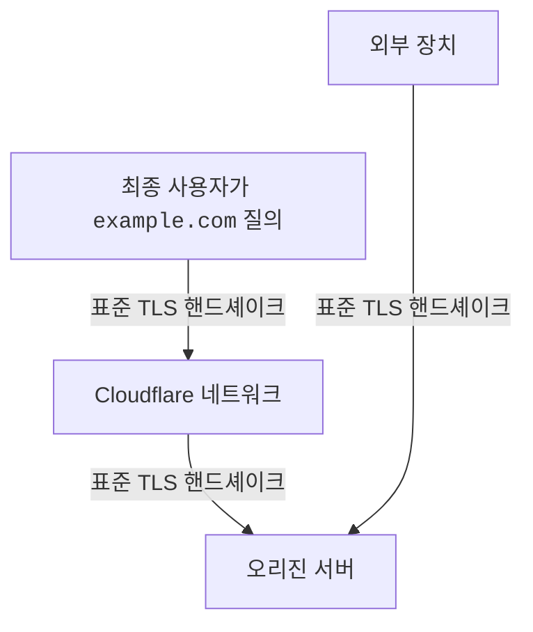
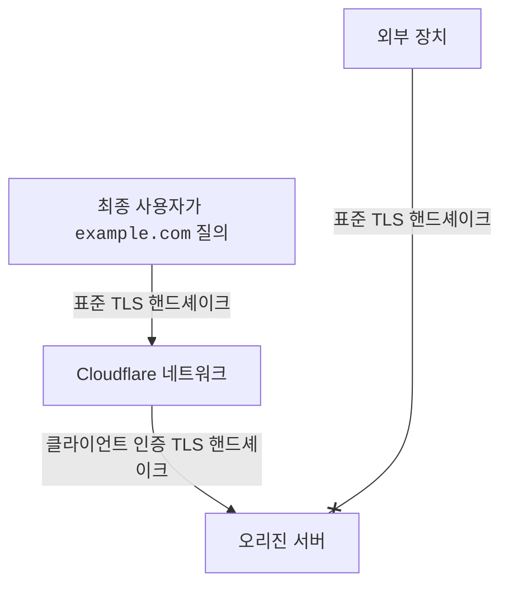

## 간단한 설명

방문자가 도메인의 콘텐츠를 요청하면 Cloudflare는 먼저 캐시에서 콘텐츠를 제공하려고 시도합니다. 이 시도가 실패하면 Cloudflare는 콘텐츠를 가져오기 위해 오리진 웹 서버로 요청, 즉 `origin pull`을 보냅니다.

Authenticated Origin Pulls는 이러한 모든 `origin pulls`가 Cloudflare에서 온 것임을 보장합니다. 다시 말해, Cloudflare 바깥에서 오는 모든 HTTPS 요청은 오리진에서 응답을 받지 못하도록 합니다.

이 차단은 Cloudflare의 [unproxied DNS records](/dns/proxy-status/#dns-only-records)에 대한 요청에도 적용됩니다.

:::caution

Authenticated Origin Pulls를 [설정](/ssl/origin-configuration/authenticated-origin-pull/set-up/zone-level/)할 때 Cloudflare가 제공하는 인증서는 계정 전용이 아니며, 요청이 Cloudflare 네트워크에서 왔다는 것만 보장합니다.

더 엄격한 보안을 위해서는 자체 인증서로 Authenticated Origin Pulls를 설정하고 [오리진에 대한 다른 보안 조치](/fundamentals/security/protect-your-origin-server/)도 함께 고려해야 합니다.

:::

## 자세한 설명

Cloudflare는 Cloudflare와 오리진 웹 서버 사이의 연결을 설정할 때 TLS 클라이언트 인증서를 이용한 추가 인증 계층을 넣어 authenticated origin pulls를 강제합니다.

자세한 내용은 [소개 블로그 게시물](https://blog.cloudflare.com/protecting-the-origin-with-tls-authenticated-origin-pulls/)을 참고하세요.

***

### 핸드셰이크 유형

자세한 내용은 [What is a TLS handshake?](https://www.cloudflare.com/learning/ssl/what-happens-in-a-tls-handshake/)를 참고하세요.

**표준 TLS 핸드셰이크**

**클라이언트 인증 TLS 핸드셰이크**

### 비교 다이어그램

Authenticated Origin Pulls가 없으면 Cloudflare는 클라이언트 장치와 Cloudflare 사이, 그리고 Cloudflare와 오리진 사이 모두에서 표준 TLS 핸드셰이크를 수행합니다.
[**Full**](/ssl/origin-configuration/ssl-modes/full/) 또는 [**Full (strict)**](/ssl/origin-configuration/ssl-modes/full-strict/) 암호화 모드를 활성화한 경우에도 마찬가지입니다.

 

이처럼 인증이 없으면 오리진이 [Cloudflare 뒤에 보호](/fundamentals/concepts/how-cloudflare-works/)되어 있더라도, 오리진 IP 주소를 아는 공격자는 오리진으로 직접 HTTPS 요청을 보내 응답을 받을 수 있습니다.

Authenticated Origin Pulls를 사용하면 Cloudflare는 클라이언트 장치와 Cloudflare 사이에서는 표준 TLS 핸드셰이크를 수행하지만, Cloudflare와 오리진 사이에서는 클라이언트 인증 TLS 핸드셰이크를 수행합니다.

 

이 추가 인증 계층은 Cloudflare 외부에서 오는 어떤 HTTPS 요청도 오리진에서 응답을 받지 못하도록 보장합니다.
