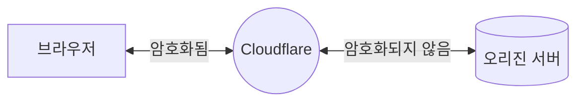

import { Render, TabItem, Tabs } from "~/components";

암호화 모드를 **Flexible**로 설정하면 사이트는 부분적으로만 보호됩니다. 방문자와 Cloudflare 사이의 HTTPS 연결은 허용되지만, Cloudflare와 오리진 사이의 모든 연결은 HTTP로 이루어집니다. 따라서 오리진에는 SSL 인증서가 필요하지 않습니다.

## 사용 시점

오리진에 SSL 인증서를 설정할 수 없거나 오리진이 SSL/TLS를 지원하지 않을 때 이 옵션을 선택하세요.

## Required setup

### Prerequisites

<Render file="ssl-mode-errors" product="ssl" />

### Process

<Tabs syncKey="dashPlusAPI"> <TabItem label="대시보드">

<Render file="change-encryption-mode-dash" product="ssl" />

</TabItem> <TabItem label="API">

<Render file="change-encryption-mode-api" product="ssl" />

</TabItem> </Tabs>

## Limitations

Flexible 모드는 포트 443(기본 포트)의 HTTPS 연결에서만 지원됩니다. 다른 포트에서 HTTPS를 사용하면 [**Full** mode](/ssl/origin-configuration/ssl-modes/full/)로 대체됩니다.

애플리케이션에 민감한 정보(개인화 데이터, 사용자 로그인)가 포함되어 있다면 [**Full**](/ssl/origin-configuration/ssl-modes/full/) 또는 [**Full (Strict)**](/ssl/origin-configuration/ssl-modes/full-strict/) 모드를 대신 사용하세요.

<Render file="ssl-mode-no-aop" product="ssl" />  
