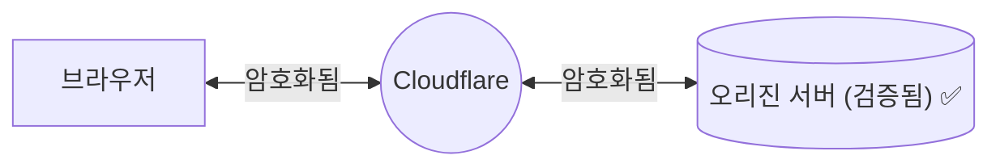

import { Render, TabItem, Tabs } from "~/components";

암호화 모드를 **Full (strict)**로 설정하면 Cloudflare는 [Full mode](/ssl/origin-configuration/ssl-modes/full/)의 모든 기능을 수행하면서 오리진 인증서에 대해 더 엄격한 요구 사항을 적용합니다.

## 사용 시점

가능하다면 항상 **Full (strict)** 모드를 선택하세요([Enterprise customer](/ssl/origin-configuration/ssl-modes/ssl-only-origin-pull/)인 경우를 제외).

오리진은 다음 조건을 만족하는 SSL 인증서를 지원할 수 있어야 합니다.

- 인증서가 만료되지 않았고, 즉 `notBeforeDate < now() < notAfterDate`를 만족해야 합니다.
- [공개적으로 신뢰되는 certificate authority](https://github.com/cloudflare/cfssl_trust) 또는 [Cloudflare’s Origin CA](/ssl/origin-configuration/origin-ca/)가 발급한 인증서여야 합니다.
- 요청되거나 대상이 되는 hostname과 일치하는 Common Name(CN) 또는 Subject Alternative Name(SAN)을 포함해야 합니다.

:::note

**Full (strict)** 암호화 외에도 [Authenticated Origin Pulls](/ssl/origin-configuration/authenticated-origin-pull/)를 설정해 모든 오리진 요청이 응답 전에 평가되도록 할 수 있습니다.

:::

## Required setup

### Prerequisites

**Full (strict)** 모드를 활성화하기 전에 오리진이 다음을 충족하는지 확인하세요.

- 포트 `443`에서 HTTPS 연결을 허용할 것
- 위 요구 사항을 만족하는 인증서를 제공할 것

그렇지 않으면 방문자가 [526 error](/support/troubleshooting/http-status-codes/cloudflare-5xx-errors/error-526/)를 보게 될 수 있습니다.

### Process

<Tabs syncKey="dashPlusAPI"> <TabItem label="대시보드">

<Render file="change-encryption-mode-dash" product="ssl" />

</TabItem> <TabItem label="API">

<Render file="change-encryption-mode-api" product="ssl" />

</TabItem> </Tabs>

## Limitations

<Render file="ssl-mode-errors" product="ssl" />
