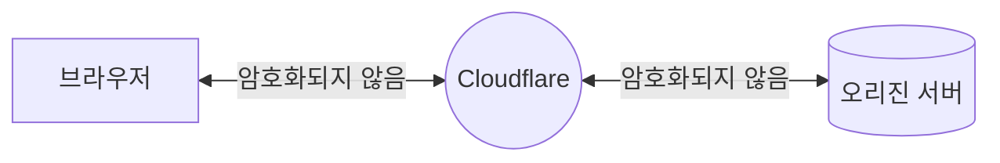

import { Render, TabItem, Tabs } from "~/components";

암호화 모드를 **Off (권장하지 않음)**으로 설정하면 모든 HTTPS 요청이 평문 HTTP로 리디렉션됩니다.

## 사용 시점

Cloudflare는 암호화 모드를 **Off**로 설정하는 것을 권장하지 않습니다.

## Required setup

<Tabs syncKey="dashPlusAPI"> <TabItem label="대시보드">

<Render file="change-encryption-mode-dash" product="ssl" />

</TabItem> <TabItem label="API">

<Render file="change-encryption-mode-api" product="ssl" />

</TabItem> </Tabs>

## Limitations

암호화 모드를 **Off**로 설정하면 애플리케이션은:

- 방문자와 애플리케이션을 [공격에 취약한 상태](https://www.cloudflare.com/learning/ssl/why-use-https/)로 둡니다.
- Chrome과 다른 브라우저에서 "안전하지 않음"으로 표시되어 방문자 신뢰를 낮춥니다.
- [SEO rankings](https://webmasters.googleblog.com/2014/08/https-as-ranking-signal.html)에서 불이익을 받습니다.

### Incompatible settings

SSL/TLS encryption mode를 **Off**로 설정하면 [**Always Use HTTPS**](/ssl/edge-certificates/additional-options/always-use-https/) 또는 [**Onion Routing**](/network/onion-routing/) 옵션이 표시되지 않습니다.

<Render file="ssl-mode-no-aop" product="ssl" />  
