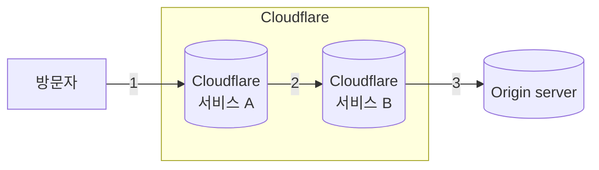

Post-quantum cryptography(PQC)는 [quantum computers](https://www.cloudflare.com/learning/ssl/quantum/what-is-quantum-computing/)의 공격에 견딜 수 있도록 설계된 암호화 알고리즘을 의미합니다. Cloudflare는 2017년부터 post-quantum을 연구하고 [관련 글을 작성해 왔습니다](https://blog.cloudflare.com/tag/post-quantum/).

[harvest now, decrypt later attacks](https://en.wikipedia.org/wiki/Harvest_now,_decrypt_later)의 위험으로부터 사용자를 보호하기 위해, 그리고 웹사이트나 애플리케이션이 Cloudflare 위에 있을 때 발생하는 모든 [연결](#three-connections-in-the-life-of-a-request)을 고려하여, Cloudflare는 [post-quantum hybrid key agreement](#hybrid-key-agreement)의 사용을 배포했고 적극적으로 확대하고 있습니다.

Cloudflare로 들어오는 요청에서 PQ 암호화 채택 현황의 최신 통계는 [Cloudflare Radar](https://radar.cloudflare.com/adoption-and-usage#post-quantum-encryption-adoption)를 참고하고, 연결이 PQ key agreement로 보호되는지 확인하려면 [pq.cloudflareresearch.com](https://pq.cloudflareresearch.com)을 방문하세요.

:::caution[TLS 1.3]
Cloudflare post-quantum key agreement는 TLS 1.3 기반 프로토콜(HTTP/3 포함)에서만 지원되며, [FIPS mode](/cloudflare-one/traffic-policies/http-policies/tls-decryption/#fips-compliance)에서는 비활성화됩니다.
:::

## TLS의 세 가지 구성 요소

[TLS handshake](https://www.cloudflare.com/learning/ssl/what-happens-in-a-tls-handshake/)가 통신을 보호하기 전에, 세 가지 암호화 알고리즘이 합의되어야 합니다.

- **Symmetric ciphers:** 데이터를 암호화하고 복호화하는 데 사용되는 알고리즘으로, 기밀성과 무결성을 보장합니다(예: `CHACHA20-POLY1305`).
- **Key agreement:** 클라이언트와 서버가 공유 키에 안전하게 합의할 수 있게 해 주는 암호화 프로토콜입니다(예: `ECDH`).
- **Signature algorithms:** TLS 인증서의 디지털 서명을 생성하는 데 사용되는 암호화 알고리즘입니다(예: `RSA`, `ECDSA`).

Cloudflare의 [블로그 글](https://blog.cloudflare.com/pq-2025/#already-post-quantum-secure-symmetric-cryptography)에서 설명했듯이 symmetric cipher는 이미 post-quantum secure 상태이므로, 아직 두 가지 마이그레이션이 남아 있습니다.

### Hybrid key agreement

TLS 1.3에서는 [X25519](https://en.wikipedia.org/wiki/Curve25519)라는 Elliptic Curve Diffie-Hellman(ECDH) 프로토콜이 key agreement에서 가장 일반적으로 사용됩니다. 그러나 그 보안성은 [Shor's algorithm](https://en.wikipedia.org/wiki/Shor%27s_algorithm)을 사용하는 quantum computer에 의해 무너질 수 있습니다.

가능한 한 빨리 key agreement를 post-quantum 알고리즘으로 마이그레이션하는 것이 시급합니다. 목표는 오늘의 암호화된 통신을 수집해 두었다가, 미래에 충분히 강력한 quantum computer를 확보했을 때 복호화할 수 있는 공격자로부터 보호하는 것입니다.

이에 대응하여 Cloudflare는 미국 National Institute of Standards and Technology(NIST)가 선택한 post-quantum key agreement인 ML-KEM의 초기 채택자입니다. 자세한 타임라인과 배경 정보는 [State of the post-quantum Internet in 2025](https://blog.cloudflare.com/pq-2025/)를 참고하세요.

Cloudflare는 다음 hybrid key agreement를 배포했습니다.

- [X25519MLKEM768](https://datatracker.ietf.org/doc/draft-kwiatkowski-tls-ecdhe-mlkem/) (권장)
  - TLS 식별자: `0x11ec`
- [X25519Kyber768Draft00](https://datatracker.ietf.org/doc/draft-tls-westerbaan-xyber768d00/) (폐기됨)
  - TLS 식별자: `0x6399`

Hybrid key agreement는 더 많은 [클라이언트](#1-visitor-to-cloudflare)가 post-quantum cryptography를 채택함에 따라 기반을 마련하는 동시에, X25519가 제공하는 현재의 보안도 유지합니다. 이는 ML-KEM의 모든 변형을 안전하지 않게 만드는 예기치 못한 돌파구가 생기더라도 더 안전한 경로입니다.

### Post-quantum signatures

Post-quantum signature로의 마이그레이션은 긴급성은 덜하지만 더 복잡합니다. Cloudflare는 새로운 표준의 발전을 면밀히 추적하고, 성능을 테스트하며, 브라우저와 함께 사용자 영향도를 이해하기 위해 협력하고 있습니다.

자세한 내용은 [A look at the latest post-quantum signature standardization candidates](https://blog.cloudflare.com/another-look-at-pq-signatures/)를 참고하세요.

## 요청 생애 주기의 세 가지 연결

### 1. Visitor to Cloudflare

[2022년 10월](https://blog.cloudflare.com/post-quantum-for-all/)부터, Cloudflare를 통해 TLS 1.3으로 제공되는 모든 웹사이트와 API는 post-quantum hybrid key agreement를 지원합니다. 그러나 연결이 post-quantum으로 보호되려면 클라이언트도 PQC를 지원해야 합니다.

Hybrid key agreement와 호환되는 브라우저와 기타 클라이언트 목록은 [Post-quantum cryptography support](/ssl/post-quantum-cryptography/pqc-support/)를 참고하세요.

### 2. Internal connections

[2023년 9월](https://blog.cloudflare.com/post-quantum-cryptography-ga/) 발표와 같이, Cloudflare 제품과 시스템의 대부분의 내부 연결은 PQC를 사용하도록 업그레이드되었습니다.

### 3. Cloudflare to your origin

마지막으로 Cloudflare는 origin에 연결할 때도 [hybrid key agreements](#hybrid-key-agreement)를 지원합니다. 이 경우 post-quantum으로 보호되는 연결은 origin server가 PQC를 지원하는지에도 달려 있습니다. 고객은 [PQ Cloudflare Tunnel](/ssl/post-quantum-cryptography/pqc-and-zero-trust/)을 통해 origin server 연결을 구성할 수도 있습니다.

자세한 내용은 [Cloudflare와 origin server 사이의 post-quantum cryptography](/ssl/post-quantum-cryptography/pqc-to-origin/)를 참고하세요.

## 기업 네트워크 트래픽 보호

[Zero Trust](/cloudflare-one/)를 통해 Cloudflare는 조직이 개별 기업 애플리케이션, 시스템, 네트워크 연결을 하나하나 업그레이드하는 번거로움 없이 민감한 네트워크 트래픽을 PQC로 업그레이드할 수 있도록 지원합니다. 자세한 내용은 [Cloudflare Zero Trust 플랫폼의 post-quantum cryptography](/ssl/post-quantum-cryptography/pqc-and-zero-trust/)를 참고하세요.
