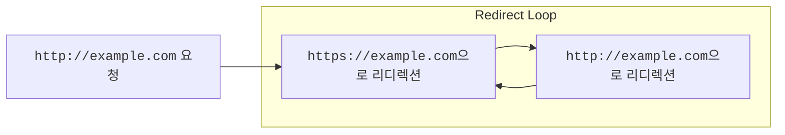
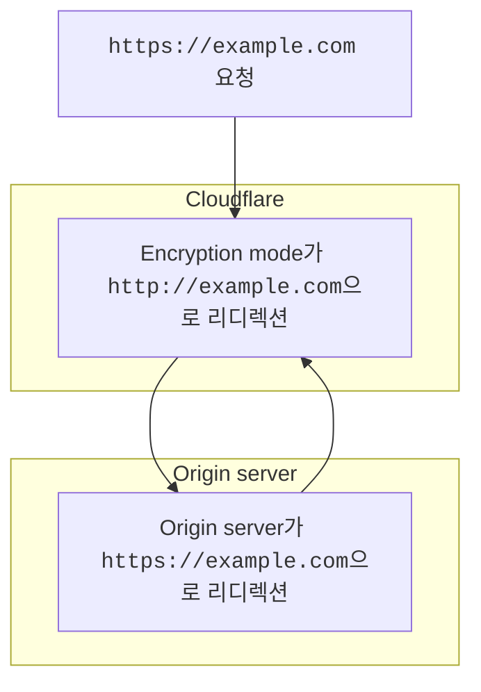
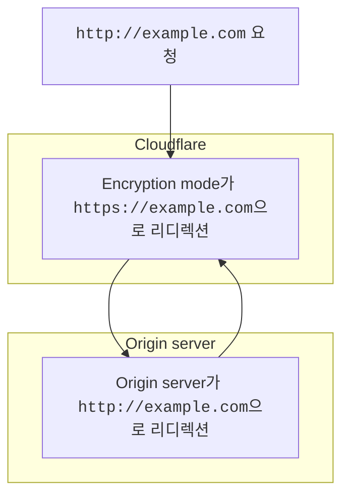
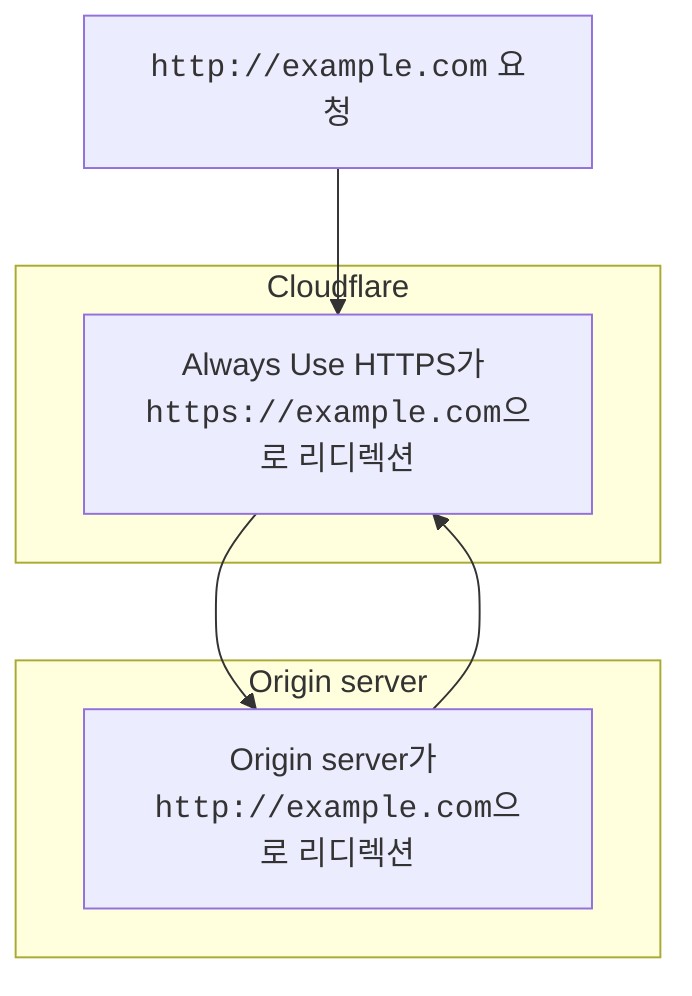
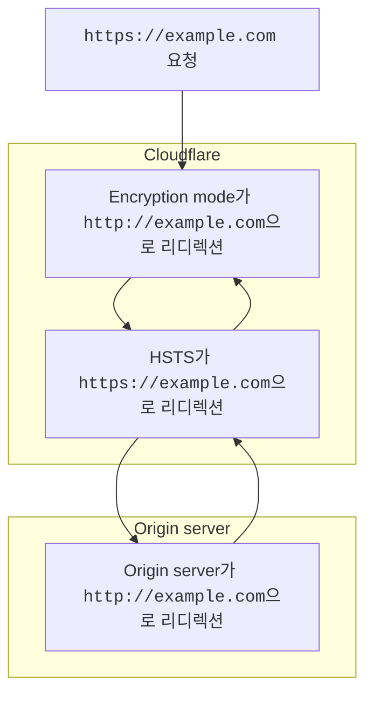
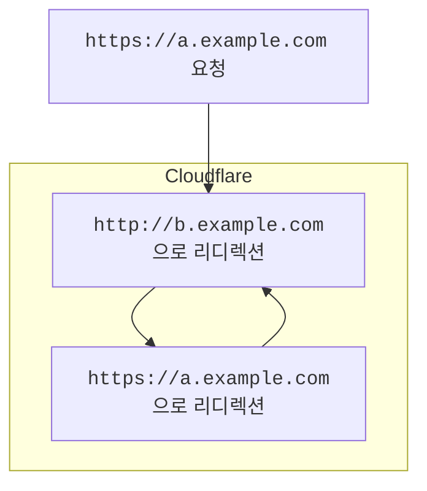

[새 도메인을 Cloudflare에 추가한 후](/fundamentals/manage-domains/add-site/), 방문자의 브라우저에 `ERR_TOO_MANY_REDIRECTS` 또는 `The page isn’t redirecting properly` 오류가 표시될 수 있습니다.

이 오류는 방문자가 redirect loop에 갇힐 때 발생합니다.

 

이 오류는 일반적으로 다음 때문에 발생합니다.

- [SSL/TLS Encryption mode](#encryption-mode-misconfigurations) 오구성
- [**Edge Certificates**](#edge-certificate-settings) 페이지의 여러 설정
- 잘못 구성된 [redirect rule](#redirect-rules)

:::note

Origin web server가 리디렉션을 응답하는지 판단하는 데 도움이 필요하면 호스팅 제공업체 또는 사이트 관리자에게 문의하세요.

:::

---

## Encryption mode 오구성

도메인의 [SSL/TLS Encryption mode](/ssl/origin-configuration/ssl-modes/)는 Cloudflare가 origin server에 어떻게 연결할지, 그리고 origin이 제시하는 SSL 인증서를 어떻게 검증할지를 제어합니다.

이 설정은 Cloudflare에 설정한 값이 origin web server의 설정과 충돌할 때 redirect loop를 일으킬 수 있습니다.

### Flexible encryption mode

도메인의 encryption mode가 [**Flexible**](/ssl/origin-configuration/ssl-modes/flexible/)로 설정되어 있으면, Cloudflare는 암호화되지 않은 요청을 HTTP로 origin server에 보냅니다.

Origin server가 모든 HTTP 요청을 HTTPS로 자동 리디렉션하면 redirect loop가 발생합니다.

 

이 문제를 해결하려면 origin server의 HTTPS 리디렉션을 제거하거나 SSL/TLS Encryption Mode를 [**Full**](/ssl/origin-configuration/ssl-modes/full/) 이상(origin server에 SSL 인증서가 구성되어 있어야 함)으로 업데이트하세요.

### Full 또는 Full (strict) encryption mode

도메인의 encryption mode가 [**Full**](/ssl/origin-configuration/ssl-modes/full/) 또는 [**Full (strict)**](/ssl/origin-configuration/ssl-modes/full-strict/)로 설정되어 있으면, Cloudflare는 HTTPS를 통해 암호화된 요청을 origin server로 보냅니다.

Origin server가 모든 HTTPS 요청을 HTTP로 자동 리디렉션하면 redirect loop가 발생합니다.

 

이 문제를 해결하려면 origin server의 HTTP 리디렉션을 제거하세요.

---

## Edge certificate 설정

### Always use HTTPS

도메인에 대해 [**Always Use HTTPS**](/ssl/edge-certificates/additional-options/always-use-https/)가 활성화되어 있으면, Cloudflare는 애플리케이션의 모든 서브도메인과 호스트에 대해 모든 `http` 요청을 `https`로 리디렉션합니다.

Origin server가 모든 HTTPS 요청을 HTTP로 자동 리디렉션하면 redirect loop가 발생합니다.

 

이 문제를 해결하려면 origin server의 HTTPS 리디렉션을 제거하거나 [**Always Use HTTPS**를 비활성화](/ssl/edge-certificates/additional-options/always-use-https/)하세요.

### HSTS

도메인에 대해 [**HTTP Strict Transport Security (HSTS)**](/ssl/edge-certificates/additional-options/http-strict-transport-security/)가 활성화되어 있으면, Cloudflare는 규정을 준수하는 웹 브라우저가 `http` 링크를 `https` 링크로 변환하도록 지시합니다.

Origin server가 모든 HTTPS 요청을 HTTP로 자동 리디렉션하거나 도메인의 encryption mode가 [**Off**](/ssl/origin-configuration/ssl-modes/off/)로 설정되어 있으면 redirect loop가 발생합니다.

 

이 문제를 해결하려면 origin server의 HTTPS 리디렉션을 제거하고 도메인의 encryption mode가 [**Flexible**](/ssl/origin-configuration/ssl-modes/flexible/) 이상인지 확인하세요.

또는 [**HTTP Strict Transport Security (HSTS)**를 비활성화](/ssl/edge-certificates/additional-options/http-strict-transport-security/)할 수 있습니다.

---

## Redirect rules

충돌하는 URL 리디렉션이 있으면 redirect loop가 발생할 수도 있습니다.

 

이 문제를 해결하려면 여러 [redirect rules](/rules/url-forwarding/)와 [Page Rules](/rules/page-rules/)를 검토하여 서로 충돌하는 규칙이 없는지 확인하세요.

:::note

Redirect loop와 [mixed content errors](/ssl/troubleshooting/mixed-content-errors/)의 가능성을 줄이기 위해 Cloudflare는 WordPress 사용자가 origin web server에 [Cloudflare WordPress plugin](https://wordpress.org/plugins/cloudflare/)을 설치하고 플러그인 내에서 _Automatic HTTPS rewrites_ 옵션을 활성화할 것을 권장합니다.

:::
