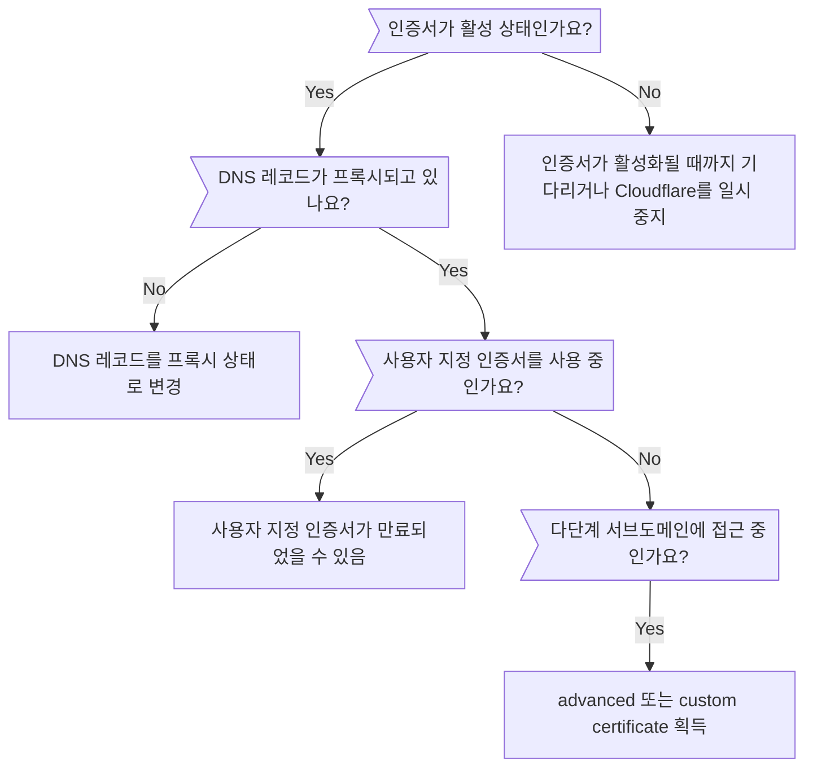

import { Stream, Render } from "~/components";

<Stream id="03e51d8a6f9a15e16969b8cc117d9225" title="ERR_SSL_VERSION_OR_CIPHER_MISMATCH" thumbnail="https://imagedelivery.net/xDOJvHcv1KwTQn6S-BGFIw/5183edaa-5d65-4344-adda-37f2cbe69c00/public" />

[새 도메인을 Cloudflare에 추가한 후](/fundamentals/manage-domains/add-site/), 방문자의 브라우저에 다음 오류 중 하나가 표시될 수 있습니다.

- `ERR_SSL_VERSION_OR_CIPHER_MISMATCH` (Chrome)
- `Unsupported protocol The client and server don’t support a common SSL protocol version or cipher suite` (Chrome)
- `SSL_ERROR_NO_CYPHER_OVERLAP` (Firefox)

이 오류는 도메인 또는 서브도메인이 SSL/TLS 인증서로 커버되지 않을 때 발생하며, 일반적으로 다음 중 하나가 원인입니다.

- [인증서 활성화 지연](#certificate-activation)
- [프록시되지 않은 도메인 또는 서브도메인 DNS 레코드](#proxied-dns-records)
- [만료된 Custom certificate](#certificate-expiration)
- [다단계 서브도메인](#multi-level-subdomains) (`test.dev.example.com`)

## 결정 트리

---

## 인증서 활성화

<Render file="universal-ssl-enable-full" product="ssl" />

### 가능한 문제

방문자가 `ERR_SSL_VERSION_OR_CIPHER_MISMATCH`(Chrome) 또는 `SSL_ERROR_NO_CYPHER_OVERLAP`(Firefox)를 겪는다면 Universal certificate의 상태를 확인하세요.

1. [Cloudflare dashboard](https://dash.cloudflare.com)에 로그인합니다.
2. 계정과 도메인을 선택합니다.
3. [**Edge Certificates**](https://dash.cloudflare.com/?to=/:account/:zone/ssl-tls/edge-certificates) 페이지로 이동합니다.
4. **Type**이 **Universal**인 인증서를 찾습니다.
5. **Status**가 **Active**인지 확인합니다.

**Status**가 **Active**가 아니라면, 인증서 활성화를 조금 더 기다리거나 즉시 조치를 취할 수 있습니다.

### 해결 방법

이 오류를 즉시 해결해야 한다면 [일시적으로 Cloudflare를 중지](/fundamentals/manage-domains/pause-cloudflare/)하세요.

Universal certificate 발급에는 최대 24시간이 걸릴 수 있으므로, 기다리면서 [인증서 상태를 모니터링](/ssl/reference/certificate-statuses/#ssltls)하세요. 인증서가 **Active**가 되면 이전에 사용한 방법으로 Cloudflare를 다시 활성화하세요.

24시간이 지나도 인증서가 여전히 **Active**가 아니라면 [timeout issue 해결](/ssl/edge-certificates/universal-ssl/troubleshooting/#resolve-a-timed-out-state)에 사용되는 다양한 문제 해결 단계를 시도하세요. 이러한 방법이 성공해 인증서가 **Active**가 되면 이전에 사용한 방법으로 Cloudflare를 다시 활성화하세요.

---

## 프록시된 DNS 레코드

Cloudflare Universal 및 Advanced certificate는 [Cloudflare를 통해 프록시된](/dns/proxy-status/) 도메인과 서브도메인만 커버합니다.

호스트명의 `A`, `AAAA`, `CNAME` 레코드 **Proxy status**가 **DNS-only**라면 **Proxied**로 변경해야 합니다.

---

## 인증서 만료

[Custom certificate](/ssl/edge-certificates/custom-certificates/)를 사용 중이고 방문자가 `ERR_SSL_VERSION_OR_CIPHER_MISMATCH`(Chrome) 또는 `SSL_ERROR_NO_CYPHER_OVERLAP`(Firefox)를 겪는다면 [상태를 확인](/ssl/reference/certificate-statuses/#ssltls)하여 만료되지 않았는지 확인하세요.

만료되었다면 [대체 인증서를 업로드](/ssl/edge-certificates/custom-certificates/renewing/)하세요.

---

## 다단계 서브도메인

<Render file="ussl-limitations-table" product="ssl" />

즉, 다단계 서브도메인에서 `ERR_SSL_VERSION_OR_CIPHER_MISMATCH`(Chrome) 또는 `SSL_ERROR_NO_CYPHER_OVERLAP`(Firefox)가 발생할 수 있습니다.

<Render file="ussl-limitations-solutions" product="ssl" />
