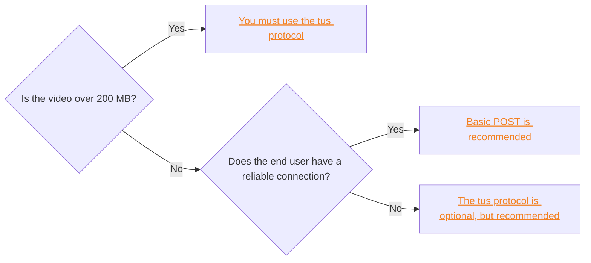
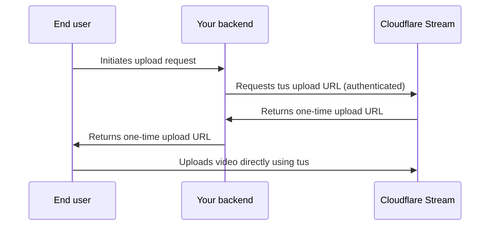

직접 제작자 업로드는 당신의 API 토큰을 클라이언트에게 폭발하지 않고 Cloudflare Stream에 직접 업로드 동영상을 업로드 할 수 있습니다. 직접 제작자 업로드를 구현할 수 있습니다.[기본 POST 요청](#basic-post-request)또는[tus 프로토콜](#direct-creator-uploads-with-tus-protocol). 이 차트를 사용하여 사용하는 방법:



:::노트\[Billing 고려사항]

기본 정보`POST`또는 tus 프로토콜은 사용 가능한 스토리지 내에서 수용 할 수 있도록 사용자의 업로드에 대한 예약을 최대 기간을 지정해야합니다. 이 기간은 사용자의 업로드가 수신될 때까지 계정의 사용 가능한 저장에서 공제됩니다. 업로드가 처리되면 실제 기간이 계산되며 나머지 예약은 공개됩니다. 비디오 오류가 발생하거나 링크가 만료되기 전에 수신되지 않으면 전체 예약이 해제됩니다.

가격과 예시 시나리오의 상세한 내역은 참조[가격 책정](/stream/pricing/).

:::

## 기본 POST 요청

최종 사용자의 비디오가 200 MB 이하이고 연결이 신뢰할 수 있고,이 방법을 사용하는 것이 좋습니다. 최종 사용자의 연결이 신뢰할 수없는 경우, 우리는 사용하는 것이 좋습니다[tus 프로토콜](#direct-creator-uploads-with-tus-protocol)대신.

직접 제작자가 업로드 할 수 있도록`POST`요구 사항:

1. 한 번의 업로드 URL 생성[직접 업로드 API](/api/resources/stream/subresources/direct_upload/methods/create/).

```sh title="Generate upload"
curl https://api.cloudflare.com/client/v4/accounts/{account_id}/stream/direct_upload \
--header 'Authorization: Bearer <API_TOKEN>' \
 --data '{
    "maxDurationSeconds": 3600
 }'
```

{/* <!-- videodelivery.net is correct domain. See STREAM-4364 --> */}

```json output {3}
{
	"result": {
		"uploadURL": "https://upload.videodelivery.net/f65014bc6ff5419ea86e7972a047ba22",
		"uid": "f65014bc6ff5419ea86e7972a047ba22"
	},
	"success": true,
	"errors": [],
	"messages": []
}
```

2. 이름 \*`uploadURL`이전 단계에서 사용자는 크기 200 MB로 제한되는 비디오 파일을 업로드 할 수 있습니다. 아래 예제 요청을 참조하십시오.

{/* <!-- videodelivery.net is correct domain. See STREAM-4364 --> */}

```bash {3} title="Upload a video to the unique one-time upload URL"
curl --request POST \
  --form file=@/Users/mickie/Downloads/example_video.mp4 \
  https://upload.videodelivery.net/f65014bc6ff5419ea86e7972a047ba22
```

성공적인 업로드는 반환`200`HTTP 상태 코드 응답. 업로드가 충족되지 않는 경우
생성의 시간에 정의 된 업로드 제약 또는 크기 200 MB보다 큰, 응답은 반환`4xx`HTTP 상태 코드.

## 직접 제작자 tus 프로토콜로 업로드

최종 사용자의 비디오가 200MB 이상이라면 tus 프로토콜을 사용해야 합니다. 파일이 200 MB 미만이라면 최종 사용자의 연결이 잠재적으로 신뢰할 수 없는 경우 Cloudflare는 tus 프로토콜을 사용하여 권장됩니다. tus 프로토콜 요구 사항, 추가 클라이언트 예제 및 업로드 옵션에 대한 자세한 정보는 참조[대용량 파일(tus)](/stream/uploading-videos/resumable-uploads/).

다음 다이어그램은이 프로세스의 두 단계가 상호 작용하는 방법을 보여줍니다 :



### 단계 1: 당신의 백엔드는 한 번 업로드 URL을 제공

:::참조

한 번 업로드 URL을 제공 하기 전에, 당신의 백엔드는 최종 사용자에서 파일 크기를 얻을 해야 합니다. tus 프로토콜은`Upload-Length`업로드 엔드포인트를 만들 때 헤더. 브라우저에서 선택한 파일에서 파일 크기를 얻을 수 있습니다.`.size`속성 (예를 들어,`fileInput.files[0].size`).

:::

아래 예제는 종료 사용자에게 한 번 업로드 URL을 반환하는 Worker를 구축하는 방법을 보여줍니다. 한 번 업로드 URL이 반환됩니다.`Location`응답의 헤더, 응답 몸에.

```javascript {23} title="Example API endpoint"
export async function onRequest(context) {
	const { request, env } = context;
	const { CLOUDFLARE_ACCOUNT_ID, CLOUDFLARE_API_TOKEN } = env;
	const endpoint = `https://api.cloudflare.com/client/v4/accounts/${CLOUDFLARE_ACCOUNT_ID}/stream?direct_user=true`;

	const response = await fetch(endpoint, {
		method: "POST",
		headers: {
			Authorization: `bearer ${CLOUDFLARE_API_TOKEN}`,
			"Tus-Resumable": "1.0.0",
			"Upload-Length": request.headers.get("Upload-Length"),
			"Upload-Metadata": request.headers.get("Upload-Metadata"),
		},
	});

	const destination = response.headers.get("Location");

	return new Response(null, {
		headers: {
			"Access-Control-Expose-Headers": "Location",
			"Access-Control-Allow-Headers": "*",
			"Access-Control-Allow-Origin": "*",
			Location: destination,
		},
	});
}
```

### 단계 2: 당신의 최종 사용자의 클라이언트는 스트림에 직접 업로드

tus 클라이언트에서 백엔드 엔드포인트를 직접 사용하십시오. 단계 1에서 uppy tus 클라이언트와 함께 백엔드를 사용하는 방법의 완전한 데모를 위해 아래 예제를 참조하십시오.

```html {35} title="Upload a video using the uppy tus client"
<html>
	<head>
		<link
			href="https://releases.transloadit.com/uppy/v3.0.1/uppy.min.css"
			rel="stylesheet"
		/>
	</head>
	<body>
		<div id="drag-drop-area" style="height: 300px"></div>
		<div class="for-ProgressBar"></div>
		<button class="upload-button" style="font-size: 30px; margin: 20px">
			Upload
		</button>
		<div class="uploaded-files" style="margin-top: 50px">
			<ol></ol>
		</div>
		<script type="module">
			import {
				Uppy,
				Tus,
				DragDrop,
				ProgressBar,
			} from "https://releases.transloadit.com/uppy/v3.0.1/uppy.min.mjs";

			const uppy = new Uppy({ debug: true, autoProceed: true });

			const onUploadSuccess = (el) => (file, response) => {
				const li = document.createElement("li");
				const a = document.createElement("a");
				a.href = response.uploadURL;
				a.target = "_blank";
				a.appendChild(document.createTextNode(file.name));
				li.appendChild(a);

				document.querySelector(el).appendChild(li);
			};

			uppy
				.use(DragDrop, { target: "#drag-drop-area" })
				.use(Tus, {
					endpoint: "/api/get-upload-url",
					chunkSize: 150 * 1024 * 1024,
				})
				.use(ProgressBar, {
					target: ".for-ProgressBar",
					hideAfterFinish: false,
				})
				.on("upload-success", onUploadSuccess(".uploaded-files ol"));

			const uploadBtn = document.querySelector("button.upload-button");
			uploadBtn.addEventListener("click", () => uppy.upload());
		</script>
	</body>
</html>
```

tus 및 example 클라이언트 코드를 사용하여 자세한 내용은 참조[대용량 파일(tus)](/stream/uploading-videos/resumable-uploads/).

## 업로드-Metadata 헤더 구문

신청할 수 있습니다.[동일한 constraints](/api/resources/stream/subresources/direct_upload/methods/create/)tus를 사용할 때 기본 업로드를 통해 Direct Creator 업로드. 이렇게하려면, 당신은 통과해야합니다`expiry`·`maxDurationSeconds`의 일부`Upload-Metadata`첫 번째 요청의 일부로 요청 헤더 ( 위의 예에서 노동자에 의해 만들어.) 더 보기`Upload-Metadata`값은 실제 파일 업로드를 수행하는 후속 요청에서 무시됩니다.

더 보기`Upload-Metadata`header는 열쇠 가치 쌍을 포함해야 합니다. 키는 텍스트이며 값은 base64로 인코딩되어야 합니다. 공간에 의해 키와 값을 분리,*아니다.*&#xAC19;은 기호. 여러 키 값 쌍에 가입하려면 추가 공간이 없습니다.

아래 예제에서,`Upload-Metadata`header는 최대 비디오 기간 10 분 동안 업로드 할 수있는 스트림을 구축하고 expiry timestamp 이전에 업로드하고이 비디오 개인을 만들 수 있습니다 :

`'Upload-Metadata: maxDurationSeconds NjAw,requiresignedurls,expiry MjAyNC0wMi0yN1QwNzoyMDo1MFo='`

`NjAw`base64는 "600"(또는 10 분)의 값을 인코딩합니다.

`MjAyNC0wMi0yN1QwNzoyMDo1MFo=`"2024-02-27T07:20:50Z"에 대한 base64 인코딩 값 (RFC3339 형식 타임스탬프)

## 트랙 업로드 진행

고유 한 일회 업로드 URL의 생성 후 고유 식별자를 유지해야합니다 (`uid`) 응답에 반환하여 사용자의 업로드의 진행 상황을 추적합니다.

다음과 같은 방법으로 업로드 진행 상황을 추적 할 수 있습니다:

- [get video details API endpoint 사용](/api/resources/stream/methods/get/)이름 \*`uid`.

- [webhook 구독 만들기](/stream/manage-video-library/using-webhooks/)비디오 상태에 대한 알림을받을 수 있습니다. 이 알림에는`uid`.
