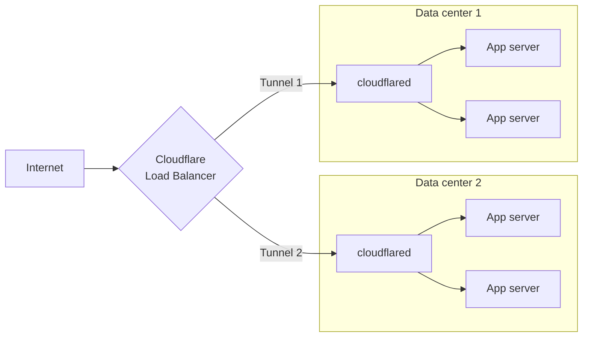

import { TabItem, Tabs, DashButton, Details, Render } from "~/components";

모델 번호: Cloudflare CloudflareXQ의 네트워크에서 터널 경로 트래픽을 추적`cloudflared`·[앱 게시](/tunnel/setup/#publish-an-application), 당신은 지역 서비스에 대한 공공 hostname을지도 — 예를 들면,`app.example.com`으로`http://localhost:8080`- 및 Cloudflare는 CDN 캐싱, WAF, 그리고 당신의 근원에 요구에 전달하기 전에 DDoS 보호를 적용합니다.

## 연락처

게시된 응용 프로그램은 터널 구성에 정의된 hostname-to-service mapping입니다. 각 mapping는 말합니다`cloudflared`로컬 서비스는 주어진 public hostname에 대한 트래픽을받습니다.

단일 터널에 여러 응용 프로그램을 게시 할 수 있습니다. 각 응용 프로그램을 위해, 지정:

- **공유 hostname**— 사용자가 방문한 도메인 또는 하위 도메인(예:`app.example.com`).
- **제품정보**— 애플리케이션이 실행되는 로컬 주소 또는 소켓 (예를 들어,`http://localhost:8080`).

대시보드XQ, CloudflareXQ를 통해 경로를 추가하면 터널 하위 도메인에 호스트 이름을 할당하는 DNS 레코드를 자동으로 생성합니다 (`<UUID>.cfargotunnel.com`).

## 지원된 의정서

<Render
  file="tunnel/protocols-table"
  product="cloudflare-one"
  params={{
  disableTlsVerificationURL: "/tunnel/configuration/#notlsverify",
  locallyManagedTunnelsURL: "/tunnel/other-tunnel-types/local-management/configuration-file/#file-structure-for-published-applications"
}}
/>

## DNS 레코드

<Render file="tunnel/dns-records-intro" product="cloudflare-one" />

### DNS 레코드 만들기

<Render
  file="tunnel/dns-records-create"
  product="cloudflare-one"
  params={{
  certPemURL: "/tunnel/other-tunnel-types/local-management/local-tunnel-terms/#certpem"
}}
/>

## 짐 밸런싱

지원하다[압축밸런서](/load-balancing/load-balancers/)게시된 응용 프로그램을 실행하는 서버의 트래픽을 배포합니다. 이것은 지역 전체에 걸쳐 건강 검사 기반 장애 및 지능형 교통 스티어링을 제공합니다.

### Replicas versus 로드밸런서

여러 번 실행`cloudflared` [회사 소개](/tunnel/configuration/#replicas-and-high-availability)같은 터널 UUID는 기본 중복을 제공합니다 - 한 호스트가 실패하면 다른 복제는 트래픽을 계속합니다. 그러나 로드밸런서는 단일 엔드포인트로 동일한 터널 UUID의 모든 복제를 처리합니다.

granular 교통 조타 및[세션 친화](/load-balancing/understand-basics/session-affinity/), 다른 갱도 UUID를 사용하여 각 주인을 연결하십시오 그래서 짐 밸런서는 그(것)들을 자주적으로 해결할 수 있습니다.

### 로드밸런서 풀에 터널 추가

:::노트\[필수]
Cloudflare 적어도 하나의 터널[관련 앱](/tunnel/setup/#publish-an-application).
:::

<Render
  file="tunnel/availability/load-balancer-create"
  product="cloudflare-one"
  params={{
  publishedAppRouteURL: "/tunnel/setup/#publish-an-application",
  tunnelIdLocation: "the [Cloudflare dashboard](https://dash.cloudflare.com/) under **Networking** > **Tunnels**"
}}
/>

  <Render
    file="tunnel/availability/load-balancer-tcp-monitors"
    product="cloudflare-one"
    params={{
  publishedAppRouteURL: "/tunnel/setup/#publish-an-application"
}}
  />

  <Render
    file="tunnel/availability/load-balancer-local-connection"
    product="cloudflare-one"
    params={{
  replicasURL: "/tunnel/configuration/#replicas-and-high-availability"
}}
  />

## Cloudflare 설정

<Render file="tunnel/dns-cloudflare-settings" product="cloudflare-one" />
