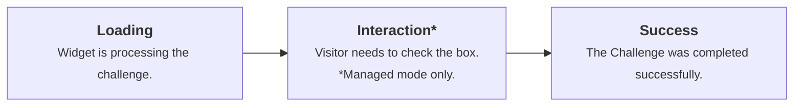

import { GlossaryTooltip, Render } from "~/components";

Turnstile의 모든 인스턴스는 Turnstile 위젯에 속합니다. 그것은 per-widget 수준에 구성 됩니다. 모든 위젯은 모드, 레이블, a<GlossaryTooltip term="sitekey">사이트맵</GlossaryTooltip>, 그리고<GlossaryTooltip term="secret key">비밀 키</GlossaryTooltip>.

Turnstile는 아래에 호스팅됩니다`challenges.cloudflare.com`. 당신의 신청은 이 근원에 연결될 것입니다.

## 위젯 구성

<Render file="widget-components" product="turnstile" />

## 위젯 모드

Turnstile 위젯의 사용 가능한 모드는**지원하다**, **비동기**·**옵션 정보**.

| Widget 모드    | 이름 \*                                                                                      | 사용 사례                              |
| ------------ | ------------------------------------------------------------------------------------------ | ---------------------------------- |
| **지원하다**(추천) | 자동적으로 방문자 위험 수준에 근거를 둔 non-interactive 또는 checkbox 도전 사이에서 선택합니다. decipher에 이미지 또는 텍스트 없음. | 적합한 보안을 가진 간단한 설정. 균형 보호 및 사용자 경험. |
| **비동기**      | load spinner와 함께 표시된 위젯. 방문자 상호 작용을 필요로 하지 않고 도전을 실행합니다.                                   | 검증을 보여주는 동안 마찰 최소화                 |
| **옵션 정보**    | 눈에 보이는 위젯이나 로딩 지표가 없는 배경에서 완전히 도전합니다.                                                      | 눈에 보이는 검증 요소로 시각적 경험을 극대화합니다.      |

### 관리 모드 (추천)

관리 모드는 Cloudflare에 의해 완전히 관리됩니다. 그것은 자동으로 클라이언트 측 신호 및 위험 수준에 따라 적절한 조치를 선택합니다. Cloudflare는 상호 작용하는 도전이 사용될지 결정하기 위하여 방문자에서 정보를 이용합니다.

Turnstile는 방문자가 인간인지 확인하는 데 필요한 경우에만 상호 작용을 요구합니다. 상호 작용이 필요한 경우, 방문자는 상자를 선택할 수 있습니다. 이미지나 텍스트가 없습니다.

관리 모드는 위젯의 행동을 미세 조정하지 않고 간단한 구성을 원하는 사용자에게 이상적입니다.

### 비동기 모드

방문자는 자신의 브라우저에서 실행되는 동안 로딩 스피너와 위젯을 볼 수 있습니다. 관리 모드와 달리, 방문자는 위젯과 상호 작용할 필요가 없습니다.

비동기 모드는 방문자 경험 우선 순위를 원하는 사용자에게 이상적입니다. Turnstile 상호 작용으로 웹 사이트에 마찰을 추가하지 마십시오.

### 보이지 않는 형태

보이지 않는 모드는 방문자가 Turnstile 위젯과 상호 작용하지 않는 Non-Interactive 모드와 유사합니다. 방문자는 위젯 또는 보이지 않는 브라우저 도전이 진행중인 표시를 볼 수 없습니다.

보이지 않는 모드는 웹 사이트의 방문자 및 시각 경험을 우선 순위하려는 사용자에게 이상적입니다.

:::note\[Cloudflare의 Turnstile 개인 정보 보호 정책]

<Render file="privacy-policy" product="turnstile" />

:::

***

## Widget 사용자 정의

### 제품 정보

Widget은 정상적인, 가동 가능한, 또는 소형 크기에서 실행될 수 있습니다.

더 알아보기[Widget 구성](/turnstile/get-started/client-side-rendering/widget-configurations/)상세한 구성 옵션 및 코드 예제를 위해.

### 외관과 테마

Turnstile 위젯은 웹 사이트의 디자인과 일치하기 위해 여러 모양 모드와 테마를 지원합니다.

더 알아보기[Widget 구성](/turnstile/get-started/client-side-rendering/widget-configurations/)구현 세부 사항.

***

## Widget 상태

### 오류 상태

| 
제품정보
 | 이름 \*                                                                                                                                                               |
| ----------------------------------- | ------------------------------------------------------------------------------------------------------------------------------------------------------------------- |
| 잘못된 오류                              | 문제 중에 알 수없는 오류가 발생하면 방문자가이 위젯 상태에 직면하게됩니다. 방문자는 위젯에서 문제 해결 지침을 따르거나 페이지를 새로 고침하여 도전을 다시 할 수 있습니다.                                                                   |
| 작업 시간                               | 방문자가 체크 박스에 표시되지만 장시간 시간 동안 상호 작용하지 않습니다. 도전은 페이지 또는 위젯을 다시로드하여 재발행해야합니다.                                                                                           |
| 도전 시간                               | 인증이 완료되었지만 더 이상 행동이 취되지 않았다면, 도전 결과는 더 이상 유효하지 않습니다. 예를 들어, Turnstile 위젯은 로그인 페이지와 Turnstile가 성공적으로 랜에 있지만, 방문자는 장시간 시간에 로그인하지 않았다, 도전은 페이지 또는 위젯을 다시로드하여 재발행해야합니다. |
| 지원되지 않은 브라우저                        | 브라우저 또는 지원되지 않은 브라우저와 방문자는이 위젯 상태를 만날 것입니다. 더 알아보기[지원되는 브라우저](/cloudflare-challenges/reference/supported-browsers/)지원되는 브라우저에 대한 자세한 내용은.                           |
