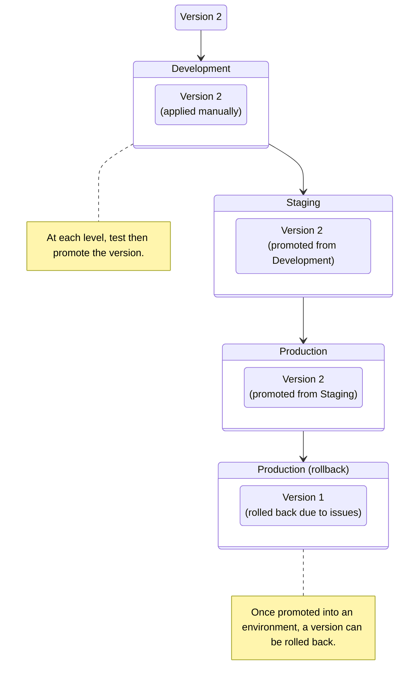

import { Render } from "~/components"

버전 관리는 조합을 통해 작동합니다.**제품정보**·**이름 \***.

## 환경분야

<Render file="environment-definition" product="version-management" />

 

너에게[지원하다](/version-management/how-to/enable/)버전 관리, 당신은 기본 환경을 만들 수있는 능력이 있습니다 :

<Render file="environment-defaults" product="version-management" />

당신은[지원하다](/version-management/how-to/versions/#create-version)새로운 버전, 그 버전은 당신의 적용 할 수 있습니다**회사연혁**환경 (또는 어떤 환경든지 가장 낮은 순위가 있습니다). 일단 당신이 당신의 버전에 테스트**회사연혁**환경, 당신은 그 버전을 홍보 할 것**사이트맵**환경과 - 문제없이 - 다음 그것을 홍보**제품정보**.

특정 환경에 대한 트래픽을 보내려면 패턴과 일치하는 환경에 요청을 보냅니다.[교통 필터](/version-management/reference/traffic-filters/).

## 이름 \*

<Render file="version-definition" product="version-management" />

 

<Render file="enable-default-creation" product="version-management" />

당신의 버전이 준비되어 있을 때, 당신은 시험하고 도달까지 각종 환경을 통해 그것을 승진시킬 것입니다**제품정보**(또는 최종 환경이 무엇인지).

새 버전을 언제든지 선택할 수 있습니다.[**이름 \***](/version-management/how-to/versions/#create-version)기존 버전에서 구성을 자동으로 복사합니다.

버전 구성은 Zone 트래픽에 적용됩니다.[버전 촉진](/version-management/how-to/environments/#promote-a-version)새로운 환경에 따라 그 환경에서 지정된 패턴과 일치하는 환경에 트래픽을 보냅니다.[교통 필터](/version-management/reference/traffic-filters/).
