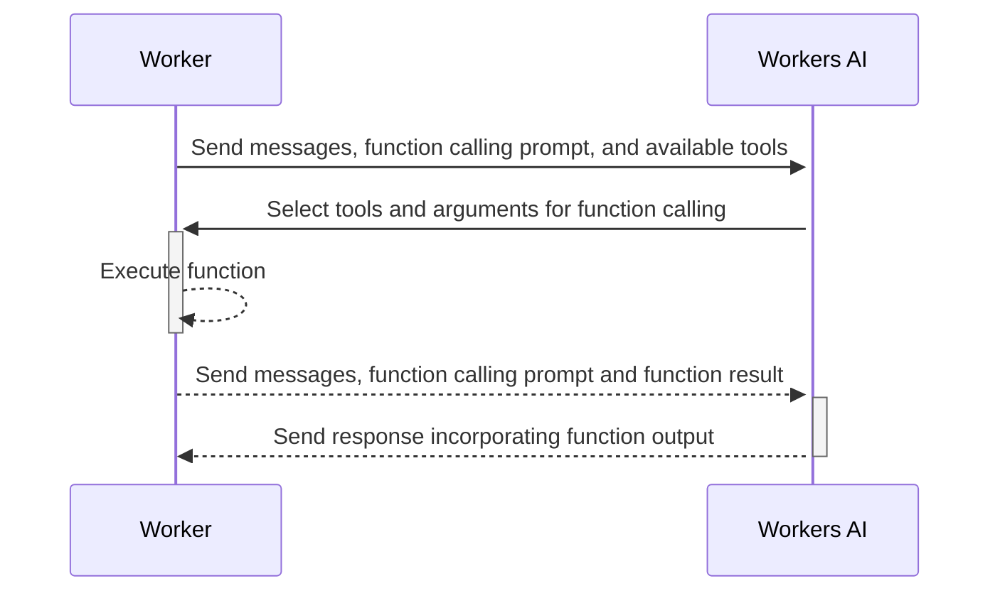

import { TypeScriptExample, PackageManagers } from "~/components";

이 가이드는 임베디드 함수 호출을 사용하여 첫 번째 Workers AI 프로젝트를 설정하고 배포합니다. Workers, Workers AI 바인딩을 사용할 수 있습니다.[`ai-utils package`](https://github.com/cloudflare/ai-utils)Cloudflare 글로벌 네트워크에 첫 번째 AI 전원 응용 프로그램을 배포하기 위해 LLM (큰 언어 모델).

## 1. Workers AI를 가진 노동자 프로젝트를 창조하십시오

자주 묻는 질문[Workers AI 시작 가이드](/workers-ai/get-started/workers-wrangler/)단계까지 2.

## 2. 추가 npm 패키지 설치

다음, 프로젝트 저장소에서 다음 명령을 실행하여 Worker AI 유틸리티 패키지를 설치합니다.

<PackageManagers pkg="@cloudflare/ai-utils" />

## 3. 추가 Workers AI Embedded 함수 호출

업데이트`index.ts`다음 코드로 응용 프로그램 디렉토리에 파일:

<TypeScriptExample filename="index.ts">
  ```ts
  import { runWithTools } from "@cloudflare/ai-utils";

  type Env = {
  	AI: Ai;
  };

  export default {
  	async fetch(request, env, ctx) {
  		//기능 정의
  		const sum = (args: { a: number; b: number }): Promise<string> => {
  			const { a, b } = args;
  			return Promise.resolve((a + b).toString());
  		};
  		//기능 호출과 AI inference 실행
  		const response = await runWithTools(
  			env.AI,
  			//기능 호출 지원 모델
  			"@hf/nousresearch/hermes-2-pro-mistral-7b",
  			{
  				//이름 *
  				messages: [
  					{
  						role: "user",
  						content: "What the result of 123123123 + 10343030?",
  					},
  				],
  				//AI 모델을 활용할 수 있는 도구의 정의
  				tools: [
  					{
  						name: "sum",
  						description: "Sum up two numbers and returns the result",
  						parameters: {
  							type: "object",
  							properties: {
  								a: { type: "number", description: "the first number" },
  								b: { type: "number", description: "the second number" },
  							},
  							required: ["a", "b"],
  						},
  						//이전에 정의된 기능에 reference
  						function: sum,
  					},
  				],
  			},
  		);
  		return new Response(JSON.stringify(response));
  	},
  } satisfies ExportedHandler<Env>;
  ```
</TypeScriptExample>

이 예제는 utils를 가져옵니다.`import { runWithTools} from "@cloudflare/ai-utils"`그리고 아래 API reference를 따르십시오.

또한, 이 예제에서 LLM이 사용자 쿼리에 응답 할 수있는 도구 목록을 정의하고 설명합니다. 여기에 목록은 하나의 도구 만 포함되어 있습니다.`sum`기능.

에 의해 압정`runWithTools`기능, 뒤에 오는 단계 발생:



더 보기`ai-utils package`또한 오픈 소스[뚱 베어](https://github.com/cloudflare/ai-utils).

## 4. 현지 개발 및 배포

단계 따라 4 과 5 의[Workers AI 시작 가이드](/workers-ai/get-started/workers-wrangler/)로컬 개발 및 배포를 위해.

:::노트\[Workers AI 임베디드 기능 호출 요금]

임베디드 함수 호출은 Workers AI inference 요청을 실행합니다. inference (e.g. token)의 표준 요금 사용료가 부과됩니다.
임베디드 기능의 코드 실행 중에 (e.g. CPU 시간)를 소모하는 리소스는 다른 노동자의 코드 실행으로만 청구됩니다.

:::

## API reference

더 자세한 내용은 참조[API reference](/workers-ai/features/function-calling/embedded/api-reference/).
