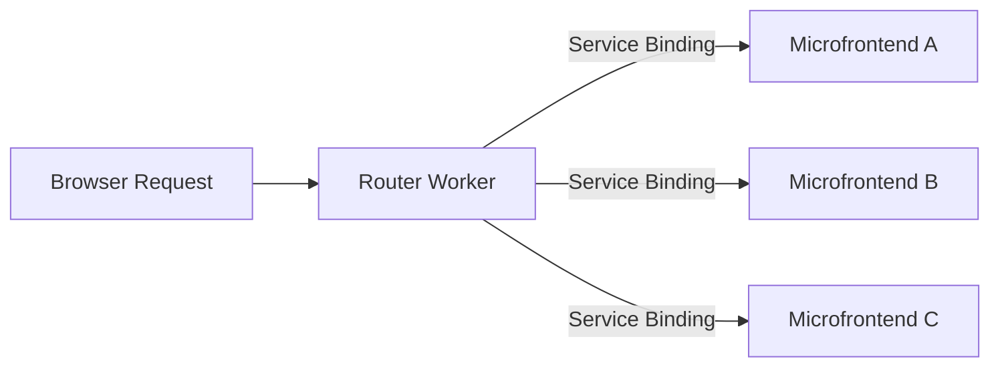

import { WranglerConfig } from "~/components";

Microfrontends는 단일 응용 프로그램을 더 작고 독립적으로 배포 가능한 단위로 분할 할 수 있습니다. 다른 기술을 사용하여 다른 팀은 개발, 테스트 및 각 microfrontend를 배포 할 수 있습니다.

원하는 경우 microfrontends를 사용하십시오:

- 독립적으로 배포하는 많은 팀을 활성화 해제
- 모놀리에서 배운 건축까지 Gradually migrate
- 멀티 프레임 워크 응용 프로그램 구축 (예를 들어, Astro, Remix 및 Next.js를 하나의 응용 프로그램에서)

## 시작하기

microfrontend 프로젝트 만들기:

[](https://dash.cloudflare.com/?to=/:account/workers-and-pages/create?type=vmfe)

이 템플릿은 사전 설정 논리로 라우터 작업기를 자동으로 생성하고 구성할 수 있습니다.[서비스 바인딩](/workers/runtime-apis/bindings/service-bindings/)Workers에 이미 Cloudflare 계정에 배포했습니다. 코드 또는이 템플릿은 GitHub에서 사용할 수 있습니다.[클라우드 플레어/templates](https://github.com/cloudflare/templates/tree/main/microfrontend-template).

## 어떻게 작동합니까?



라우터 노동자:

1. 수신 요청 경로 분석
2. 설정된 경로에 대한 일치
3. 서비스 바인딩을 통해 적절한 microfrontend에 대한 요청을 전달
4. HTML, CSS 및 헤더를 작성하여 자산 부하를 올바르게 보장합니다.
5. 브라우저에 대한 응답을 반환

각 microfrontend는 일 수 있습니다:

- 전체 프레임 워크 응용 프로그램 (Next.js, SvelteKit, Astro 등)
- 정적 사이트[Workers 정적 자산](/workers/static-assets/)
- 다른 프레임 워크와 기술을 내장

## 루팅 로직

라우터 노동자는`ROUTES` [환경 변수](/workers/configuration/environment-variables/)microfrontend가 각 경로를 다룹니다. 경로는 특정성에 의해 일치, 더 긴 경로 복용 우선.

이름 \*`ROUTES`윤곽:

```json
{
	"routes": [
		{ "path": "/app-a", "binding": "MICROFRONTEND_A", "preload": true },
		{ "path": "/app-b", "binding": "MICROFRONTEND_B", "preload": true },
		{ "path": "/", "binding": "MICROFRONTEND_HOME" }
	],
	"smoothTransitions": true
}
```

각 노선은 요구합니다:

- `path`: microfrontend 용 마운트 경로 (다른 경로에서 구별됩니다)
- `binding`: 서비스 바인딩의 이름[Wrangler 구성 파일](/workers/wrangler/configuration/)
- `preload`(선택): 더 빠른 탐색을 위해이 microfrontend를 prefetch 여부

요청이 있을 때`/app-a/dashboard`, 대패:

1. 그것을 일치`/app-a`오시는 길
2. 요청을 전달`MICROFRONTEND_A`
3. 스트립 스`/app-a`prefix, 그래서 microfrontend 수신`/dashboard`

라우터는 logic을 일치하는 경로가 포함되어 있습니다.

```typescript
//정적 경로
{ "path": "/dashboard" }

//동적 매개 변수
{ "path": "/users/:id" }

//Wildcard 매칭 (제로 또는 더 많은 세그먼트)
{ "path": "/docs/:path*" }

//필요한 세그먼트 (하나 이상의 세그먼트)
{ "path": "/api/:path+" }
```

## 관련 링크

라우터 worker 사용[HTMLRewriter](/workers/runtime-apis/html-rewriter/)자동적으로 HTML 속성을 다시 작성하여 마운트 경로 접두사, 정확한 위치에서 자산 부하를 보장합니다.

microfrontend가 장착되면`/app-a`HTML을 반환:

```html
<link rel="stylesheet" href="/assets/styles.css" />
<script src="/assets/app.js"></script>

```

라우터는 다음과 같습니다.

```html
<link rel="stylesheet" href="/app-a/assets/styles.css" />
<script src="/app-a/assets/app.js"></script>

```

rewriter는 모든 HTML 요소에 걸쳐 이러한 속성을 처리합니다.

- `href`, `src`, `poster`, `action`, `srcset`
- `data-*`같은 속성`data-src`, `data-href`, `data-background`
- Framework-specific 속성`astro-component-url`

라우터는 외부 URL을 파괴하기 위해 구성 된 자산 접두사로 시작하는 경로 만 다시 작성합니다.

```javascript
//기본 자산 prefixes
const DEFAULT_ASSET_PREFIXES = [
	"/assets/",
	"/static/",
	"/build/",
	"/_astro/",
	"/fonts/",
];
```

대부분의 프레임 워크는 기본 접두사를 사용합니다. 다른 빌드 출력과 프레임 워크 (Next.js와 같은)`/_next/`), 당신은 custom prefixes를 사용하여 구성할 수 있습니다`ASSET_PREFIXES` [환경 변수](/workers/configuration/environment-variables/):

```json
["/_next/", "/public/"]
```

## 자산 처리

라우터는 CSS 파일을 다시 씁니다.`url()`references는 제대로 작동합니다. microfrontend가 장착되면`/app-a`CSS를 반환:

```css
.hero {
	background: url(/assets/hero.jpg);
}

.icon {
	background: url("/static/icon.svg");
}
```

라우터는 다음과 같습니다.

```css
.hero {
	background: url(/app-a/assets/hero.jpg);
}

.icon {
	background: url("/app-a/static/icon.svg");
}
```

라우터도 핸들:

- **Redirect 헤더**: 수정`Location`헤드러는 마운트 경로 포함
- **쿠키 경로**: 업데이트`Set-Cookie`마운트 경로의 범위 쿠키에 헤더

## 노선 Preloading

시간 :`preload: true`정적 마운트 경로에 설정, 라우터는 자동으로 더 빠른 탐색을 가능하게하는 그 루트를 미리로드합니다. 라우터 사용**브라우저 별 최적화**각 브라우저에서 최고의 성능을 제공하려면:

### 크롬 브라우저 (Chrome, Edge, Opera, Brave)

Chromium 기반 브라우저의 경우 라우터는**Speculation 규칙 API**- 현대, 브라우저 부정적인 prefetching 기계장치:

- 관련 제품`<script type="speculationrules">`이름 \*`<head>`이름 \*
- 브라우저는 최적의 우선순위 관리로 자동으로 처리
- 사용자 preference(배터리저, 데이터저장기 모드)
- 빠른 액세스를위한 per-document in-memory 캐시 사용
- Cache-Control 헤더에 의해 차단되지 않음
- JavaScript-기반 fetching 보다는 능률적

**예제 주사 된 speculation 규칙 :**

```json
{
	"prefetch": [
		{
			"urls": ["/app1", "/app2", "/dashboard"]
		}
	]
}
```

## 연락처

microfrontends 사이 매끄러운 페이지 전환을 가능하게 할 수 있습니다[전환 API 보기](https://developer.mozilla.org/en-US/docs/Web/API/View_Transitions_API).

원활한 전환을 가능하게 하기 위해, set`"smoothTransitions": true`내 계정`ROUTES`윤곽:

```json
{
	"routes": [
		{ "path": "/app-a", "binding": "MICROFRONTEND_A" },
		{ "path": "/app-b", "binding": "MICROFRONTEND_B" }
	],
	"smoothTransitions": true
}
```

라우터는 자동으로 CSS를 HTML 응답으로 주사합니다.

```css
@supports (view-transition-name: none) {
	::view-transition-old(root),
	::view-transition-new(root) {
		animation-duration: 0.3s;
		animation-timing-function: ease-in-out;
	}
	main {
		view-transition-name: main-content;
	}
	nav {
		view-transition-name: navigation;
	}
}
```

이 기능은 View Transitions API를 지원하는 브라우저에서만 작동합니다. 지원없이 브라우저는 일반적으로 애니메이션없이 탐색합니다.

## 새로운 microfrontend 추가

초기 설정 후 응용 프로그램에 새로운 microfrontend를 추가하려면:

1. **새로운 microfrontend worker를 만들고 배포합니다.**

   새로운 microfrontend를 별도의 작업자로 배포합니다. 이것은 일 수 있습니다[프레임워크](/workers/framework-guides/)(Next.js, Astro, 등) 또는 정체되는 위치를 가진[Workers 정적 자산](/workers/static-assets/).

2. **추가하기[서비스 바인딩](/workers/runtime-apis/bindings/service-bindings/)라우터의 Wrangler 구성 파일**

   <WranglerConfig>
     ```toml
     [[services]]
     binding = "MICROFRONTEND_C"
     service = "my-new-microfrontend"
     ```
   </WranglerConfig>

3. **업데이트`ROUTES`환경 변수**

   새로운 경로 추가`ROUTES`윤곽:

   ```json
   {
   	"routes": [
   		{ "path": "/app-a", "binding": "MICROFRONTEND_A", "preload": true },
   		{ "path": "/app-b", "binding": "MICROFRONTEND_B", "preload": true },
   		{ "path": "/app-c", "binding": "MICROFRONTEND_C", "preload": true },
   		{ "path": "/", "binding": "MICROFRONTEND_HOME" }
   	]
   }
   ```

4. **Redeploy 라우터 노동자**

   ```sh
   npx wrangler deploy
   ```

새로운 microfrontend는 현재 구성 경로에 접근할 수 있습니다 (예를 들어,`/app-c`).

## 지역 개발

개발 도중, 당신은 Wrangler의 서비스 바인딩 지원을 사용하여 현지으로 당신의 microfrontend 건축술을 시험할 수 있습니다. 라우터 Worker를 로컬로 실행`wrangler dev`, 그리고 그 후에 분리된 맨끝은 microfrontends의 각각을 실행합니다.

microfrontends 중 하나에서만 일할 필요가 있는 경우에, 당신은 다른 사람을 원격으로 사용 실행할 수 있습니다[먼 바인딩](/workers/development-testing/#remote-bindings)소스 코드에 액세스하거나 로컬 dev 서버를 실행할 필요가 없습니다.

로컬 dev에서 원격으로 실행하고 싶은 각 microfrontend를 위해, 원격 플래그와 서비스 바인딩을 구성:

<WranglerConfig>
  ```json
  {
  "services": [
  	{
  	"binding": "<BINDING_NAME>",
  	"service": "<WORKER_NAME>",
  	"remote": true
  	}
  ]
  }
  ```
</WranglerConfig>

## 계정 만들기

각 microfrontend는 라우터 또는 기타 microfrontends를 중복하지 않고 독립적으로 배포 할 수 있습니다. 이 팀은 다음과 같습니다.

- 자주 묻는 질문
- 다른 사람에 영향을 미치지 않고 롤백 개별 microfrontends
- 시험과 방출 특징 자주적으로

microfrontend worker를 배포할 때, 라우터는 서비스 바인딩을 통해 최신 버전으로 자동적으로 요청합니다. 새로운 루트를 추가하거나 업데이트하지 않는 한 라우터 변경이 필요하지 않습니다.`ROUTES`구성.

생산에 배포하려면 사용할 수 있습니다.[주문 영역](/workers/configuration/routing/custom-domains/)라우터 노동자를 위해, 및 구성[모델 번호: Workers 회사연혁](/workers/ci-cd/builds/)당신의 Git 저장소에서 지속적인 배포를 위해.
