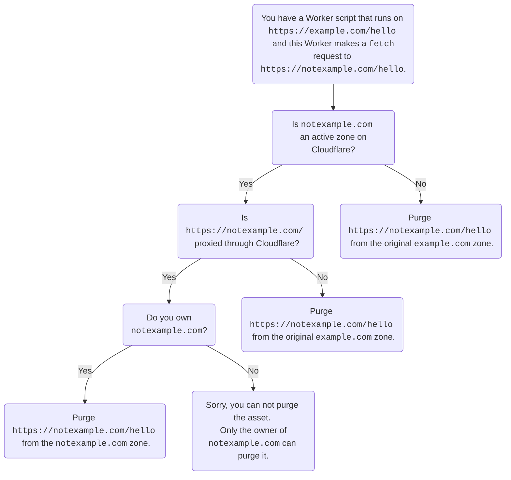

Workers는 개발자가 QXQX0738XQ 캐시에 직접 상호 작용할 수 있도록 CloudflareXQXQ의 글로벌 네트워크 상단에 설계 및 구축되었습니다. 캐시는 ephemeral, data center-local storage을 자주 액세스 정적 또는 동적 컨텐츠에 편리한 방법으로 제공할 수 있습니다.

개발자가 캐시에 쓰기를 허용함으로써 Workers는 Cloudflare의 CDN에서 캐시 동작을 사용자 정의하는 방법을 제공합니다. 캐싱의 이점에 대해 알아 보려면, 학습 센터의 기사 참조[캐싱은 무엇입니까?](https://www.cloudflare.com/learning/cdn/what-is-caching/).

Cloudflare Workers은 캐시 전에 실행되지만 캐시에서 반환되면 자산을 수정하는 데 사용할 수 있습니다. 캐시에서 반환된 자산을 수정하는 것은 서명하거나 응답을 개인화할 수 있는 기능을 허용하고, 또한 근원에 짐을 감소시키고 가까운 위치에서 자산을 봉사해서 최종 사용자에게 늦게 감소시키.

## Cloudflare 캐시를 가진 해석

개념적으로, 노동자를 사용하여 Cloudflare의 캐시와 상호 작용하는 두 가지 방법이 있습니다.

- 자주 묻는 질문[`fetch()`](/workers/runtime-apis/fetch/)Workers 스크립트에서. CloudflareXQ를 통한 요청은 영역의 기본 또는 구성 동작에 따라 WorkersXQ없이 캐시됩니다 (예를 들어, 파일이 종료된 것과 같은 정적 자산`.jpg`기본적으로 캐시됩니다. Workers는 이 행동을 더 주문을 받아서 만들 수 있습니다:

  - Cloudflare 캐시 규칙 설정 (즉, 작동`cf`객체의[이름 \*](/workers/runtime-apis/request/)).

- 저장 응답 사용[캐시 API](/workers/runtime-apis/cache/)Workers 스크립트에서. 이것은 근원에서 오지 않는 응답을 캐싱하고 또한 더 정밀한 통제를 제공합니다:

  - 모든 자산의 캐시 행동을 사용자 정의`Cache-Control`응답에 전달`cache.put()`.

  - Worker 자체에 의해 생성 된 Caching 응답`cache.put()`.

:::카ution\[티드 캐싱]

Cache API는 계층 캐싱과 호환되지 않습니다. tiered 캐싱의 이점을 가지고 가기 위하여, 사용[페치 API](/workers/runtime-apis/fetch/).

:::

### 단일 파일 퍼지 자산은 노동자에 의해 캐시

Single-file purge를 사용하여 Worker에 의해 캐시 된 자산을 퍼지려면 최종 사용자 URL을 사용하지 않도록하십시오. 대신 URL을 퍼지`fetch`이름 \* 예를 들어, 실행중인 노동자가 있습니다.`https://example.com/hello`그리고이 노동자는`fetch`지원하다`https://notexample.com/hello`.

캐시가 우려되는 것처럼, 자산은`fetch`요청 (`https://notexample.com/hello`) 캐시 된 자산입니다. 그것을 퍼지려면, 당신은 퍼지해야합니다`https://notexample.com/hello`.

최종 사용자 URL을 제거,`https://example.com/hello`, 캐시가 볼 URL이 없기 때문에 작동하지 않습니다. 당신은 실제로 fetching URL을 확인해야합니다, 그래서 당신은 정확한 자산을 순화 할 수 있습니다.

이전 예제에서,`https://notexample.com/hello`Cloudflare를 통해 발음되지 않습니다. 이름 \*`https://notexample.com/hello`이었다 ([오렌지 클라우드](/dns/proxy-status/)) Cloudflare를 통해, 당신은 소유해야 합니다`notexample.com`관련 기사`https://notexample.com/hello`으로`notexample.com`지역.

예를 잘 이해하려면 다음 다이어그램을 검토하십시오.

### Cache API로 저장된 Purge 자산

캐시에 저장된 자산[캐시 API](/workers/runtime-apis/cache/)작업은 몇 가지 방법으로 순화 될 수 있습니다:

- 이름 \*`cache.delete`Worker 안에는 매칭 요청 변수를 가진 자산을 위한 캐시를 유효하게 합니다.

  - 이 방법으로 순화 된 자산은 로컬 데이터 센터에 순화되어 Worker runtime이 실행되었습니다.

- 글로벌 자산을 확보하려면 표준을 사용하십시오.[캐시 퍼지 옵션](/cache/how-to/purge-cache/). 캐시 API 구현을 기반으로, Cache API에 저장된 자산을 순화하기위한 모든 캐시 퍼지 엔드 포인트 기능.

  - 영역의 모든 자산은 사용함으로써 순화 될 수 있습니다.[모든 것](/cache/how-to/purge-cache/purge-everything/)캐시 작업. 이 퍼지는 Cloudflare 영역과 관련된 모든 자산을 제거 할 것입니다.

  - [캐시 태그](/cache/how-to/purge-cache/purge-by-tags/#add-cache-tag-http-response-headers)호출하여 worker에서 동적으로 요청할 수 있습니다.`response.headers.append()`관련 기사`Cache-Tag`값은 동적으로 그 요청합니다. 설정되면 해당 태그는 영역에서 모든 캐시 된 자산을 유효하지 않고 캐시에서 선택적으로 퍼지 자산을 사용할 수 있습니다.

- 현재 작업자가 설정한 사용자 정의 캐시 키를 사용하는 URL을 추적 할 수 없습니다. 대신, 사용[Cache 규칙을 통해 생성 된 사용자 정의 키](/cache/how-to/cache-rules/settings/#cache-key). 대안으로, 모든 것을 사용하여 자산을 추적, 태그에 의해 퍼지, prefix에 의해 호스트 또는 퍼지.

## Edge versus 브라우저 캐싱

브라우저 캐시가 제어됩니다.`Cache-Control`header는 클라이언트에 응답에서 보냈습니다 (the`Response`인스턴스는 핸들러에서 반환합니다. Workers는 응답에 이 우두머리를 조정해서 브라우저 캐시 동작을 주문을 받아서 만들 수 있습니다.

이 문서에 언급되지 않은 Cloudflare의 캐시를 제어하는 다른 방법은 다음과 같습니다. 페이지 규칙 및 Cloudflare 캐시 설정. 더 알아보기[Cloudflare의 캐시를 사용자 정의하는 방법](/cache/concepts/customize-cache/)JavaScript를 작성하지 않으려면 몇 가지 관용성을 제어하십시오.

:::note\[QXQXQ에서 캐싱 오브젝트에 대한 캐시 API 또는 fetch?]

Workers가 미들웨어(즉, Workers는 하위 퀘스트를 통해 전송하는 요청`fetch`) 사용 권장`fetch`. 이것은 preexisting 조정이 unintended 동적 캐싱을 방지하는 동안 캐싱을 최적화하는 장소에 있기 때문에 입니다. 백엔드가 없는 프로젝트를 위해 (그것은, 전체 프로젝트는 Workers에 안으로 입니다[모델 번호: Workers 사이트 맵](/workers/configuration/sites/start-from-scratch)) Cache API는 캐싱을 사용자 정의 할 수있는 유일한 옵션입니다.

자산은 Worker 's subrequest 내에서 지정된 호스트 이름 아래에서 캐시됩니다. 따라서, 캐시 된 자산을 투여하기 위해, 퍼지는 Worker subrequest에 포함 된 호스트 이름에 대해 수행해야합니다.

:::

### `fetch`

Workers의 상황에 따라[`fetch`](/workers/runtime-apis/fetch/)실행 시간에 의해 제공 Cloudflare 캐시와 통신. 첫 번째,`fetch`URL이 다른 영역에 일치하면 확인. 그것이라면 그 영역의 캐시 (또는 노동자)를 통해 읽습니다. 그렇지 않으면 URL이 비-Cloudflare 사이트 인 경우에도 자체 영역의 캐시를 통해 읽습니다. Cache 설정`fetch`Cloudflare 설정에 따라 캐싱 규칙을 자동으로 적용합니다.`fetch`캐시에 도달하기 전에 객체를 수정하거나 검사 할 수 없습니다. 그러나 캐시가 어떻게 수정하는 것을 허용한다.

응답이 캐시를 채울 때, 응답 헤더는 포함`CF-Cache-Status: HIT`. 객체가 캐시하려고 할 수 있습니다.`CF-Cache-Status`모든 것.

이름 \*[관련 기사](/workers/examples/cache-using-fetch/)fetch를 사용하여 주어진 요청에 Cloudflare 캐시 동작을 사용자 정의하는 방법을 보여줍니다.

### 캐시 API

더 보기[캐시 API](/workers/runtime-apis/cache/)ephemeral key-value 저장소로 생각할 수 있습니다.`Request`객체 (또는 더 구체적으로, 요청 URL)는 키이며,`Response`값입니다.

Cloudflare 캐시에 사용할 수 있는 캐시 네임스페이스의 두 가지 유형이 있습니다:

- **`caches.default`**– 당신은 기본 캐시에 액세스 할 수 있습니다 (과 같은 캐시 공유`fetch`요청) 접근`caches.default`. 이것은 이미 응답을받은 후 이미 캐시 된 콘텐츠를 override 할 때 유용합니다.
- **`caches.open()`**– Namespaced 캐시에 액세스할 수 있습니다 (암호에서 공유하는 캐시에서)`fetch`요청) 사용`let cache = await caches.open(CACHE_NAME)`. 주의사항[`caches.open`](https://developer.mozilla.org/en-US/docs/Web/API/CacheStorage/open)async 함수입니다.`caches.default`.

Cache API를 사용할 때:

- programmatically save 및/또는 캐시에서 응답을 삭제 할 때. 예를 들어, 기원은 응답하고 있습니다.`Cache-Control: max-age:0`헤더를 변경할 수 없습니다. 대신, 당신은 복제 할 수 있습니다`Response`, header를에 조정하십시오`max-age=3600`값, 그리고 Cache API를 사용하여 수정 된 저장`Response`1시간

- 프로그래밍을 원할 때 캐시에서 응답에 의존하지 않고`fetch`이름 \* 예를 들어, 이미 캐시 된 경우 확인 할 수 있습니다.`Response`제품정보`https://example.com/slow-response`끝점. 그렇게하면 느린 요청을 피할 수 있습니다.

이름 \*[관련 기사](/workers/examples/cache-api/)캐시 API를 사용하는 방법을 보여줍니다. 캐시 API의 제한을 위해, 참조[제한 사항](/workers/platform/limits/#cache-api-limits).

:::caution\[티드 캐싱과 캐시 API]

Workers 안에 Cache API는 계층화된 캐싱을 지원하지 않습니다. Tiered Cache는 소스 서버에 연결하여 네트워크 위치의 전체 세트보다 작은 데이터 센터에서 왔습니다. Cache API는 데이터 센터에 로컬이며, 이것이 그 의미입니다.`cache.match`찾아보기`cache.put`응답을 저장하고,`cache.delete`작업자가 요청을 처리하는 데이터 센터의 캐시에만 저장된 응답을 제거합니다. 이 메소드는 로컬 캐시에만 적용되므로 계층 캐시가 작동하지 않습니다.
주요 특징

## 관련 자료

- [캐시 API](/workers/runtime-apis/cache/)
- [Workers를 가진 캐시 행동을 주문을 받아서 만드십시오](/cache/interaction-cloudflare-products/workers/)
